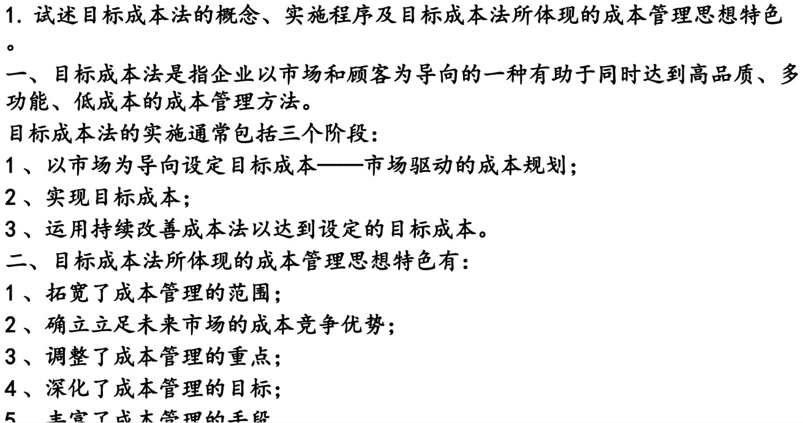

## 作业成本法与作业管理

作业：指为达到一定目的、其内容具有相对独立性，能够与其他业务区分开来的活动。

作业成本法的基本程序：其并非成本计算程序的重新设计，而是间接成本归集和分配方式的改变，由传统的以产品为中心分配成本转移到以作业为中心的成本积累及分配上来。

作业成本的思路：产品生产要耗费作业，而作业活动需耗费资源，由此资源成本构成作业成本，作业成本应分配于产品。

成本动因及成本动因的确定：所谓成本动因是指引起某类作业成本发生的活动或因素。
在作业成本法下，成本动因的确定是采用作业成本法的关键.在划分作业和确定成本动因的过程中，应考虑成本和效益原则，尽量利用现成资料，使成本计算既合理可靠又避免不必要的工作量。降低成本信息处理成本。

作业成本分配率：以某作业的成本动因为分配基础而制定的，如材料的整理准备成本，以整理的材料数量为成本动因，计算公式如下：`材料整理准备作业成本分配率 = 材料整理准备成本 / 材料整理数量`

## 目标成本计算与管理

目标成本：
	产品具有市场竞争力，使企业能够获取目标利润所允许的成本。目标成本法则是指企业以市场和顾客为导向的一种有助于同时达到高品质、多功能、低成本的成本管理方法。
	企业首先要通过市场调査了解市场可以接受的价格，以及期望的功能、质量，同时还应掌握竞争对手或替代产品状况。企业根据市场可接受、且具有竞争力的价格，扣除企业希望获取的利润以及为继续开发产品所需的研究经费，计算出产品在制造、分销和产品加工处理过程中所允许的最大成本，即目标成本，用公式表示是：
`产品目标成本 = 目标售价 - 目标利润`

## 适时生产系统的内容和特点

适时生产系统也称为无存货管理 （要多少生产多少），20世纪70年代由日本人首先创立。

主要有：
	1、以制造单元组织生产活动。
	2、掌握多种技能的技术工人。
	3、实施全面的质量控制。
	4、减少机器设备的调整和准备时间。
	5、防护性的设备维护。
	6、与供应商建立良好互利共贏的伙伴关系,

## 质量成本和质量管理

质量成本指企业因生产不符合质量的产品，以及为防止或纠正低质量产品而发生的成本。可分为四种类型：

预防成本：也称防护性成本，是指为防止或杜绝次品、废品等质量问题所发生的成本，增加预防成本，将会减少因不符合质置而产生的损失。

鉴定成本：为了检査、验证、确定产品是否符合特定质要求所发生的成本。

内部故障成本：又称内部损失成木，指产品或劳务交付客户之前，发生质量缺陷而造成的损失，以及为处理该缺陷所发生的费用之和。

外部故障成本：又称外部损失成本，指产品或劳务在售出后，因质量问题而产生的一切损失和费用之和。外部故障成本主要包括质量异议赔偿、产品折价损失等。

## 综合记分卡

综合记分卡，也称为平衡记分卡，是一种以信息为基础、系统考虑企业业绩驱动因素、多维度平衡评价的一种战略业绩评价系统；同时，它又是一种将企业战略目标与企业业绩驱动因素相结合、动态实施企业战略的战略管理系统。

构成综合记分卡的四个维度：财务、客户、内部业务流程、学习和成长

客户方面的主要评价指标：
(1)市场份额，又称市场占有率，是反映企业竞争实力的重要指标。
(2)客户保持和客户忠诚。
(3)贏得新客户。
(4)客户满意度。
(5)客户期望的满足。
(6)源于客户的获利能力。

综合记分卡与经营战略的计量：
1、财务方面：财务指标主要有：营业利润、营运资本投资报酬率、经济增加值、销售增长率、现金流量不同阶段采用相应的评价指标，企业的生命周期分为：企业创业阶段、成长阶段、成熟阶段、衰退阶段

2、客户方面：指标指标主要有：市场份额、客户保持和忠诚、赢得新客户、客户的满意程度 、源于客户的获利能力、满足客户期望。

3、内部业务流程：研究开发过程、营运过程、售后服务过程

4、学习和成长方面：员工满意度、员工保持率、员工生产率