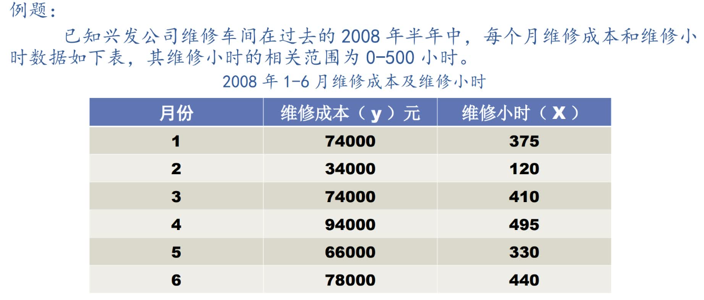
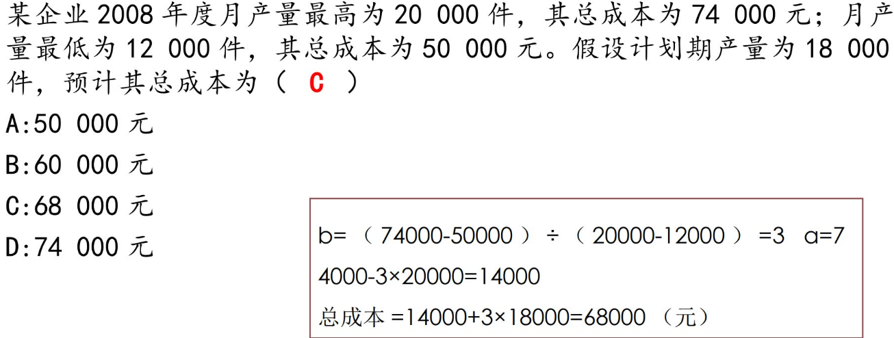
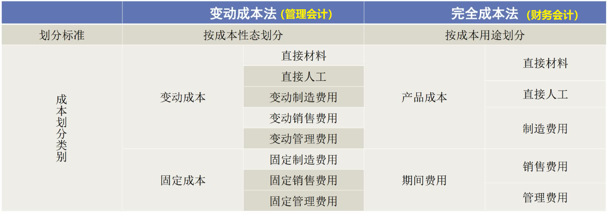
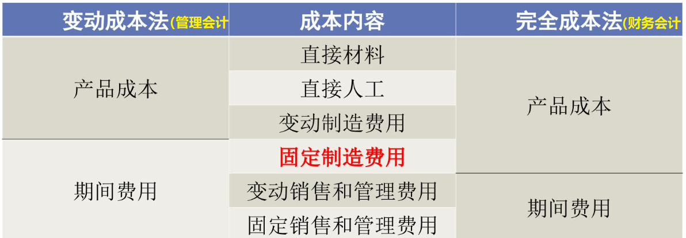
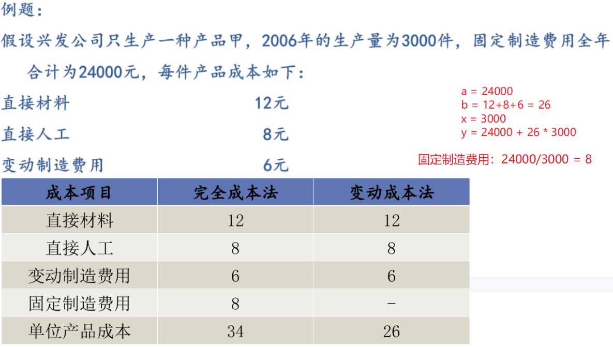
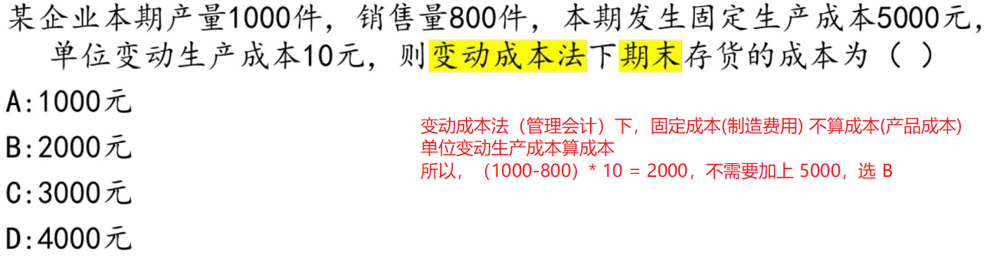
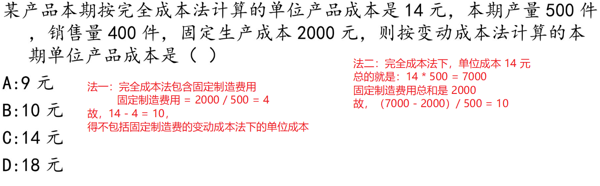
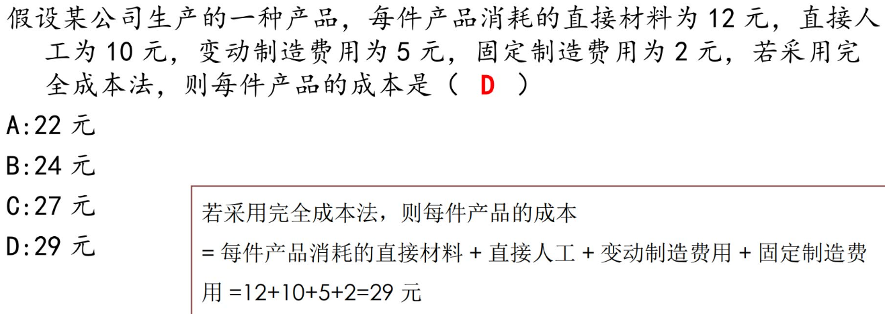
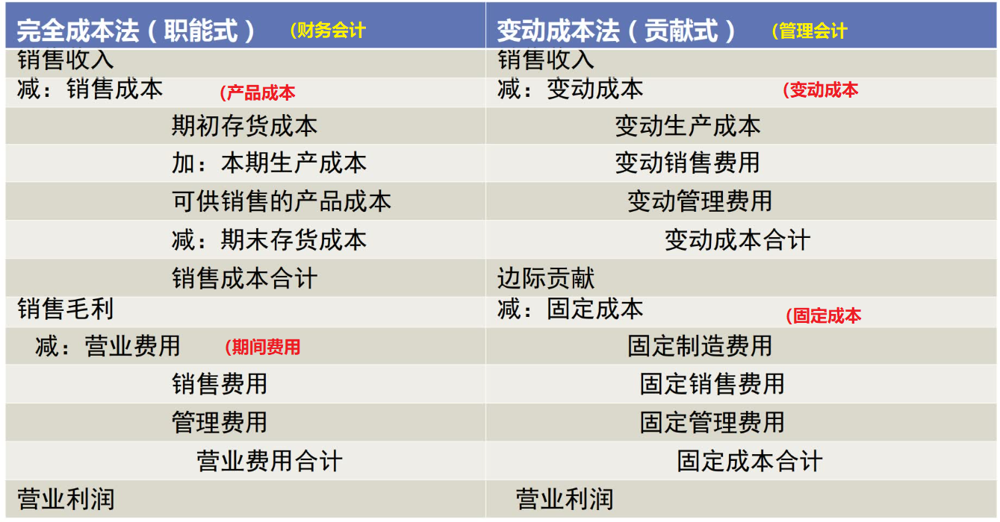

[TOC]

## 成本性态

### 固定成本

总额随业务量的变化，保持不变。单位固定成本与业务量成反比关系
如：租凭费、保险费、薪金、广告、促销、研发、培训....

#### 约束性固定成本

不受企业管理层短期决策行为影响，即短期内不能改变数额的固定成本
如：房租、保险...

#### 酌量性固定成本

受企业管理层短期决策行为影响，能改变其数额的固定成本
如：广告费、促销费、研发费、培训费、薪金...

### 变动成本

总额随业务量的变化，成正比例变动。单位变动成本不受业务量增减变动的影响，即单位成本保持不变。
如：
	产品成本中的直接材料成本和直接人工成本
	制造费用中随业务量成正比例变动的物料用品费、燃料费、动力费
	按销量支付的佣金（提成）、包装费、装运费、营业税....

#### 设计变动成本

由产品的工艺设计所确定，只要工艺技术及产品设计不改变，成本就不会变动，所以不受企业管理层决策的影响。

#### 酌量性变动成本

受管理层决策影响，有很大的选择性。

### 混合成本

既非完全固定不变，也不随着业务量成正比例变动，故为混合成本
如：阶梯成本和半变动成本

#### 阶梯成本

在一定业务量范围内是固定的，业务量超过一定范围，其发生额就会跳跃上升一个新的水平，并在新的业务量范围内固定不变，直到出现另一个新的跳跃为止。

#### 半变动成本

由明显的固定和变动两部分组成，通常会现有一个基数不受业务量影响，此阶段相当于固定成本。超过此阶段，便随业务量的增长，成本也成正比例增长，此阶段相当于变动成本。

### 混合成本分解

将混合成本分别纳入固定成本和变动成本两大类中：常有如下分解方法：

#### 工程分析法 (技术测定法)

在一定的生产技术和管理水平条件下：
0.根据投入成本和产出数量之间的关系
1.将生产过程中的投入量和产出量进行分析
2.确定各种耗用量标准，将这些耗用量标准乘以相应的单位价格，即可得到各项的标准成本。

此法可得较为精准结果，但应用较为复杂，故此法常用于缺乏历史数据可供参考的新品。
相当于搞研究....

#### 账户分析法

从各个成本明细账户：
把与固定资产成本较为接近的成本，归为固定成本
把与变动成本较为接近的成本，归为变动成本

具有简便易行的优点，适用于会计基础工作较好的企业 （意思就是，必须有会计、有之前的账本... 哈哈哈

#### 合同确认法

根据企业与供应单位订立的经济合同中的费用支付规定和收费标准，分别确认哪些属于固定成本和变动成本。
但，大多数合同并没有订立的如此详细，故该法适用于：水电费、煤气费、电话费等公共使用费的成本性态分析。

此法方便好用，但由于大多合同并非如此详细，故使用有局限。

#### 历史成本分析法（定量分析）

任何一项混合成本都是由固定成本、变动成本两种因素构成，
设 混合成本 = y，固定成本 = a，变动成本 = b，业务量 = x
常用的方法，及其准确度排序：高低点法 < 散步图法 < 最小平方法

##### 高低点法

从过去一定时期相关范围内的资料中，选出最高业务量和最低业务量及相应成本
由于固定成本在相关范围内固定不变，单位变动成本在相关范围内是个常数
故变动成本总额就随着高低点业务量的变动而变动
因此，只需使用这两组数据，便可推算固定成本、单位变动成本

此法代表性差，一般用于成本变化趋势比较稳定的企业

设：
$$
最高业务量的成本函数： y_1 = a + bx_1	\\
最低业务量的成本函数： y_2 = a + bx_2	\\
计算方法：\frac{|y_2-y_1|}{x_2-x_1} = b , 再带入得\ a	\\
 
$$

$$
34000 = a + 120b	\\
94000 = a + 495b	\\
得\ a = 14800 ，b = 160	\\
维修成本函数：y = 14800 + 160x
$$

##### 散布图法

收集到一系列业务量、混合成本的历史数据，标于直角坐标图上，以纵轴为成本，横轴为业务量。而后通过目测，画出一条反应成本变动趋势的直线，该直线应较为合理的接近大多数点。

此法虽形象直观，易于理解，但由于直线主要靠目测确定，且固定成本和变动成本的计量仍是主观的，从而影响了计算的客观性。

举例，我班同学最高年龄70岁，最低年龄18岁，但多数同学在22岁左右，故直线就在 22 岁。

##### 最小平方法（最小二乘法）

此法最准确，但计算工作量大，大体思路为：
从散步图找到一条直线，使该直线与由全部历史数据形成的散布点之间的误差平方和最小，这条直线在数理统计中称为 "回归直线" 或 "回归方程"，因而这种方法又称为回归直线法

## 成本预测

已经算出 $y=14800 + 160x$ 了，即已经知道固定成本和变动成本了。
那难度升级，现在需要算出之后的固定成本、变动成本，目的在于降低成本
对于固定成本，应尽可能区分约束性固定成本和酌量性固定成本进行分析，预测出 a
对于变动成本，也应区分设计变动成本和酌量性变动成本，预测出 b

## 完全成本法与变动成本法

在会计实务中，成本计算主要有两方面的目的：
1.为编制财务报表而计量成本
2.为管理决策提供成本信息

由此产生两种不同类型的成本计算方法，即：完全成本法、变动成本法
完全成本法：相当于财务会计的角色，只需考虑成本是否与生产相关，不必考虑属于什么成本、后续如何省钱
变动成本法：相当于管理会计，需要区分变动成本、固定成本，考虑如何省钱
费用与产品相关则为产品成本，期间费用(成本)则与产品生产无关

假设某机器，不开动下每月折损 100 元，开动情况下每月折损 800 元
则 固定制造费用为 100 元，变动制造费用为 800-100=700 元

如下图，管理会计和财务会计会在 "固定制造费用" 的所属问题上，产生 "分歧"
因为，财务会计认为不管开工与否，仪器设备折旧属于仪器消耗，与生产相关，故认为是产品成本
管理会计认为，生产与否，这 100 元的固定制造费用都会产生，故其认为与生产无关

### 两法对于存货计价的影响（成本计算）

变动成本法将全部固定制造费用，作为从当期销售收入中扣除的已耗费成本；
完全成本法则将固定制造费用作为未耗成本保留在存货成本中，并在以后销售时作为销售成本的一部分从销售收入中扣除。

由上表可见：
完全成本法下，由于每件产品包含了固定织造费 8 元，因而单位产品成本为 34 元
变动成本法下，单位产品变动成本为 26 元
故，变动成本法的存货成本必然小于完全成本法的存货成本

### 两法下的损益表 （利润计算）

两种计算方法下，因为原先计算成本时，固定制造费用的所属不同，所以在计算营业利润时，利润也是不同的

营业利润差额 = 完全成本法的营业利润 - 变动成本法的营业利润
营业利润差额 = 固定制造费用的分配律 * （期末存货量 - 期初存货量）
固定制造费用的分配律 就是单位固定成本

当，
期末 > 期初：利润差 > 0 ，完全成本下利润 > 变动成本下利润
期末 < 期初：利润差 < 0 ，完全成本下利润 < 变动成本下利润
期末 = 期初：利润差 = 0 ，完全成本下利润 = 变动成本下利润

### 变动成本法的优、缺点

优点：
1、能够促使企业重视销量、防止盲目生产
2、能提供企业管理层预测和短期决策的有用信息
3、有利于企业加强成本管控和正确的业绩评价
4、简化成本计算

缺点：
1、不符合财务会计的产品成本概念及对外报告的要求。对外编制财务报表时候，产品存货的计价和损益的计算必须以完全成本为基础，变动成本法确定的存货成本不被官方所承认。
2、不能适应长期决策地需要。该法对短期决策很适用，但是对长期决策就很难具有说服力。