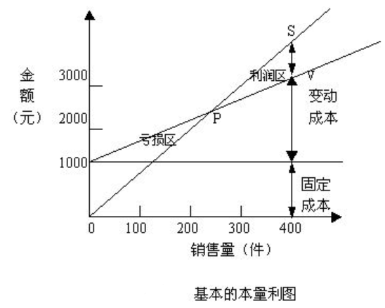

[TOC]

## 概述

本量利关系：成本、业务量、利润三者之间的相互依存关系
目的：通过分析短期内产品的销售量、价格、固定成本、变动成本以及产品结构等因素的变化对利润的影响，为企业管理层提供相关的信息

### 基本假定

就是进行本量利分析的前提条件：
1、销售价格固定：前提条件是产品处于成熟期，售价比较稳定
2、成本是线性的：总成本函数是一元线性方程 $y=a+bx$
3、产销平衡：产量与销量相等，实现产销平衡，都能卖掉，不会积压产品
4、销售组合固定：不同的销售组合，其利润肯定不一样，因此如果成本不一样，就需要重新分析

### 基本公式

$$
\begin{align*}
利润	&= 销售收入 - 变动成本 - 固定成本	\\
	 &= 销售价格 * 销售量 - 单位变动成本 * 销售量 - 固定成本	\\
	 &=（销售价格-单位变动成本）* 销售量 - 固定成本		
\end{align*}			
$$

销售价格为p，销售量为x，固定成本总额为a，单位变动成本为b，利润为P
$$
\begin{aligned}
P 	&= px-bx-a	\\
 	&= (p-b)x-a
\end{aligned}
$$

### 边际贡献及相关指标的计算

边际贡献：销售收入 - 变动成本
$$
\begin{aligned}
单位边际贡献（CM） &= 一份的销售收入 - 一份的变动成本	\\
				&=（p - b）		\\
\\

总额边际贡献（TCM）&= 销售收入 - 变动成本 	\\
				&= 单位边际贡献 * 销售量	 \\
				&= px-bx				\\
				&= (p-b)x				\\
				&= CM*x			\\

\\
营业利润（P）	&= 边际贡献 - 固定成本 	\\
			&= TCM - a			\\
			
\\

边际贡献率 	 &= \frac{边际贡献\ (TCM)}{销售收入\ (px)}*100\%	\\
			&= \frac{单位边际贡献\ (CM)}{销售价格\ (p)}*100\%	\\
			
\\

变动成本率 	 &= \frac{变动成本\ (bx)}{销售收入\ (px)}*100\%	\\
			&= \frac{单位变动成本\ (b)}{销售价格\ (p)}*100\%	\\
\\

边际贡献率 &+ 变动成本率 = 1

\end{aligned}
$$

## 本量利分析

### 盈亏平衡

处于盈亏平衡时，利润（P）为 0
$$
\begin{aligned}
盈亏平衡点、盈亏临界点、保本点：销售收入 &= 总成本 		\\
\\

利润（P）&= (p-b)x-a	\\

\\
盈亏平衡点销量（x） &= \frac{a}{p-b}					\\
				&= \frac{a}{CM}	\\
				&= \frac{固定成本}{销售价格 - 单位变动成本} \\
				&= \frac{固定成本}{单位边际贡献} \\
				
\\		

盈亏平衡点销售额 &= 销售价格 * 盈亏平衡点销量	\\
				&= p * \frac{a}{p-b}	\\
				&= a * \frac{p}{p-b}	\\
				&= a * \frac{p}{p-b}	\\
				&= a / \frac{p-b}{p} = a / \frac{CM}{p} 	\\
				&= a/边际贡献率
				
\\		
\end{aligned}
$$

### 本量利分析图

在直角坐标系上，反映不同业务量水平条件下的盈亏状态图形，又称盈亏平衡图，主要以下三种：

1、标准本量利图
2、边际贡献式本量利图
3、利量图

盈亏平衡点不变：销量越多，盈利越多。销量越小，盈利越少。甚至亏损

销售量不变：盈亏平衡点越低，盈利越多。盈亏平衡点越高，盈利越少。甚至亏损

销售收入即定：即顶天了，只能卖那么多。
	单位变动成本或固定成本总额越小，盈亏平衡点越低，且利润越高
	~						~						~大,  盈亏平衡点越高，且利润越低

### 安全边际分析

假设生产 500 个，需要先卖 200 个 才能回本，之后的 300 个能帮我赚钱。那么这 300 个就是安全边际量。
$$
安全边际量 = 预算（实际）销售量 - 盈亏平衡点的销售量	\\

\\

安全边际额 = 预算（实际）销售额 - 盈亏平衡点的销售额	\\

\\

安全边际率 = \frac{安全边际量（额）}{预算（实际）销售量（额）} * 100\%
$$

| 安全边际率 | 10%以下 | 10%-20% | 20%-30% | 30%-40% | 40%以上 |
| ---------- | ------- | ------- | ------- | ------- | ------- |
| 安全程度   | 危险    | 不安全  | 较安全  | 安全    | 很安全  |

利润是由安全边际提供的，只有超过盈亏平衡点的那部分销售量，才能提供利润
$$
\begin{align*}
营业利润 &= 安全边际量 * 单位边际贡献	\\
营业利润 &= 安全边际额 * 边际贡献率
\end{align*}
$$

### 保利分析

盈亏平衡时，$利润（P）= (p-b)x-a = 0$ ，保利分析即确保利润不低于某数。

预计资产平均占用额：就是这次投了多少钱
假设要求利润为 2000，求销售量，则 ：
$$
\begin{aligned}
目标利润 & = 预计资产平均占用额 * 投资报酬率	\\
利润（P）& = (p-b)x-a = 2000	\\
实现目标利润的销售量（x） & = \frac{固定成本 + 目标利润}{单位边际贡献} &= \frac{a + 2000}{p-b} \\
实现目标利润的销售额（x） & = \frac{固定成本 + 目标利润}{边际贡献率} &= \frac{a + 2000}{(p-b)/p}\\
实现目标利润的销售价格  & = 单位变动成本 + \frac{固定成本 + 目标利润}{销售量} \\
实现目标利润的单位变动成本  & = 销售价格 - \frac{固定成本 + 目标利润}{销售量} \\
实现目标利润的固定成本  & = （销售价格 - 单位变动成本）* 销售量 - 目标利润 \\
安全边际率 + 保本作业率 & = 1
\end{aligned}
$$
销售价格越低，必增加销售量和销售额才能实现目标
销售价格增长，可减轻目标销售量和销售额的压力

## 本量利与相关因素变动分析