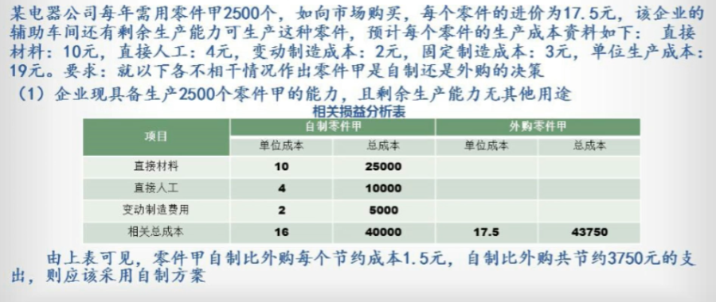

[TOC]

## 概述

特征：决策总是面向未来、要有明确的目标、要考虑人的因素

### 决策的分类

* 按决策对经营活动影响期的长短分：
    * 短期决策：对较短时间（一年以内）的经营活动产生影响，不涉及固定资产投资，只涉及经营过程中的如					何实现最大经济效益。
    * 长期决策：对较长时间（一年以上）的经营活动产生影响，涉及需要将大量的资金投资在固定资产方面。
                           由于时间跨度长，更多的要考虑货币时间的价值和不确定的因素。
* 按决策者所掌握的信息特点分类：
    * 确定性决策：只有一个确定的结果
    * 风险性决策：不止一个结果，但知道各个的概率
    * 不确定性决策：不止一个结果，但不知道概率
* 按决策方案之间的关系分：
    * 独立方案决策：每个方案独立存在，选择 A 方案，不会影响 B
    * 互斥方案决策：在两个或两个以上相互排斥的备选方案中选一个
    * 组合方案决策：受一定限制条件下从多个备选方案选出一组最佳组合方案

### 决策分析的程序

1. 确定决策目标：决策分析的出发点，首先要明确解决什么问题，达到什么目的三点要求：

    （1）目标要具体化，不能过于笼统抽象，以免被误解
    （2）目标要量化，尽可能用计量数量指标表达，通俗易懂
    （3）明确约束条件，充分揭示约束条件

2. 收集与决策目标相关的信息：针对决策目标广泛收集相关的信息，是决策分析程序中的重要步骤

3. 提出实现目标的各种备选方案：根据所确定的决策目标和掌握的信息，充分考虑现实与可能制定出

    ​													  实现目标的备选方案

4. 选择最满意方案：整个决策分析程序中最关键的步骤

5. 决策方案的实施和跟踪反馈

## 经营决策中的相关成本和无关成本

相关成本：某项特定决策方案，直接引起的未来成本支出
无关成本：不需要考虑的成本，不管使用哪一套方案均将会发生某项成本

相关成本的常见概念：

1. 增量成本：
    				   		狭义：因实施某项具体方案引起的成本，不采纳该方案，此成本不会发生。
                       广义：两个备选方案相关成本之间的差额，又称为差量成本。
2. 机会成本：决策分析的过程中，选择了某一方案而放弃另一方案所丧失的潜在收益。
                                      假设鱼8万，熊掌10万，但只能选一个，于是选了熊掌，那鱼就是机会成本
3. 重置成本：按照现行市场价格购买能力与某项现有资产相同或相似的资产所需要支付的成本
                                      5年前电脑买了1000元，现在同样配置买了800元，这就是重置成本。决策分析时要着重考虑。
4. 可避免成本：选择某一个特定的方案就可以消除的成本，如选择方案A，那方案B的成本就是可避免成本
                           变动成本都是可避免成本，一旦停止某项经营业务，这些费用就不会再发生
5. 专属成本：能够明确归属于某一特定决策方案的固定成本，属于决策方案的相关成本
                       只有选择某方案，才会发生的成本。如吃饭不用买保险，蹦极需要，保险的钱就是专属成本
6. 可分成本：在联产品或半成品的生产决策中，
                       已经分离的联产品或已产出的半成品进行深加工而追加发生的成本，
                       此成本是进一步加工方案必须考虑的相关成本
                       如挖黄金，挖出来炼成金砖要10w，继续加工成项链要5w，这5w就是可分成本

无关成本的常见概念：

1. 沉没成本：由过去的决策引起并已发生的实际支出，不是现在或将来决策所能改变的，属于历史成本
2. 不可避免成本：不论做何种决策都不能改变发生数额，与特定的决策方案无关，不管是否采用方案，都会发生
                               A方案5w，B方案8w，不可避免的就是5w
3. 共同成本：由多个方案共同负担，各方案间没有差别的成本，不论采用何种方案，发生额相同。
                       A方案5w，B方案8w，但是员工吃饭的伙食费与选哪个方案无关，伙食费就是共同成本
4. 联合成本：联产品在分离前的生产过程中发生的由所有联产品共同承担。
                       挖的金炼成金砖花了10w，后续一部分做成金链，一部分做成手镯，故这10w就是联合成本

## 经营决策分析方法

### 差量分析法

`AB方案的销售收入差 - AB方案的变动成本差 = 差量损益`，根据差量损益做比较

### 边际贡献分析法 p-b

AB方案的无关成本（固定成本）必须相同的情况下，才使用此方法。

`销售收入 - 变动成本 = 边际贡献`，根据比较 A、B 方案的边际贡献做出选择

### 本量力分析法 (p-b)x-a

`销售收入 - 变动成本 - 固定成本 = 本量力` ，根据比较 A、B 方案的本量力做出选择

在各方案固定成本相同时，可以使用边际贡献分析法，从而减轻计算量。反之建议使用本量力分析法

## 生产决策分析

指在短期内，围绕是否生产、生产什么、生产多少，及如何安排生产等方面进行决策，是企业经营决策的重要内容

### 特殊订单的决策

简言之，新订单有没有能力接，接受之后能不能比原来的订单更好。

* 在剩余生产能力**无其他用途**的情况下，如果接受特殊订单**不需要追加**专属成本，那么只要该特殊订单的**出价大于产品单位变动成本**，就可以接受该订单
* 在剩余生产能力**无其他用途**的情况下，接受特殊订单**需要追加**专属成本，那么接受该订单的条件是**边际贡献大于专属成本**（相关损益大于零）
* 剩余生产力能力具**有其他的用途**，那么应该将其他用途上产生的收益作为接受特殊订单的机会成本
* 特殊订单的订货数量**超过剩余生产能力**的生产量，则接受该订单会将正常销售量转入了该特殊订单，这种情况下将由此放弃正常销售产生的边际贡献，作为特殊订单的机会成本

### 亏损产品是否停产或亏损部门是否撤消的决策

原则：

1. 当亏损产品的生产能力没有其他用途时，只要亏损产品还能产生边际贡献就不应停产。（p-b > 0）
2. 当亏损产品的生产能力可以转作它用，即亏损产品停产后，闲置设备转他用，只要转产后产生的边际贡献大于亏损产品的边际贡献就可用这个方案。

### 自制或外购的决策（计算题）

只考虑相关成本，不考虑收入，考虑不可避免的固定成本，不考虑普通固定成本
如果剩余生产能力有其他用途，必须考虑机会成本

### 联产品是否进一步加工的决策

联产品：投入同一种原材料在同一生产过程中，同时生产出来的若干种经济价值较大的产品。

### 有限资源利用的决策（计算分析题）

## 风险和不确定条件下的生产决策分析

### 不确定性决策

1. 保守决策方法：A、B、C方案都做最坏打算，之后再从最坏打算中选收益最高方案。

也称悲观决策方法（小中取大法）,在几种不确定的结果中，选择最不利的市场需求情况下具有最大收益值的方案作为最优方案的一种决策方法。

2. 乐观决策方法：大中取大法，在都做乐观打算的情况下，再选择收益最好的方案
3. 折衷决策法：各方案的预期收益=该方案的最高收益值*α+该方案的最低收益值（1-α）

