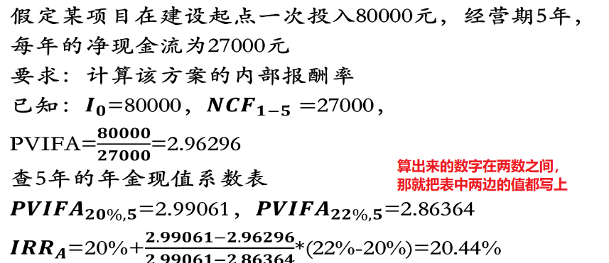

[TOC]


## 概述

类型：
	1、扩充型投资与重置型投资
		扩充型投资：对企业未来发展前景将产生长时间重大影响
		重置型投资：为了改进现有产品的工艺技术，改善企业的生产经营或状况，而做出的决策

​	2、独立方案与互斥方案
​		独立方案：作为评价对象的各个方案的现金流量是独立的任一方案的采用与否，都不影响其他方案是否采用
​		互斥方案：方案之间存在互不相容、相互排斥关系


## 长期投资决策分析的基本因素

### 货币时间价值

投资的一笔货币，就意味着放弃了使用或者消费的机会，按照放弃时间的长短，计算的代价或报酬就称为货币的时间价值，如利息

P：本金，F：本金和利息之和，i：表示利息，n：存款年数，利息计算的两种方式：
	单利：`F = P * (1 + i*n)`
	复利：`F = P * (1 + i)^n`，`F * 1/(1 + i)^n = P `

年金（A）：在一定时期内每隔相同时间就发生相同数额的收款或付款
分为：普通年金、先付年金、递延年金、永续年金
年金终值和现值计算：
$$
\begin{aligned}
& 年金终值公式：FVA_n = A * \frac{(1+i)^n - 1}{i} = A * FVIFA_{(i,n)}	\\
& 年金终值系数：FVIFA_{(i,n)} = \frac{(1+i)^n-1}{i}	\\
& 年金现值公式：PVA_0 = A * \frac{1-(1+i)^{-n}}{i} = A * PVIFA_{(i,n)}	\\
& 年金现值系数：PVIFA_{(i,n)} = \frac{1-(1+i)^{-n}}{i}
\end{aligned}
$$

```
复利终值系数FVIF : Future Value Interest Factor
复利现值系数PVIF : Present Value Interest Factor：n 年后 m 元，值现在的多少钱？
年金终值系数FVIFA : Future Value Interest Factor of Annuity 
年金现值系数PVIFA : Present Value Interest Factor of Annuity：每年存一笔，n年后一共多少钱？

现值 * 复利终值系数 = 终值
终值 * 复利现值系数 = 现值
年金 * 年金终值系数 = 终值
年金 * 年金现值系数 = 现值 （n年， 每年 m 万，站在现在算 n 年之后的这么多钱，值现在的多少钱）
```


### 现金流量（计算分析）

净现金流量是指：项目寿命期内，每年的现金流入量和流出量之间的差额，是投资项目决策评价指标的重要依据
现金流量在评价长期投资项目中具有如下几个方面的作用：
	1、有利于正确评价投资项目的经济效益；
	2、使投资决策更符合客观实际；
	3、有利于科学地应用货币时间价值

现金流入：CIF、现金流出：COF、净流入：NCF，`NCF = CIF - COF` 

确定现金流量应考虑的因素：
	1、对企业其他部门或产品的影响
	2、营运资金的需求,是指增加的流动资产,与增加的流动负债之间的差额,对营运资金的需求应视为新投资项目的现金流出
	3、全投资假设（将投资资金全部视为自有资金）


现金流量的估计：
	一、初始现金流量：指投资项目开始投资时所发生的现金流量，包括：
			（1）固定资产投资；
			（2）增加的营运资金；
			（3）其他投资费用；
			（4）原有固定资产的出售收入
	二、营业现金流量：投资项目建成投产后,在其经济寿命期内开展生产经营活动所带来的现金流入和流出,包括：
			（1）营业收入；
			（2）付现成本；
			（3）各项税款（新建项目只估算所得税）
	三、终结现金流量：投资项目寿命期结束时发生的各项现金回收。包括：
			（1）固定资产残值收入	 （现金流入
			（2）营运资金的收回 		（现金流入

营业净现金流量的计算公式：
$$
\begin{aligned}
& 各年营业现金净流量(NCF_t) = 该年营业收入 - 该年付现成本 - 该年所得税	\\
& 各年营业净现金流量(NCF_t) = 该年税后净利润 + 该年折旧 + 该年摊销额
\end{aligned}
$$


### 资本成本

资本成本：企业为筹措和使用资金所付出的代价，真实生活中为了找银行借 200w 而付出的代价，叫利息
资本成本通常包括：资金使用费、筹资费用
资金使用费用：向股东支付的股利、向债权人支付的利息等。
筹资费用：向银行支付的借款手续费，发行股票、债券支付的发行费资本成本一般用相对数来表示，资金使用费与实际筹得资金的比率。

债务资本成本的计算公式：`资本成本 = [利息费用 * (1 - 所得税率)] / (筹资数额-筹资费用)`


### 要求报酬率

指投资应该补偿其成本应获取的最低收益率，如投 100w ，至少要收回 110w，那 10w 就是要求报酬
资本加权平均成本：以单项筹资资本成本为基础，以各类资本所占比例为权数，计算公式如下：
$$
\begin{aligned}
K = \sum_{i=1}^nW_iK_i	\\
& K : 资本加权平均成本	\\
& W_i : 第i种资本来源所占比重	\\
& K_i : 第i种资本来源的资本成本 	
\end{aligned}
$$

```
如：	
	第一笔 100w 资本成本 5%
	第二笔 300w 资本成本 6%
	第三笔 100w 资本成本 8%
	
100 + 300 + 100 = 500(w)	
100/500 = 20%, 300/500 = 60% ....
K = 20% * 5% + 	60% * 6% + 20% * 8% = 6.2%
```


## 长期投资方案分析评价的基本方法

### 非折现的现金流量法（不考虑货币时间价值）

* 回收期法：根据投资项目的回收期长短进行投资决策
    投资回收期 (PP) 是指：投资项目寿命期内，各期的营业净现金流量，回收该项目原始投资总额所需时间（以年为单位），投资方案的投资回收期 < 企业期望的回收期 ? 接受投资方案 : 拒绝投资方案。

    ```
    回收期（各年相等） = 原始投资总额 / 每年相等的净现金流量
    回收期（各年不等） ：比如投资 20w, 各年净现金流量分别为：3、5、6、8
    				20 - 3 - 5 - 6 = 6 ，6/8 = 0.75 ，那就是 3.75 年
    ```

* 折现回收期法
    图中乙方案的 0 表实不赚钱、亏损

* 平均报酬率法：根据投资项目的平均报酬率高低进行投资决策的方法
    平均报酬率 (ARR) ，指一项投资方案的年平均净利润与初始投资额的比例，此比例越高，说明获利能力越强。
    `平均报酬率 = 年平均净利润 / 初始投资额`
    


### 折现的现金流量法（计算分析）

* 净现值 (NPV) 法：将各年的净现金流量按照要求的报酬率或资本成本折算为现值的合计
    投资方案的 NPV >= 0 ? 接受方案 : 拒绝方案，即流入大于流出就接受方案
    
    
    优点：
    	1、考虑了货币时间价值
    	2、考虑了项目寿命期内的全部净现金流量
    	3、考虑了投资的风险
    缺点：
    	1、不能揭示各个投资方案本身可达到的实际报酬率
    	2、净现值是一个绝对值，只能反映某个单独方案的投资与收益关系
    	3、投资者所要求的报酬率或资本成本的确定比较困难


* 获利指数 (PI) 法
    `获利指数(PI) = 经营期净现金流量的现值合计 / 初始投资额的现值合计`
    
    


* 内部报酬率 (IRR) 法：指一项长期投资方案在其寿命期内预期可达到的报酬率，实质是未来净现金流量的现值之和等于初始投资的现值之和的折现率，也就是投资项目的净现值等于零时的折现率。
  
    投资方案的 IRR ≥ 要求的报酬率或资本成本 ? 接受方案 : 拒绝方案

    


    




## 长期投资决策案例分析


