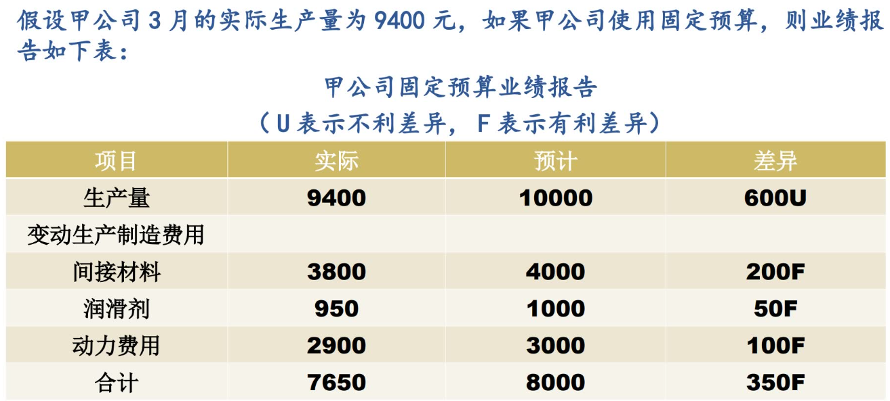

## 全面预算的意义和内容

* 意义：
    １、明确企业各级各部门工作的目标
    ２、是企业内部各部门间工作的协调工具
    ３、有助于收入提升与成本节约
    ４、提供了企业进行工作业绩评价的标准
* 特点：
    １、全员参与
    ２、全额预算
    ３、全程实施


### 预算内容：

#### 营业预算：

企业在预算期的日常经营活动，即生产和购销活动的相关预算，是具有实质性的基本活动预算
商业企业预算具体内容：
	1、根据销售预测编制的销售预算
	2、销售成本和存货预算
	3、购货预算
	4、预计损益表
制造业的营业预算包括：
	1、销售预算
	2、生产预算
	3、直接材料采购预算
	4、直接人工预算
	5、制造费用预算
	6、期末存货预算
	7、销售成本预算
	8、营业费用预算或称销售及管理费用费用预算
	9、预计损益表

#### 财务预算：

建立在营业预算基础上的，一系列专门反应企业未来一定预算期内有关投资和筹资、预计财务状况和经营成果、现金收支等价值指标的各种预算总称。
包括：资本支出预算、现金预算、预计资产负债表等


## 全面预算的编制

### 全面预算编制程序

1、明确的战略规划
2、预算委员会提出预算期的企业生产经营总体目标及各部门的具体任务，确定预算的总目标
3、编制分项预算草案
4、汇总上报分项预算草案，编制全面预算草案
5、确定全面预算
6、审议批准
7、下达执行
8、定期对预算执行情况进行分析，取得反馈用于决策


### 全面预算编制原理

* 销售预算：制造型企业生产经营预算的编制要以销售预算为出发点，进而编制生产、材料采购、存货、费用等预算

* 生产预算：以预计销售量和预计产成品存货为基础，可根据预计销售量和生产成品期初、期末的预计库存量确定

```
预计销售量 + 预计期末生产成品存货 = 预计可供销售量
预计生产量 = 预计可供销售量 - 预计期初生产成品存货
```

* 直接材料预算：以生产预算为基础编制的，显示计划年度直接材料数量和金额的计划

```
预计期末存货：是本期期末不是上期期末
预计生产量 * 单位产品材料耗用量 = 预计材料消耗量
预计材料消耗量 + 预计期末存货 = 需求合计量 
需求合计量 - 预计材料期初存货 = 预计材料采购量
```

* 直接人工成本预算：以生产预算为基础进行

```
预计生产量 * 单位产品直接人工小时 = 预计生产用人工总工时
预计生产用人工总工时 * 小时工资率 = 预计的直接人工成本
```

* 制造费用预算：除直接人工和直接材料以外的，产品生产过程中所有的其他间接成本预算。
    按照成本性态分为变动性和固定性两部分，固定性制造费用可在上年的基础上根据预算期变动进行适当修正。
    变动性制造费用根据预计生产量乘以单位产品预订分配率进行预测。

```
预计变动性制造费用 + 预计固定性制造费用 = 预计制造费用合计
预计制造费用合计 - 预付费用摊销、折旧等 = 预计需用现金支付的制造费用
```

* 单位生产成本预算：目的有二：
    一、为编制预计收益表提供产品销售成本数据；
    二、为编制预计资产负债表提供期末产成品存货数据。

* 销售及管理费用预算：
    包括预算期内将发生的除制造费用以外的各项费用，根据成本性态分为变动性和固定性，分别制作预算。
    销售及管理费用预算的依据是销售预算和生产预算。

* 其他现金收支预算：
    除生产经营过程中发生的现金收支外，其他业务发生的现金收入和支出。主要指长期投资方面的现金支出计划，包括固定资产投资预算、权益性资本投资预算和债券投资预算。

* 现金预算：根据以上各项预算中的现金收支预算资料进行编制

    ```
    期初现金余额 + 各项预算现金收入 = 当期筹资前可得到的现金合计
    当期筹资前可得到的现金合计 - 现金预算现金支出 = 现金多余（不足） 
    现金多余（不足）+ 现金的筹集（运用） = 期末现金余额
    ```

* 预计收益表：根据权责发生制编制，是最重要预算表之一，揭示企业预算的盈利情况。
    归集销售收入预算、生产预算、成本及制造费用、销售和管理费用预算，就可以编制预算的收益表。

* 预计资产负债表：反映预算期末企业财务状况的报表，在预算期初资产负债表的基础上通过对经营预算和现金预算中的数字做适当调整。可观察企业预期的财务状况，及时发现问题。


### 总预算案例解析


## 预算编制的其他方法

### 固定预算

特点：
	1、预算仅以某个估计的生产数量或销售数量为基础，不考虑实际产销量与预算销量发生的差异。
	2、在一个控制期内，当实际产销量已经确定，固定预算产销量不根据实际产销量进行相应调整。


### 弹性预算

为克服固定预算缺点而设计，在成本性态分析的基础上，分别按一系列可能达到的预计业务量水平而编制的能适应多种情况的预算。
特点：按一系列业务量水平编制，扩大预算的适用范围；按照成本性态分类列示，便于计算实际业务量的预算成本
编制：主要用于编制弹性成本、弹性利润
`弹性成本预算 = 固定成本 + 单位变动成本 * 业务量`
事先确定有关业务量变动的最高和最低限度，列出各项成本，就可推算出业务量相关范围内的各项预算成本
根据影响利润的有关因素和收入成本关系，反应变动时相应的预算利润。

### 滚动预算

发现不足，则更新预算，但每次更新都更新一年

优点：
	保持预算的完整性、持续性，从动态预算中把握企业未来。能始终对未来12个月的生产经营活动有所考虑，有利于生产经营稳定有序进行，减少预算编制中的不确定性，不断调整预算，有利于充分发挥预算的控制作用。

缺点：
	1.滚动预算系统要求在一个财务年度分多次编制，将消耗更多的时间、金钱。
	2.可能涉及到对标准成本修订，需要对存货计价调整。
	3.频繁的预算编制有可能给那些怀疑预算价值的管理者提供否定预算价值的借口。

### 零基预算

为区别于传统的增量预算而设计的一种编制费用预算的方法。编制预算时，不考虑以往情况，从零开始，根据必要性来确定预算期内的支出基本程序。

优点：
	1.有可能找出和去除低效率或过时的经营方式，引导员工避免浪费性支出；
	2.对所有项目进行成本效益分析，有利于合理地进行资源分配；
	3.支出中的过时项目将被找出并被抛弃。

缺点：
	1.过分强调短期利益，而损害长期利益；
	2.编制零基预算的工作量大，预算成本相对较高；
	3.各项费用支出预算等级的划分具有主观性，易引起部门间的矛盾。