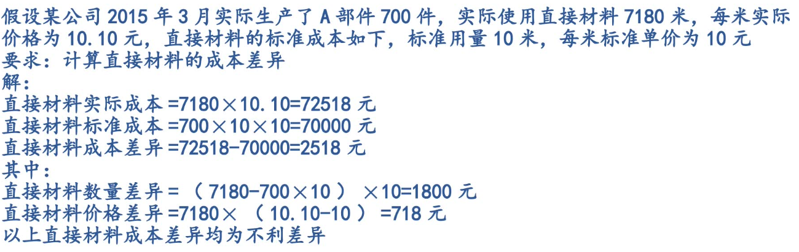
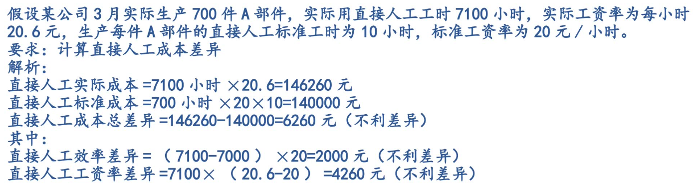
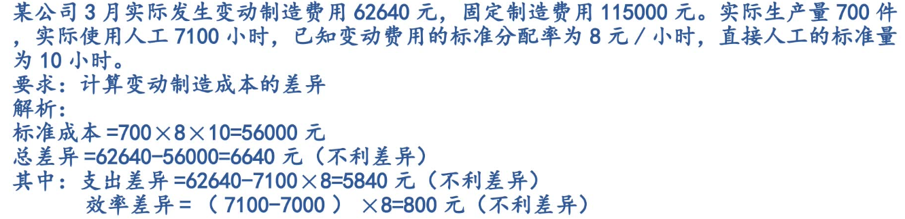
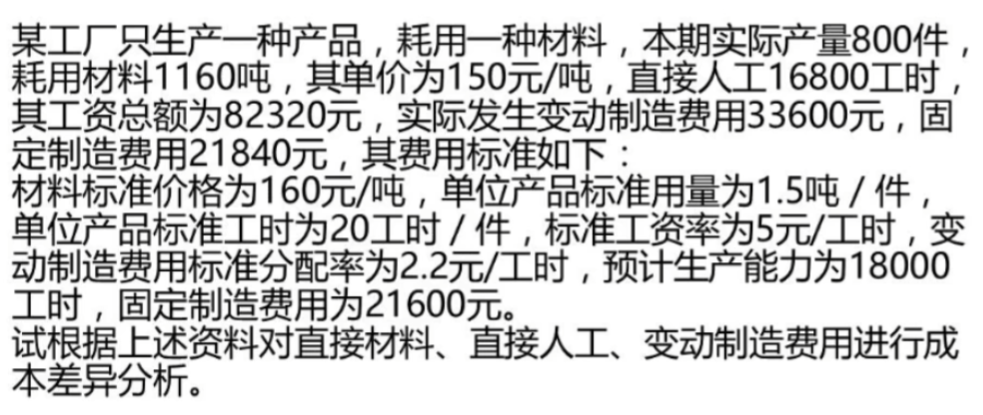
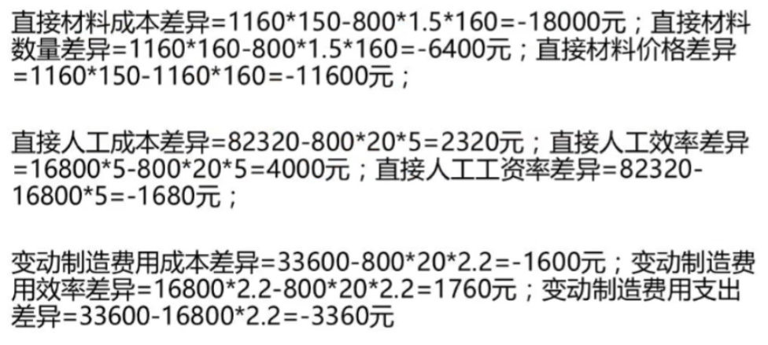

[TOC]


## 标准成本系统及其作用

### 标准成本系统

包含成本分析、成本控制、成本计算为一体的成本计算模式。
包括：成本标准的制定、成本差异分析、成本计算及账务处理


### 标准成本系统的作用

1、控制成本，提高成本管理水平标准成本是衡量正常成本水平的尺度
2、正确评价和考核工作成果，调动职工的积极性标准成本是在生产过程开始前综合分析所确定
3、为企业的预算编制和经营决策提供依据全面预算是一个企业实现短期利润目标、综合平衡实行全面控制的措施4、简化成本计算、为对外财务报表的编制提供资料


### 标准成本的类型

指产品生产过程中应发生的成本，即标准成本
	1、理想的标准成本（理想型）：就是最高要求的标准成本
	2、正常的标准成本（轻松达到）：在经营活动中，排除异常或偶然事件对成本水平的影响
	3、现行可达到的标准成本（稍稍努力）：在现行的生产经营条件下，在预计可能达到的开工率下，考虑了平均的先进技术水平和管理水平而确定的成本


### 实施标准成本系统的基本条件

1、工艺操作过程的标准化
2、健全的成本管理系统
3、全体员工成本意识的提高
举例：企业不允许免费打印


## 标准成本的指定

### 成本要素和标准成本计算的基本模式

产品成本包括直接材料、直接人工、制造费用，每一项的标准成本都包括数量标准和价格标准标准成本计算公式：`标准成本 = 数量标准 × 价格标准`


### 直接材料标准成本的制定

指直接归属于某种产品、构成该产品实体的原材料。
（1）直接材料的数量标准：是指在现有生产技术条件和正常经营条件下，生产单位产品所需要的各种直接材料的标准用量，包含生产过程中的损耗。
（2）直接材料的价格标准：是指产品生产所需各种材料的标准价格，包含成本价格和所需的采购费用直接材料成本公式：`直接材料成本=直接材料标准用量×直接材料标准价格`


### 直接人工标准成本的制定

是指可以直接归属到产品，为制造该产品而直接发生的人员工资。
（1）直接人工的标准工时：
指在现有生产技术条件下生产每单产品所需的直接人工小时
包含：所需用的工时、必要的间歇和停工时间、不可避免的废品需耗用的工时

（2）直接人工的标准工资率（工人工钱 / 每小时）
指每个直接人工标准工时应获取的工资额
`直接人工成本 = 直接人工标准工时 * 直接人工标准工资率`
产品加工需不同工资需不同工人加工时：`直接人工标准成本 = 各项作业标准工时 * 相应的标准工资率`


### 制造费用标准成本的制定

$$
\begin{aligned}
& 变动制造费用标准分配率(每件单价) = \frac{预算变动制造费用总额}{变动制造费用分配基础（指标）预计总数量}	\\
& 变动制造费用标准成本 = 变动制造费用标准分配率 * 分配基础分配用量(数量)	\\

& 固定制造费用标准成本分配率(每件单价) = \frac{预算固定制造费用总额}{固定制造费用分配基础（指标）预计总数量}	\\
& 固定制造费用标准成本 = 固定制造费用标准分配率 * 分配基础标准用量(数量)	\\

& 单位标准成本 = 直接材料标准成本 + 直接人工标准成本 + 变动制造费用标准成本 + 固定制造费用标准成本
\end{aligned}
$$


## 成本差异分析

实际成本与标准成本间的差异分为：价格差异、数量差异

价格差异计算模式（建立在实际投入数量基础上）：`价格差异 = 实际用量 * (实际价格-标准价格)`
注：直接人工的价格差异通常被称为工资率差异

数量差异计算模式（建立在标准价格基础上）：`数量差异 = (实际用量 - 标准用量) * 标准价格`
注：用于直接材料或直接人工时称为用量差异或效率差异

`实际成本 < 标准成本 ？有利差异 : 不利差异`


### 直接材料成本差异的分析

直接材料实际成本与标准成本间的差异，包括数量和价格两块差异

（一）直接材料价格差异：指直接材料实际价格偏离标准价格形成的差异
`直接材料价格差异 = 材料实际用量 * (实际价格 - 标准价格)`
（二）直接材料数量差异：指生产过程中直接材料实际耗用量偏离标准用量的差异
`数量差异 = (材料实际用量 - 材料标准用量) * 标准价格`




### 直接人工成本差异的分析

指直接人工实际成本与标准成本直接的差额，包括效率差异（数量）、工资率差异（价格）

（一）直接人工的工资率差异
指因直接人工实际工资率偏离预定的标准工资率而形成的差异
`工资率差异 = 实际工时 * (实际工资率 - 标准工资率)`

（二）直接人工效率差异是指因生产单位产品实际耗用的直接人工工时偏离预定的标准工时所形成的差异
`效率差异 = (实际工时 - 标准工时) * 标准工资率`




### 制造费用成本差异的分析

(一）变动制造费用差异（建立在实际产出量基础上）
指实际发生额与标准发生额之间的差额，包括支出差异（价格）和效率差异（数量）。

1、变动制造费用的支出差异，是指因变动制造费用实际分配率偏离标准分配率的差异
`支出差异 = (实际费用分配率 - 标准费用分配率) * 分配基础实际用量`
2、变动制造费用的效率差异是指因生产单位产品实际耗用的直接人工工时偏离预定的工时形成的差异
`效率差异 = (分配基础实际用量-分配基础标准用量) * 标准费用分配率`


（二）固定制造费用差异

1、固定制造费用支出差异
`支出差异 = 固定费用实际发生额 - 固定费用预算额`

2、固定制造费用生产能力利用差异

```
生产能力差异 	= 固定制造费用预算总额 - 按实际工时总数和标准分配率计算的固定制造费用
			= (分配基础预计用量 - 分配基础实际用量) * 标准分配率
```

3、固定制造费用效率差异
`效率差异 = (分配基础实际用量 - 标准用量) * 标准费用分配率`






## 成本差异处理和标准成本下的成本账务处理