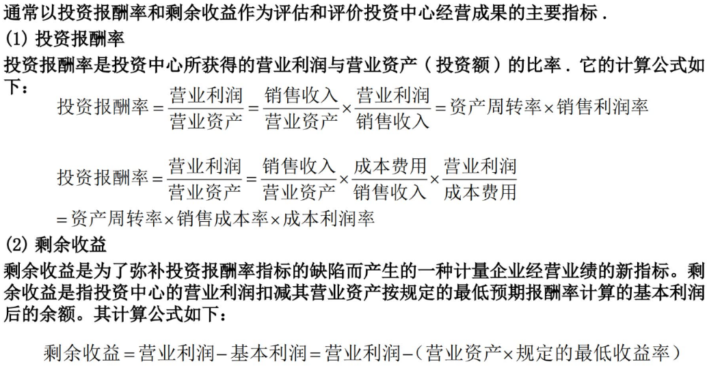
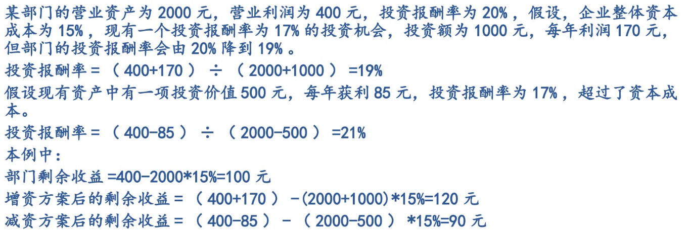

## 企业环境与分权管理

### 一、集权管理
把生产经营决策权较多的集中在其企业最高管理层，而下属单位就负责执行
优点：
	便于统一指挥
	有利于实现目标一致性
	有利于合理利用资源
缺点：
	下级职位处于被动，限制了管理人员主动性和积极性
	最高决策层难于监督，对市场变化反应慢
	部门之间的协调困难

### 二、分权管理
将生产经营决策权同相应的经济责任下放给下层管理人员，使其对日常经营活动做出及时的决策以适应市场变化。
优点：
	节约时间，让高层集中处理更重要事情
	反应的时效性
	下级管理人员的激励机制
缺点：
	可能会导致事业部与总部的职能失调
	指挥不灵活，增加成本
	管理费用公平分配的问题


## 责任中心

### 含义

在分权管理企业中，各宗承担与其经营决策权相适应的经济责任的组织部门或区域，称为责任中心。责任中心在会计制度上设定为有责任执行所规定活动的计量单位。即：
1、责任中心具有履行经济责任中各条款的行为能力
2、责任中心一旦不能履行经济责任，能对其后果承担责任。
四种表现形式：成本中心、收入中心、利润中心、投资中心

### 责任中心的基本特征：责、权、利相结合

具体说来：
1、拥有与企业总体管理目标相协调、且与其管理职能相适应的经营决策权；
2、承担与其经营决策权相适应的经济责任；
3、建立与其责任相配套的利益机制；
4、各责任中心的目标与企业整体目标协调一致。

### 成本中心

只对成本或费用支出承担责任的责任中心。其特点：
（1)只对生产经营过程中投人的成本或费用负责，无需对利润情况和投资效果承担责任；
（2)只对可控成本承 担责任；
（3)只对责任成本评价和控制。

### 利润中心
对利润负责的责任中心，它常被称为战略经营单位。它既要对收入负责，又要对成本费用负责。有两种类型：
1、自然的利润中心：可以像一个独立的企业那样，直接在市场上销售产品或劳务
2、人为的利润中心：在企业内部按内部转让价格“出售”产品和劳务
利润中心可以进行收支对比，使责任中心更容易看出责任履行情况和效益大小

### 投资中心

对投资负责的责任中心，一个就本身投资基础的盈利能力对最高层管理者负责的企业单位。
其特点是既要对成本、收入、利润负责，又要对利润与投资之间的比例关系、投资的效果、资本支出决策、存货储存量、顾客应收账款政策、坏账收回和材料采购负责。投资中心同时也是利润中心。


## 责任会计

三个特征：
（1）必须与组织策略和目标保持高度一致
（2）适应组织的结构及管理者不同的决策责任
（3）激励管理者及雇员


## 责任会计与业绩评价

### 成本中心的业绩评价

目标：在保质和保量完成生产任务或搞好管理的前提下控制和降低成本费用

成本中心的控制：
1、责任成本必须是可控成本
2、责任划分必须明确
3、各成本中心编制成本预算
4、建立责任成本计量体系

成本中心的业绩评价指标：
1、标准成本中心的业绩评价

```
预算成本节约额 = 预算成本 - 实际成本 
预算成本节约率 = (预算成本节约额 / 预算成本) * 100%
```

2、费用中心的业绩评价
一般以一定的业务工作量为基础，事先按期编制费用弹性预算来评价费用中心的成本控制业绩。


### 利润中心的业绩评价

目标：建立利润中心的主要目标，是通过授予必要的经营权和确立利润这一综合指标来推动和 促进各责任中心扩大销售、节约成本.努力实现自己的利润目标，促使企业有限的资金得到最有效的利用。

利润中心的控制要求：
1、各利润中心经营决策权的授权必须明确。
2、利润评价指标的确定要合理。
3、制定合理的内部转让价格。
4、建立利润中心评价体系。

利润中心的业绩评价指标：
企业通常以“边际贡献”作为利润中心的业绩评价指标。边际贡献指标用于责任中心业绩评价，还可引申分部经理边际和分部边际等指标。其计算公式分别为：

```
分部边际贡献 = 分部销售收入 - 分部变动成本  （分部可以理解为各部门）
分部经理可控边际 = 分部边际贡献 - 分部经理人员可控的固定成本
分部边际 = 分部经理可控边际 - 分部经理不可控的固定成本
分部税前利润 = 分部边际 - 分配来的共同固定成本
公司税前利润各分部税前利润总和
```


### 投资中心的业绩评价

目标：确保投资的安全回收和投资的收益率，以保证企业的规模和经营不断有所发展。

投资中心的控制要求：
1、投资中心的投资决策权必须落实。
2、利润中心的所有控制要求都适合投资中心。
3、投资决策讲究科学化。
4、各投资中心共同使用的资产必须划分清楚。
5、当企业是由几个投资中心组成的时候，每个投资中心的战略目标应与企业整体的目标保持一致。

评价指标：



基本利润可以理解为期待的利润，营业利润则为实际利润

剩余收益的优点：
	1、可以消除利用投资报酬率进行业绩评价所带来的错误信号，促使管理当局重视对投资中心业绩用金额的绝对数进行评价。
	2、有利于防止各投资中心的本位主义，便于实现部门目标与整体目标一致性。剩余收益的

缺点：
	1、剩余收益指标是绝对数指标，不便于不同规模的企业之间的比较，规模大的部门容易获得较大的剩余收益。
	2、剩余收益计算公式中含有净利润，因此它同样具有会计收益指标的固有缺陷。




## 企业内部转让价格的制定

内部转让价格的概念及作用：
企业内部各责任中心之间由于相互提供产品或劳务，为区分责任和评估业绩进行结算或转账所选用的一种价格标准

制定内部转让价格的一般管理作用在于：
1、明确各责任中心的经济责任。
2、使对各责任中心的业绩评价能建立在客观、可比的基础上。
3、通过它能够知道每个单位对企业做出的贡献。

内部转让价格的制定通常遵循以下两条基本原则：
1、凡成本中心相互之间提供产品或劳务，以及有关成本中心之间责任成本的转账，一般应以“标准成本”或“预计分配率”作为内部转让价格。
2、企业内部产品或劳务的转让以及责任成本的转账，凡是涉及利润中心或投资中心，应尽可能采用“市场价格”作为内部转让价格，此外也可选用“协商价格”、“双重价格”、“成本加成”等作为内部转让价格。

内部转让价格的类型包括：
1、以成本为基础的转让价格。
2、以市场为基础的转让价格。
3、根据协商价格制定转让价格。
4、双重内部价格。