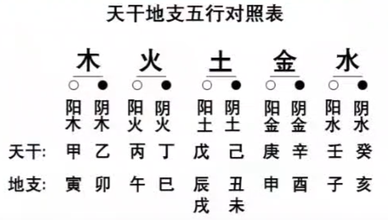
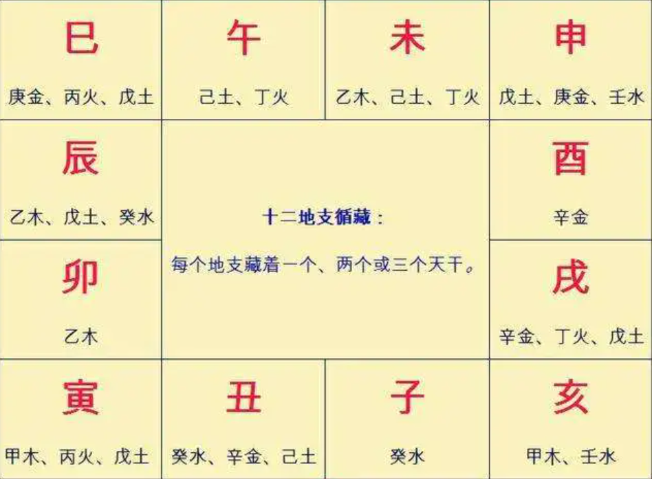
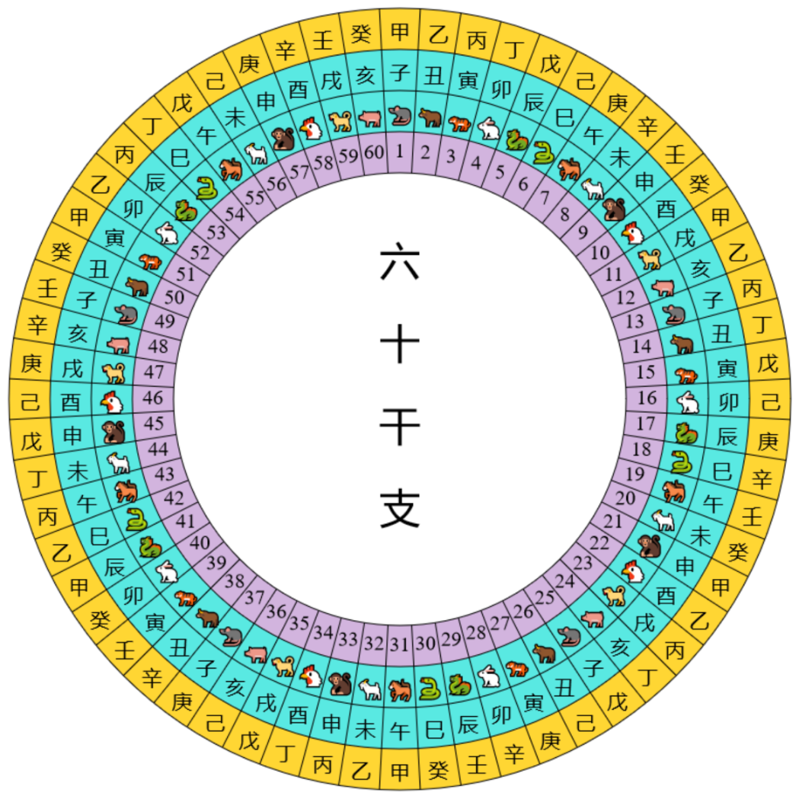

## 五行学说

甲、乙、丙、丁、戊、己、庚、辛、壬、癸
子、丑、寅、卯、辰、巳、午、未、申、酉、戌、亥
公元年求干支：$(公元年数 - 3)\ mod \ 60$，得到的数就对应 60 干支

相生：木火土金水
相克：木土水火金

六冲：子午冲，鼠马冲。 丑未冲，牛羊冲。 辰戌冲，龙狗冲
六合：子丑合。 卯戌合，巳申合，寅亥合，辰酉合，午未合
六害：卯辰害 ，丑午害 ，申亥害 ，寅巳害 ，子未害 ，酉戌害

## 排八字

确定年：立春之前属于上一年，立春之后属于今年。如某年为虎年，阳历 2月4日 立春，某人 2月3日 生，在立春之前生，那即便是阳历虎年生的，也要算做属牛

确定月：一年第一个节是立春，后大约半个月为第一个气是雨水，再后半个月到第二个节：惊蛰。不用管气，节与节之间为月份的始末。如立春到惊蛰属一月。

确定日：

