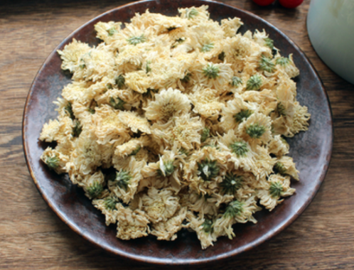
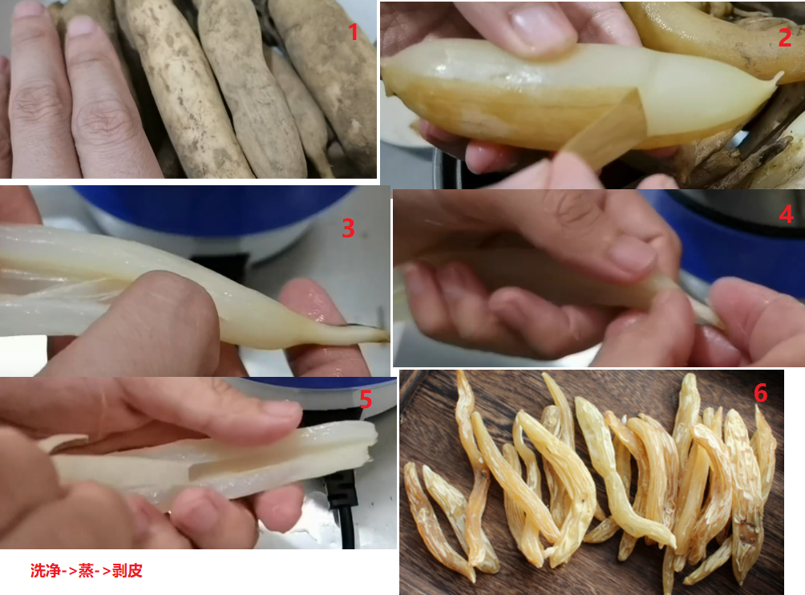

[TOC]


```
### 模板
**功效**：
**产地**：
**鉴别**：
**炮制**：
**价格**：
**注意**：
**性味归经**：
**用法用量**：
```


### 昌蒲（又称菖蒲，为石菖蒲）
**功效**：主风寒湿痹、宣窍泄热、开心孔补五脏、通九窍、健胃行滞、解巴豆大戟毒
**产地**：
**鉴别**：
**炮制**：拣去杂质，刷去灰尘，洗净晒干，去灰尘即得
**价格**：约 10元/斤
**注意**：忌饴糖羊肉铁器
**性味归经**：味辛性温无毒
**用法用量**：普通生用二三钱，干用五分至一钱半


### 鞠华（菊花）

**功效**：平肝熄风，主疏散风热兼明目，解毒平肝阳。菊花并茎叶打汁，可治疔疮，内服外涂均可
**产地**：处处有之，种类繁多，黄白二种入药，味苦，家庭玩赏之菊不入药，今杭州出产多，号称杭菊。
**鉴别**：
**炮制**：拣去杂质及梗叶，拍去灰尘即得。
**价格**：约 40元/半斤
**注意**：味苦辣者，陈久者，不堪用
**性味归经**：甘、苦，微寒无毒。入肺、肝经
**用法用量**：普通一钱至三钱




### 人参

**功效**：为大补元气要药，主五劳七伤，病后气血两虚者佐他要调理
**产地**：我国吉林辽宁产者最良，山西长子县云南姚安县安徽舒城县亦有出产，高丽产出丰。
**鉴别**：
**炮制**：用湿布包裹，焖润用火烤，再晾干或烘干即可。
**价格**：多人工栽培约 330元/斤，唐容川曰可用黄耆甘草代人参，方剂中常用党参代人参，党参约 80元/斤
**注意**：补能恋邪，反藜芦
**性味归经**：味甘微苦，性微寒，无毒，入肺、脾经
**用法用量**：普通五分至三钱，大剂一两。


### 天门冬
**功效**：清虚热润燥痰，主心病嗌干，心痛渴欲饮，益肌肤
**产地**：
**鉴别**：
**炮制**：拣去杂质，洗净晒干即得。
**价格**：约 100元/斤
**注意**：胃虚无热及泻者均忌，忌鲤鱼。
**性味归经**：甘、苦、寒、入肺经肾经
**用法用量**：普通一钱至三钱




### 甘草
**功效**：能解百毒，补脏腑，泻诸火，在上去痰止咳，在中调和脾胃，在下清热利溲，入和剂则补益，入汗剂则解肌，入凉剂则泻热，入润剂则生津，入峻剂则缓正气，制药之暴性，效益甚多，为诸药之君。
**产地**：
**鉴别**：
**炮制**：徐灵胎曰生用泻火，解毒炙用，和中益气。倪海厦曰解毒生用即可，炙后强心
**价格**：甘草约 20元/斤，蜜炙甘草约 24元/斤
**注意**：凡中满人呕家酒家，诸湿肿满及胀满均忌，反大戟甘遂芫花海藻，恶远志忌猪肉。
**性味归经**：味甘性平无毒
**用法用量**：普通生者五分至钱半，炙者三分至一钱，大剂一两左右


### 干地黄
**功效**：凉血生血，滋肝肾除肤燥，养心益肺，通血脉逐血痹。
**产地**：
**鉴别**：
**炮制**：
**价格**：约 40元/斤
**注意**：凡病人脾胃弱，大便泄，产后不食或泻，及胸膈多痰，气道不利者均忌，忌铜铁及茶，得清酒麦冬良。
**性味归经**：味甘性寒无毒
**用法用量**：倪海厦曰女用生地助凉血，男用熟地助生津滋阴。普通二钱至四钱，大剂二三两。


### 白术
**功效**：理胃益脾，和中调气，治心下水痞
**产地**：以浙产之油质最厚，可补脾之膏油
**鉴别**：白术补脾补气（打包），茯苓渗湿利尿（带走），苍术燥湿发汗
**炮制**：
**价格**：约 40元/斤
**注意**：凡病属阴虚血少，精不足，内热骨蒸，口干唇燥，咳嗽吐痰，吐血鼻血，齿血，咽塞，便秘，滞下均忌，溃疡用之反生脓作痛，忌与蛤雀桃李菘菜青鱼同食。
**性味归经**：味苦甘性温无毒，入脾经、胃经
**用法用量**：普通半至三钱，大剂二三两。外用托疡疮。


### 菟丝子
**功效**：补肾益精；接续筋骨；养肝明目；固胎止泄；治茎中寒，精自出，溺有余沥，腰痛膝冷
**产地**：
**鉴别**：
**炮制**：
**价格**：约 30元/斤
**注意**：肾家多火，阳强不痿（不倒），及大便燥急者，均忌，得酒良。
**性味归经**：味辛甘，性平无毒，入肝经、肾经
**用法用量**：普通一钱至三钱


### 牛膝
**功效**：补肝肾，强筋骨，逐瘀通经，舒筋行血，引水火及诸药下行，降气堕胎，治膝痛，落死胎。
**产地**：
**鉴别**：
**炮制**：
**价格**：川牛膝约 60元/斤，怀牛膝约 50元/斤
**注意**：误用必伤胎，经闭未久，疑有妊者忌。上焦药中、梦遗失精、脾虚下陷、血崩不止亦忌。忌牛肉牛乳。
**性味归经**：味苦酸性平无毒，入肝经、肾经
**用法用量**：普通三钱，病重或体壮者加至五六七八钱亦可


### 充蔚子（充蔚、益母草）
**功效**：主明目益精，除水气，通调月经，疗血逆，可做浴汤主瘾疹痒，除大热头痛心烦
**产地**：
**鉴别**：
**炮制**：
**价格**：益母草约 5元/斤
**注意**：此为味辛性微寒之药，故血崩及瞳子散大均忌，唯热血欲贯瞳仁者（眼睛里有红血丝），可与凉药同用。
**性味归经**：味辛苦，性微寒，无毒，入心包经、肝经
**用法用量**：外用消恶毒疔肿乳痈丹游等毒，鲜叶捣汁敷之即可。汤剂普通一钱至三钱。


