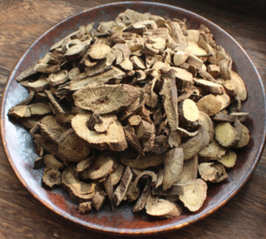

[TOC]


```
### 模板
**功效**：
**产地**：
**鉴别**：
**炮制**：
**价格**：
**注意**：
**性味归经**：
**用法用量**：
```


### 女萎（玉竹）
**功效**：治风热风湿入肌作痛要药，主邪热头痛、腰痛身痛、补劳伤可养阴润燥，如肺胃阴伤等，久服去面黑皯
**产地**：
**鉴别**：有带皮、纯肉、野生之分
**炮制**：
**价格**：野生玉竹约 60元/斤（带皮），非也生纯肉约 70元/斤，一般约 35元/斤（带皮）
**注意**：畏咸卤
**性味归经**：味甘性平无毒，入胃经、肺经
**用法用量**：普通二钱至四钱，大剂二三两。


### 防葵
**功效**：主疝瘕，肠泄，膀胱热结，溺不下，咳逆，温疟，癫痫，惊邪狂走，久服坚骨髓
**产地**：
**鉴别**：
**炮制**：
**价格**：
**注意**：
**性味归经**：辛、寒、无毒，入肺、肝、脾、胃、肾五经。
**用法用量**：煎汤，三钱


### 茈胡（柴胡）
**功效**：主心腹，去寒热邪气，推陈致新，其性轻扬，能逐半表半里之邪，治热劳骨蒸烦疼、胸胁苦满、往来寒热
**产地**：分南北两种，性味相同，产陕西银州者曰银柴胡，色黄白而大，凡热在骨髓者，非此不除
**鉴别**：开小黄花者，乃为真柴胡
**炮制**：
**价格**：山西产北柴胡约 80元/斤
**注意**：
**性味归经**：苦，性平，无毒。归肝、胆经
**用法用量**：普通八分至一钱，体壮者大剂三四钱
汪昂曰凡胁痛，多属肝旺，宜小柴胡汤，可加青皮、川芎、白芍等行气活血。左胁痛活血行气，右胁痛宜消食行痰


### 麦门冬（麦冬）
**功效**：润肺清火要药，主治肺中伏火，痰多，心腹结气，肺弱胃弱，津少口渴，止咳嗽，疗肺病吐脓血
**产地**：
**鉴别**：
**炮制**：
**价格**：约 80元/斤
**注意**：寒咳勿用
**性味归经**：甘、微苦，微寒。入心、肺、胃经
**用法用量**：普通一钱至三钱


### 独活
**功效**：为风痛要药，主治头痛身痛脚痛，机关不利，风湿诸痹。去肾间风邪，搜肝风，泻肝气，治项强，腰脊痛
**鉴别**：
**炮制**：
**价格**：40元/斤
**注意**：凡血虚发痉，血虚头痛，及遍身疼痛，骨痛，因而带寒热者，均属内症，均忌，误用必反剧。
**性味归经**：味辛苦，性温，无毒，归肝、肾、膀胱经。
**用法用量**：普通一钱至三钱，五六钱亦可，多可一两


### 车前子
**功效**：利水通淋，渗湿止泻，清肺肝风热，渗膀胱湿热。
**产地**：
**鉴别**：
**炮制**：
**价格**：约 70元/斤
**注意**：虚寒，内伤劳倦，阳气下陷者忌，肾气虚脱者忌与淡渗药同用。
**性味归经**：甘，寒，无毒。归肝、肾、小肠、肺经
**用法用量**：普通钱半至三钱


### 木香
**功效**：行气散郁，主气郁寒积，胞胁胀满，脾胃失行，哎吐腹泻。消痞积，辟毒疫温鬼，强志，久服不梦寤魇寐
**产地**：
**鉴别**：
**炮制**：
**价格**：川木香约 40元/斤
**注意**：肺虚有热，元气虚脱，及阴虚内热，诸病有热，心痛属火，均忌。
**性味归经**：味辛苦，性温无毒，入肺经、脾经、肝经
**用法用量**：普通五分至二钱
弘景曰：
木香丸（香附黄柏胡黄连木香），治腹痛食伤，气郁作痛，诸虫痛，盖佐以苦寒之药，则不仅治冷痛也
香连丸（木香黄连）治痢疾为调和之剂
木香丸（木香附子卤砂）治寒疝绕脐作痛，结鞭不消
木香饼（生地木香作饼），热熨贴之，治结肿成核，消乳中结核酸痛等，均有灵效




### 署豫（山药、淮山）
**功效**：补虚扶弱清虚热，疗健忘遗精，生捣敷痈疮，消肿硬。
**产地**：
**鉴别**：
**炮制**：
**价格**：约 60元/斤
**注意**：恶甘遂，不宜与面同食
**性味归经**：甘、温、平、无毒。入肺、脾、肾经；不燥不腻；
**用法用量**：普通三钱至五钱


### 薏苡仁
**功效**：除湿行水，利肠胃，消水肿，祛风湿。主治浮肿，养胃舒筋，除湿泄热。
**产地**：
**鉴别**：
**炮制**：
**价格**：约 16元/斤
**注意**：大便燥结，因寒转筋，及孕妇忌
**性味归经**：味甘淡，性微寒，无毒
**用法用量**：五钱起驾，一两二两三两亦可


### 泽泻
**功效**：渗湿利尿，宣通水道，泄热通淋，去旧水，养新水，补虚损，通淋沥，止遗泄
**产地**：
**鉴别**：
**炮制**：
**价格**：约 30元/斤
**注意**：凡病人无湿无饮而阴虚，及肾气乏绝，阳衰精自流出，肾气不固，精滑目痛，虚寒作泄等候，均忌
**性味归经**：味甘咸，性寒无毒，入肾经、膀胱经
**用法用量**：普通一钱至三钱，病重五六钱亦可
著名方剂有：
疏凿饮（泽泻商陆赤小豆羌活大腹皮椒目木通秦艽茯苓槟榔生姜）治水气通身浮肿，烦燥喘渴，小便不利
泽泻汤（泽泻五两白术二两）治心下有支饮其人苦冒眩者
五苓散（茯苓猪苓白术泽泻肉桂）治水分有热，小便不利，烦渴或水饮内停，脐下悸者
苍术加泽泻解酒


### 远志
**功效**：益智宁心，补心通窍，散心中之滞血，益智慧，耳目聪明不忘。煎汁饮，可杀天雄附子乌头毒
**产地**：
**鉴别**：
**炮制**：
**价格**：去芯远志约 120元/斤
**注意**：凡心经有实火为心家实热应用黄连生地者，禁与参术等助阳气药物同用，畏珍珠藜芦得茯苓良
**性味归经**：味辛苦性温无毒，入心经、肾经
**用法用量**：普通四五钱


### 龙胆（龙胆草）
**功效**：涤邪火除湿热，去肠中小虫，主治肝火胆火胃火，下焦湿热。若睛赤肿胀，可酒浸使之上行外行
**产地**：
**鉴别**：
**炮制**：洁古曰下行之功与防己同，酒浸则能上行外行。（泡在酒里2小时再拿出来）
**价格**：约 80元/斤
**注意**：胃虚血少，脾胃两虚作泻，病虚有热均忌。因性大寒故不可久服，恐伤胃气
**性味归经**：味甘涩，性大寒，无毒。入胆经、肝经
**用法用量**：普通三钱，视排便次数加减


