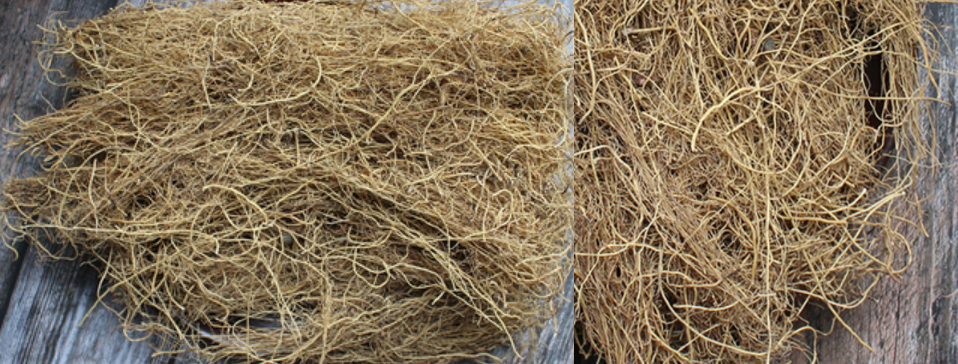
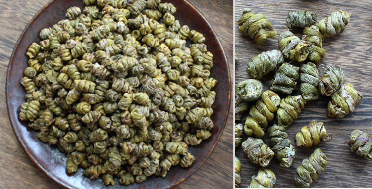
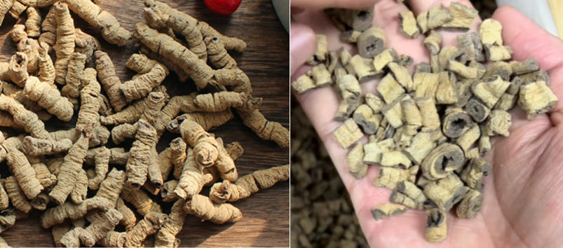
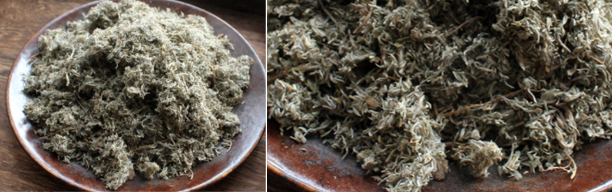
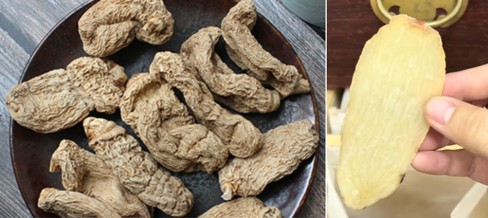
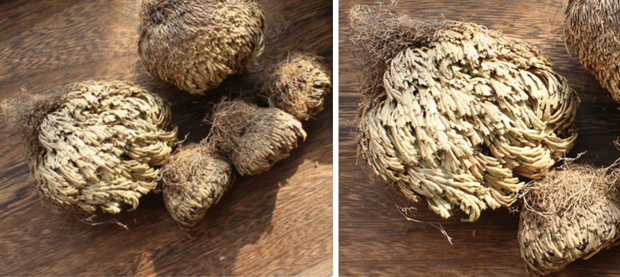
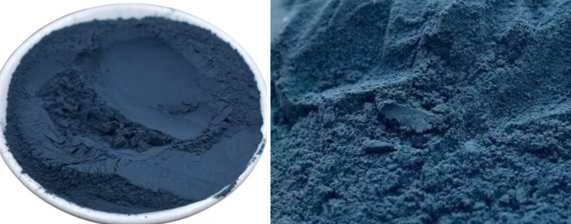

[TOC]

### 细辛
**功效**：入水中之阳，散风袪寒，主痰饮咳逆，风冷头痛，风湿痹痛，开窍行水。治水气在心下而咳满或上逆或胁痛
**产地**：
**鉴别**：
**炮制**：
**价格**：约 100元/斤
**注意**：升燥发散性烈，凡内热及火升炎上，上盛下虚，气虚有汗，血虚头痛，阴虚咳嗽，均忌。
**性味归经**：味辛性温，入肺经、肾经，岐伯曰无毒
**用法用量**：一钱起价，视体格大小及服后反应，二钱三钱逐渐加之
吴克潜曰细辛主治诸痛，但用不可过剂。
宗奭曰治头面风不可缺此。
元素曰以独活为使，治少阴头痛如神。
张子和曰治头痛，太阳经则羌活，少阴则细辛，阳明则白芷，厥阴则川芎吴萸，少阳则柴胡。
成无己曰胆气不足，细辛补之。

### 石斛
**功效**：除热益阴，补五脏虚劳羸瘦，主养脾胃，益心肾，补虚劳，退虚热，治自汗盗汗，小便余沥，脚痛痹弱。
**产地**：
**鉴别**：
**炮制**：
**价格**：铁皮石斛约 500元/斤
**注意**：多服能寒胃，至大便溏薄，入姜一二片为辅，则无此弊，清肺补脾也，恶凝水石巴豆，畏雷丸僵蚕。
**性味归经**：味甘性平无毒，入胃经、肾经
**用法用量**：普通一钱至三钱

### 巴戟天
**功效**：补气益精，祛风除湿，祛鬼邪，疗泄精，头面游风，阴痿不起，小腹及阴中相引痛。
**产地**：
**鉴别**：
**炮制**：
**价格**：约 90元/斤
**注意**：遗精滑精阳痿者宜，虚火者忌
**性味归经**：味辛甘，性微温，无毒，入肝经、肾经
**用法用量**：三钱起价，一两亦可

### 白英
**功效**：解热药，治风疹，丹毒，黄疸及热疟。有补益之效
**产地**：
**鉴别**：
**炮制**：
**价格**：约 20元/斤
**注意**：
**性味归经**：苦寒无毒，入胃经、肝经
**用法用量**：

### 白蒿（茵陈）
**功效**：主五脏邪气风寒湿痹，补中益气，长毛发令黑，疗心悬少食常饥，久服轻身耳目聪明不老
**产地**：
**鉴别**：
**炮制**：
**价格**：
**注意**：约 20元/斤
**性味归经**：味甘平，无毒
**用法用量**：

### 赤箭（天麻）
**功效**：助阳气，开窍通血脉，祛风镇痉，治诸风头痛头眩，风湿痹，语多恍惚，小儿精痫拘挛
**产地**：
**鉴别**：
**炮制**：
**价格**：约 300元/斤
**注意**：风药多燥，风能胜湿故也。凡病人觉津液少，口干舌燥，咽干痛，大便涩，火炎头晕，血虚头痛，似中风症皆忌
**性味归经**：味辛性平无毒，入肝经
**用法用量**：普通八分至二三钱
东垣曰肝虚不足者，天麻川芎以补之。
罗天益曰眼黑头眩，风虚内作，非天麻不能治，因此天麻有养血之功。
汪昂云风药中必兼养血药，以制其燥，养血药须兼收风药，宣其滞也。
古云治风先治血，血行风自灭。举凡能宣血之滞，故能发痘疹

### 奄闾子
**功效**：治扑打损伤效，主五脏瘀血，风寒湿痹，男子阴痿不起，妇人月水不通
**产地**：
**鉴别**：
**炮制**：
**价格**：
**注意**：罕有用于调理者
**性味归经**：味苦性微寒，无毒
**用法用量**：普通一钱至三钱，内服外敷均可

### 析蓂子
**功效**：【本经原文】味辛微温，主明目目痛泪出，除痹痛，补五脏益精光，久服轻身不老
**产地**：
**鉴别**：
**炮制**：
**价格**：
**注意**：
**性味归经**：
**用法用量**：

### 蓍（shī ）实
**功效**：明目聪慧先知
**产地**：
**鉴别**：
**炮制**：
**价格**：
**注意**：
**性味归经**：味苦平，无毒。
**用法用量**：

### 赤芝黑芝青芝白芝黄芝紫芝
赤芝，味苦平，主胸中结，益心气，补中，增慧智，不忘，久服轻身不老，延年神仙。一名
丹芝。生霍山。
黑芝，味咸平，主癃，利水道，益肾气，通九窍，聪察，久服轻身不老，延年神仙。一名元
芝。生恒山。
青芝，味酸平，主明目补肝气，安精魂，仁恕，久服轻身不老，延年神仙。一名龙芝。生太
白。
白芝，味辛平，主咳逆上气，益肺气，通利口鼻，强志意，勇悍，安魂，久服轻身不老，延
年神仙。一名玉芝。生华山。
黄芝，味甘平，主心腹五邪，益脾气，安神，忠信和乐，久服轻身不老，延年神仙。一名金
芝。生嵩山。
紫芝，味甘温，主耳聋，利关节，保神，益精气，坚筋骨，好颜色，久服轻身不老，延年神
仙。一名木芝。生高夏地上，色紫形如桑。
六芝皆无毒，六月八月采。

### 卷柏
**功效**：主女子阴中寒热，痛，症瘕，血闭，绝子。通月经，除面皯，暖水脏。
**产地**：
**鉴别**：
**炮制**：生用性平，主破血通经。炙用性温，止血兼治肠风脱肛
**价格**：约 18元/斤
**注意**：
**性味归经**：味辛性平无毒
**用法用量**：普通一钱至三钱

### 蓝实（青黛）
**功效**：解散热毒，散五脏郁火，敷热疮虫蛇犬咬，头生黄水疮，解狼毒、射罔毒，治小儿丹毒。
**产地**：
**鉴别**：
**炮制**：
**价格**：约 30元/斤
**注意**：凡血证非血分实热，而由阴虚内热，阳无所附者、寒凝者忌
**性味归经**：味咸性寒无毒，入肝经
**用法用量**：内服三分至钱半(五分)

