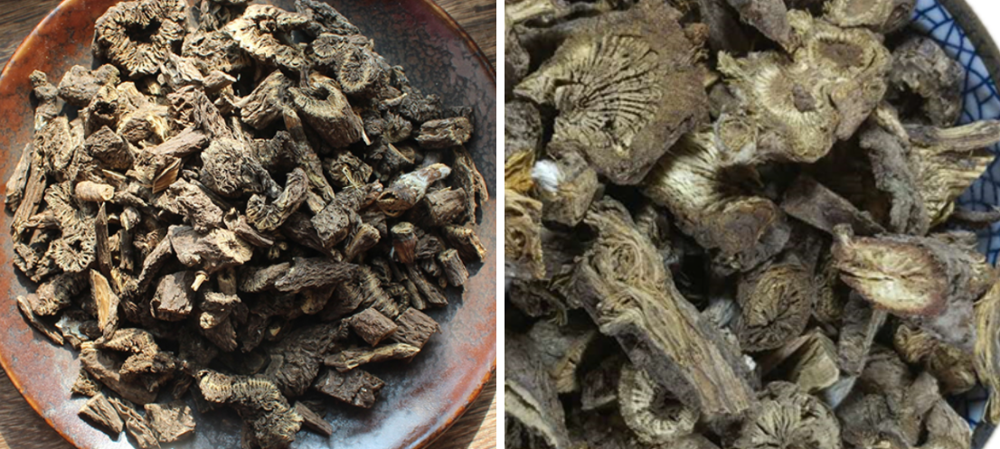

[TOC]

### 芎穷（川芎）

**功效**：行气开郁，入肝理血。上行头目，下行血海。主散风寒，气滞血瘀，经闭不通，补肝散风
**产地**：产四川陜西及江南各地，为多年生草本，或自生或栽种，根为块状结节，味辛烈，入药。
**鉴别**：
**炮制**：
**价格**：约 40元/斤
**注意**：其性疏散，不宜久服，反能损肝，畏黄连，伏雌黄
**性味归经**：味辛性温无毒，入肝、胆、心包经
**用法用量**：普通三钱至钱半

### 蘼芜（川芎之苗）
【本经原文】味辛性温，主咳逆定惊气辟邪恶，除蛊毒鬼注，去三虫，久服通神。即川芎之
苗也。
【别录】身中老风，头中久风，风眩。
【苏颂】作饮止泄泻。
【时珍】蘼芜花入面脂用。

### 黄连
**功效**：清火除湿健胃，治湿滞，解热毒，益肝胆，厚肠胃。主治心中烦悸，旁治心下痞，敷之消脓疗口疮
**产地**：
**鉴别**：
**炮制**：
**价格**：约 150元/斤
**注意**：血少气虚，致惊悸烦燥，小儿痘疮阳虚作泄，行浆后泄泻，老人脾胃虚寒泻，真阴不足内热均忌。
**性味归经**：味苦性大寒无毒，入胃经、心经、肝经、大肠经
**用法用量**：普通一钱至三钱。敷五倍子亦可疗口疮

### 络石（络石藤）
**功效**：主风热死肌，刀斧伤疮，痈肿不消，水浆不下。能凉血退热，舒筋活络。服汁并敷之，愈蝮蛇疮毒心闷
**产地**：
**鉴别**：
**炮制**：
**价格**：约 12元/斤
**注意**：寒者忌。喉痹肿塞、喘息不通须臾欲绝，用络石草一两，水煎一大碗，细细吞下，少顷即通
**性味归经**：味苦性微寒，无毒，入肝经、肾经
**用法用量**：内服二三钱，重病如水浆不下，一两亦可，若未效，硝石

### 蒺藜子
**功效**：主恶血，利湿，破症结积聚，喉痹乳难。白疾藜治睛球凹陷，及睛生障翳，视物模糊
**产地**：
**鉴别**：
**炮制**：
**价格**：白蒺藜约 30元/斤
**注意**：
**性味归经**：味苦性温，入肝经
**用法用量**：
腰脊引痛——捣末为蜜丸，胡豆大，酒服二丸日三。
年久失明——阴干捣散，食后水服方寸匕。（外台）

### 黄耆（黄芪）
**功效**：助肺气实皮毛，排脓止痛，升提疮口补肌肉，女人子脏冷，益气破症癖瘰疬瘿赘，行三焦、肌表之水
**产地**：
**鉴别**：
**炮制**：
**价格**：约 60元/斤
**注意**：黄耆功能实表，有表邪者忌，又能塞补不足，胸膈气闭闷，肠胃有积滞者忌，又能补阳，
			阳盛阴虚者忌，上焦热甚，下焦虚寒，及病人多怒肝气不和，并痘疮血分热者均忌。
**性味归经**：味甘性微温无毒。入肺经、脾经
**用法用量**：普通生者钱半至三钱，炙者八分至三钱，大剂一二两。

### 肉松容（肉苁蓉）
**功效**：男子绝阳不兴，女人绝阴不产，益精壮阳，阳痿不举，妇人症瘕，润枯燥，滑大肠
**产地**：
**鉴别**：
**炮制**：
**价格**：约 130元/斤
**注意**：凡泄泻，肾中有热，强阳易兴而精不固者均忌，忌犯铁器
**性味归经**：味甘酸咸，性温无毒，入肾经、大肠经
**用法用量**：普通二钱至四钱，自己吃可一两
**酒制**：取肉苁蓉片，加白酒调匀，置密闭容器内，隔水蒸至酒被吸尽，停火稍闷，取出晒干即得。一般酒制后，较能温肾助阳。

### 防风
**功效**：专治风邪，周身痛，善表散故可解毒，如诸毒药、野菌毒。制黄耆，其得防风而功最大，治风邪久留
**产地**：
**鉴别**：
**炮制**：
**价格**：约 40元/斤 ，野生约 280元/斤
**注意**：似中风，产后血虚发痉，诸病血虚痉急，头痛不因风寒，溏泻不因寒湿，二便秘涩，小儿慢惊，阴虚盗汗，阳虚自汗，均忌。
**性味归经**：味甘辛，性温，无毒。入脾经、肝经、膀胱经
**用法用量**：普通一钱至三钱，一两亦可
徐之才曰得葱白行周身，得泽泻橐本疗风，得归芍阳起石禹余粮治妇人子脏风
元素曰治风去湿之仙药也。

### 蒲黄
**功效**：凉血活血散结除热排脓，止女子崩中带下，月侯不匀，利水道，通经络
**产地**：
**鉴别**：
**炮制**：生用消瘀通经，疗扑打损伤，炒黑用止血止崩，止带止遗。
**价格**：约 70元/斤
**注意**：一切劳伤发热，阴虚内热，无瘀血者忌
**性味归经**：味甘辛，性平，无毒。入心经、肝经
**用法用量**：内服普通七分至二钱，外用宜炒黑
蒲黄配合五灵脂，治产后腹痛，产后血晕，不省人事，亦治妇人痛经，单用炒黑，止一切血均效。

### 香蒲
时医多用蒲黄，鲜少用香蒲。

### 续断
**功效**：主伤科，去骨节间之风寒，接筋骨，调血脉，生肌肉，破症结瘀血、肠风痔瘘乳痈瘰疬，子宫冷
**产地**：
**鉴别**：
**炮制**：
**价格**：约 40元/斤
**注意**：
**性味归经**：味苦，性微温，无毒。入肝经、肾经
**用法用量**：普通二钱至三四钱，病重五钱八钱亦可
欲行血理伤，当与当归牛膝肉桂延胡索同用
欲止血疗崩中补不足，则与白胶阿胶地黄麦冬杜仲人参山茱萸杞子黄耆五味同用
欲安胎则与凉血补血顺气药同用
欲疗金疮，则与金疮药同用。

### 漏芦
**功效**：泄热解毒，主恶疮热毒，乳痈肿痛，痈疽发背，排脓止血，湿痹，扑损，通经脉，下乳汁
**产地**：
**鉴别**：
**炮制**：
**价格**：约 30元/斤
**注意**：妊娠禁用，疮疡阴证平塌不起发者，真气虚也，法当内塞，漏芦苦寒，非所宜投
**性味归经**：味苦咸，性寒，无毒。入胃经
**用法用量**：普通一钱至三钱

