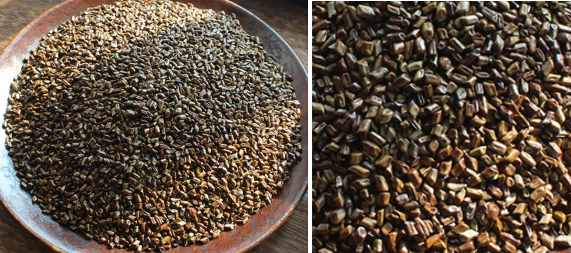

[TOC]

### 营实（蔷薇之子）

**功效**：清热解毒，口舌縻烂，痈疽恶创，阴蚀不瘳
**产地**：处处有之，亦名蔷薇，茎多刺，花红色，亦有白色黄色者，子即营实，入药。
**鉴别**：
**炮制**：
**价格**：约 40元/斤
**注意**：用以配大黄，行水之效甚著，普通方药罕用之
**性味归经**：味酸，性温，无毒。入肺经、脾经、肝经、膀胱经
**用法用量**：普通一二钱。炒之磨粉可外用
**括要**：口舌縻烂，蔷薇根煮汁温含，口疮日久，延及胸前生疮，三年以上不愈者，用此效，
			杨梅疮筋骨毒痛，取根皮煮汁多饮效，下疳用黄花蔷薇叶焙研洗之敷之良。

### 天名精
**功效**：主瘀血，诸毒疔肿
**产地**：
**鉴别**：
**炮制**：
**价格**：约 15元/斤
**注意**：时珍曰有小毒，生汁吐人
**性味归经**：味甘苦性平无毒。入肺经
**用法用量**：普通一二钱

### 决明子
**功效**：泻肝明目益精，补肝虚泻肝经风热，以水调末涂肿毒，润肠通便
**产地**：
**鉴别**：
**炮制**：
**价格**：约 8元/斤
**注意**：恶麻仁，疗目疾外，其他用者鲜，惟外治可以疗蛇伤虫刺。
**性味归经**：味甘苦咸，性平。入肝经、肾经
**用法用量**：普通一钱至三钱。

### 丹参
**功效**：活血散郁，去心腹痛疾，破宿血，生新血，止崩带，调月经，安生胎落死胎，恶疮疥癣瘿赘
**产地**：
**鉴别**：
**炮制**：
**价格**：约 40元/斤
**注意**：孕妇无故忌，畏咸水，反藜芦。
**性味归经**：味苦性微寒，无毒，入心经、肝经
**用法用量**：普通二钱至三四钱，大剂一两
丹参为女子调经良药，故有一味丹参功兼四物之称，产后养血去瘀，能入心养血，故天王补
心丹中用此味治劳心过度，神志不宁，烦热健忘，怔忡。又言丹参入心又曰赤参。

### 茜根（茜草）
**功效**：凉血止血，行血祛瘀，如扑损瘀血、月经不通月经不止。下行力重
**产地**：
**鉴别**：
**炮制**：
**价格**：约 60元/斤
**注意**：病人虽见血证，若加泄泻，饮食不进者忌。
**性味归经**：味酸咸，性寒无毒。入肝经。
**用法用量**：普通一钱至二钱。病重一两亦可
茜草一名血见愁，其理血之效可知，俗方用治女子经水不通。以一两煎酒服之。
仲醇曰治疸，此治因蓄血而发黄的疸，不专于湿热者也。
黑发方：茜根一斤，生地三斤，加水熬成膏，每日酒服半匙，一月发尽黑。

### 飞廉
**功效**：主骨节热，胫重酸疼，皮间邪气，小儿疳痢
**产地**：
**鉴别**：
**炮制**：
**价格**：
**注意**：里有寒，又兼下痢者禁用
**性味归经**：味苦，性平无毒。
**用法用量**：普通一钱至三钱

### 五味子
**功效**：咳逆上气，壮水镇阳，祛痰止咳，敛肺滋肾，益精
**产地**：
**鉴别**：
**炮制**：
**价格**：约 80元/斤
**注意**：咳初起脉数，有实火，及肝家有动气，肺气有实热痧疹初发，及一切停饮，均忌。
**性味归经**：味酸（皮甘肉酸核辛苦，都具咸味，五味俱备）性温无毒，入肺经、肾经。
**用法用量**：普通一钱，病重三钱亦可，大剂五钱
东垣曰酸以收逆气，
肺寒气逆宜与干姜同治之，又五味收肺气，乃火热必用之药，故治咳嗽，有痰加半夏，喘加阿胶。
丹溪曰五味大能收肺气，宜其有补肾之功，收肺气即是除热，补肾即是暖水脏，故乃
火热嗽必用之药，黄昏嗽乃火气浮入肺中，不宜用凉药，宜五味子敛而降之。

### 旋华（旋覆花）
**功效**：主腹中寒热邪气，消痰行水；降气止哕，固精强壮，合金疮补劳损续筋骨
**产地**：
**鉴别**：
**炮制**：
**价格**：约 30元/斤
**注意**：
**性味归经**：旋花之花，根，茎，叶俱甘滑微苦，性温。入胃经、肺经、大肠经
**用法用量**：普通五分至一二钱
太乙金锁丹：功于秘精益髓，龙骨，覆盆子各五两，莲花蕊四两，栀子花三两，芡实米
100 粒，共为末，另以金樱子 200 枚，去皮臼杵捣烂，水七升煮浓汁一升，加药粉杵为丸梧
子大，每空心盐酒服下 30 丸，服至百日，极效。

### 兰草
**功效**：消炎除恶荡涤肠胃，推陈致新，除胸中痰癖，润肌肉，利水道
**产地**：
**鉴别**：
**炮制**：
**价格**：
**注意**：
**性味归经**：味辛性平无毒，
**用法用量**：普通一钱至三钱
我国药物同名甚多。因兰草又名省头草。今药房所谓佩兰，其名亦省头草，解释为籣草
为较老草，佩兰为较嫩草，同为一株。

### 蛇床子
**功效**：疏风去湿强阳益阴，下焦湿毒，妇人阴肿痛痒，男子阳痿湿痒，恶疮湿癣，温子脏，久服令人有子
**产地**：
**鉴别**：
**炮制**：
**价格**：约 30元/斤
**注意**：肾家有火，下部有热。及阳易举者，虽有湿，宜与苦配。恶丹皮，巴豆，贝母，伏硫磺。
**性味归经**：味辛苦，性温无毒，入肾经
**用法用量**：普通一钱至三钱

### 地肤子
**功效**：
**产地**：
**鉴别**：
**炮制**：
**价格**：约 20元/斤
**注意**：
**性味归经**：味苦性寒，无毒，入肾经、膀胱经
**用法用量**：

