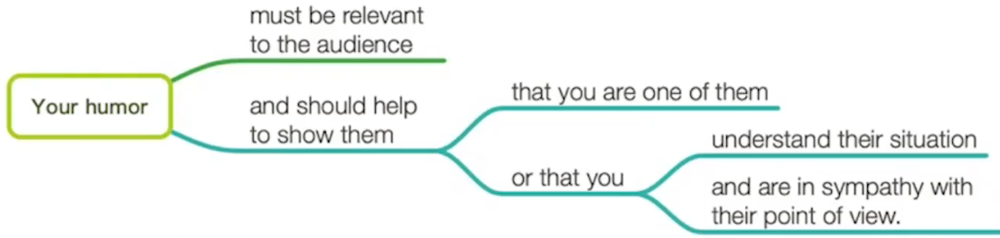

### Text 1

```
21. To make your humor work, you should .
[A] take advantage of different kinds of audience			take advantage of 利用
[B] make fun of the disorganized people						make fun of    取笑 拿...开玩笑
[C] address different problems to different people
[D] show sympathy for your listeners						listeners n.听众

joke 笑话			implies 暗示
22. The joke about doctors implies that, in the eyes of nurses, they are .
[A] impolite to new arrivals								impolite 不礼貌
[B] very conscious of their godlike role			conscious 意识到		godlike 神圣的
[C] entitled to some privileges						entitled 有资格的	 privileges 特权
[D] very busy even during lunch hours

23. It can be inferred from the text that public services .			inferred 推论
[A] have benefited many people						benefited 有益于
[B] are the focus of public attention				focus 焦点 		attention 注意力
[C] are an inappropriate subject for humor			inappropriate 不合适
[D] have often been the laughing stock				laughing stock 笑料   	stock 存货

desired 渴望
24. To achieve the desired result, humorous stories should be delivered .	
[A] in well-worded language			well-worded 有文采的
[B] as awkwardly as possible		awkwardly 尴尬
[C] in exaggerated statements		exaggerated 夸张
[D] as casually as possible			casually	随意

25. The best title for the text may be .
[A] Use Humor Effectively			Effectively 有效的
[B] Various Kinds of Humor			Various Kind 各种类型
[C] Add Humor to Speech				Speech 演讲
[D] Different Humor Strategies		Strategies 策略
```


If you intend using humor in your talk to make people smile, you must know how to identify shared experiences and problems. 

```
intend v.打算 			humor n.幽默			identify v.识别 
如果你打算使用幽默在谈话中是人们发笑，你必须得知道识别共享的经历和问题
```


Your humor must be relevant to the audience and should help to show them that you are one of them or that you understand their situation and are in sympathy with their point of view. 



```
be relevant to ... 与...相关		relevant a.相关的		irrelevant a.不相关的
sympathy n.同情 赞同			in sympathy with sb/sth	 同情 赞同或支持某人			
你的幽默必须与听众相关，并且应该有助于向他们表明你是他们中的一员，或者你理解他们的处境并赞同他们的观点
```


Depending on whom you are addressing, the problems will be different. 

```
address v.向...讲话 发表演说 致辞  n.地址 演讲
根据你谈话对象的不同，问题也将有所不同
```


If you are talking to a group of managers, you may refer to the disorganized methods of their secretaries; alternatively if you are addressing secretaries, you may want to comment on their disorganized bosses.

```
refer to... 谈到... 指的是...			disorganized a.缺乏组织的		secretaries n.秘书
alternatively adv.二选一 或者
如果你正在和一群管理者谈话，你可能提及他们秘书没有条理的工作方式；或者，如果你跟秘书们谈话，你可能会评论一下他们做事没有条理的老板
```


Here is an example, which I heard at a nurses’ convention, of a story which works well because the audience all shared the same view of doctors. 

```
convention n.会议 习俗 惯例		
这里有一个例子，是我在一次护士大会上听到的，这个故事效果很好，因为在场的听众对医生都持有同样的看法
```


A man arrives in heaven and is being shown around by St. Peter. 

```
arrives vi.到达			heaven n.天堂 上帝		
SB be shown around 某人被带着到处转			show SB around 带某人到处看
一个人来到天堂，正在被 St. Peter 带着四处参观
```


He sees wonderful accommodations, beautiful gardens, sunny weather, and so on. 

```
accommodation n.住所		 and so on 等等
他看到怡人的住所、美丽的花园和明媚的天气，等等
```


Everyone is very peaceful, polite and friendly until, waiting in a line for lunch, the new arrival is suddenly pushed aside by a man in a white coat, who rushes to the head of the line, grabs his food and stomps over to a table by himself. 

```
polite a.礼貌的	impolite 无礼的		arrival n.到达者		suddenly 突然的
be pushed aside 被推到一边			grab v.夺 抓		stomp v.跺脚 重踩
每个人都非常平和、礼貌且友好，直到在排队等候午餐时，这个新来的人突然被一个穿白大褂的人推到一边，只见他冲到队伍前面，夺过食物，重重的踏步独自走向餐桌
```


“Who is that?” the new arrival asked St. Peter. “Oh, that’s God,” came the reply, “but sometimes he thinks he’s a doctor.”

```
came = come
“那是谁？”新来的人问 St. Peter. “哦，那是上帝” 他回答说，“但有时他认为自己是一位医生”
```


If you are part of the group which you are addressing, you will be in a position to know the experiences and problems which are common to all of you and it’ll be appropriate for you to make a passing remark about the inedible canteen food or the chairman’s notorious bad taste in ties. 

```
be in a position to do sth 有资格 有能力做某事			appropriate a.合适的  inappropriate
make a passing remark about... 顺便评价关于...		inedible a.不能吃的		canteen n.小卖店
notorious a.臭名昭著的			taste n.味道
如果你是谈话对象中的一员，你就能了解对于你们所有人来说共有的经历和问题，而且你顺便评论一下餐厅里难以下咽的食物或者领导选择领带时糟糕的出了门的品味也是合适的
```


With other audiences you mustn’t attempt to cut in with humor as they will resent an outsider making disparaging remarks about their canteen or their chairman. 

```
attempt to do... 尝试做...			 cut in 插嘴			resent v.厌恶 愤恨
make remard 作出评论			make disparaging remarks about...  关于...发表贬低性评论
disparaging a.贬低的 毁谤的
面对其他听众，你绝对不要试图用这种幽默插话，因为他们会对一个局外人对他们的餐厅或领导做出贬低性评论而感到愤恨。
```


You will be on safer ground if you stick to scapegoats like the Post Office or the telephone system.

```
be on safer ground 处于更安全的境地			stick to... 坚持 粘住		scapegoat n.替罪羊
如果你坚持（调侃）邮局或电话系统这样的替罪羊，你将会更安全
```


If you feel awkward being humorous, you must practice so that it becomes more natural. 

```
awkward a.尴尬的 别扭的			practice n.练习		natural a.自然的
如果你觉得在表现幽默时，有些别扭，就必须得练习，从而使它变得更自然
```


Include a few casual and apparently off-the-cuff remarks which you can deliver in a relaxed and unforced manner. 

```
casual a.随意的		apparently adv.显然地			off-the-cuff a.当场的 即兴的
deliver v.发表讲话 传达			unforced a.非受迫的 自然的			manner n.举止 方式
加入一些随意的、看起来即兴的话语，你可以用轻松和自然的方式表达出来
```


Often it’s the delivery which causes the audience to smile, so speak slowly and remember that a raised eyebrow or an unbelieving look may help to show that you are making a light-hearted remark.

```
delivery n.传递			raised v.提高		  eyebrow n.眉毛 		  a raised eyebrow 挑眉
unbelieving a.不相信的			making a light-hearted remark 做出轻松的评论
通常是说话的方式引人发笑，所有说得慢一点，并且记住一个挑眉或不相信的表情可能有助于表明你在轻松地说话
```


Look for the humor. 

```
寻找幽默
```


It often comes from the unexpected. 

```
expected 预期			unexpected a.意想不到的
幽默往往来自意想不到的事情
```


A twist on a familiar quote “If at first you don’t succeed, give up” or a play on words or on a situation. 

```
twist n.扭曲 拧 转变 歪曲			familiar a.常见的 熟悉的			quote n.引述 引用
give up 放弃		play on words 玩文字游戏	
曲解一下人们熟知的引语，比如 “如果你一开始没成功，就放弃”，或者在文字或情景上做点文章
```


Search for exaggeration and understatement. 

```
exaggeration n.夸张  		statement 陈述 		understatement n.轻描淡写
寻求言过其实和轻描淡写
```


Look at your talk and pick out a few words or sentences which you can turn about and inject with humor.

```
turn about 反复思考	转身		inject v.注入
看看你自己的谈话内容，挑出几个词或句子反复思考并引入幽默
```

