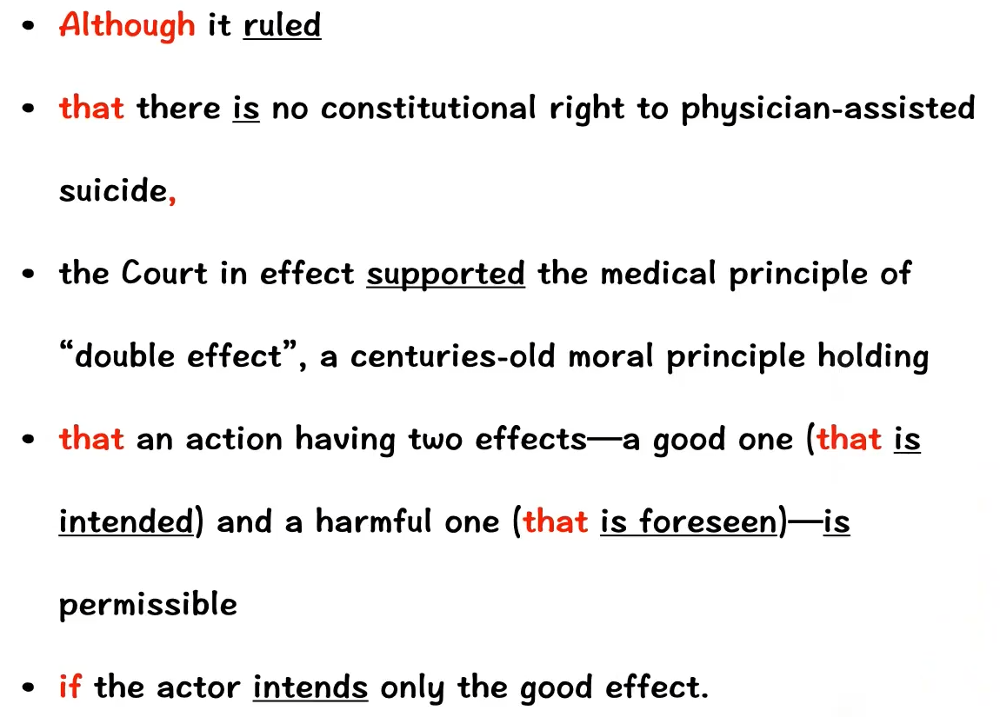

```
【B】36. From the first three paragraphs, we learn that .			learn 得知
used to do... 过去常常做 (现在啊不做了)
[A] doctors used to increase drug dosages to control their patients’pain
[B] it is still illegal for doctors to help the dying end their lives
opposes 反对
[C] the Supreme Court strongly opposes physician-assisted suicide
[D] patients have no constitutional right to commit suicide		病人没有自杀的宪法权利


【C】37. Which of the following statements its true according to the text?
held = hold 认为 持有			guilty 有罪的
[A] Doctors will be held guilty if they risk their patients’death.
assist 帮助		terminally ad.晚期的			painless a.无痛的
[B] Modern medicine has assisted terminally ill patients in painless recovery.
relieve 救济 减轻			prescribe 开处方
[C] The Court ruled that high-dosage pain-relieving medication can be prescribed.
no longer 不再		justified 合法		intention 意图 目的
[D] A doctor’s medication is no longer justified by his intentions.


end-of-life  寿命末期		care 护理				end-of-life care 临终护理
38. According to the NAS’s report, one of the problems in end-of-life care is .
[A] prolonged medical procedures
[B] inadequate treatment of pain
[C] systematic drug abuse
[D] insufficient hospital care

39. Which of the following best defines the word “aggressive” (line 3, paragraph 7)?
[A] Bold.
[B] Harmful.
[C] Careless.
[D] Desperate

punished 受处罚
40. George Annas would probably agree that doctors should be punished if they .
[A] manage their patients incompetently
[B] give patients more medicine than needed
[C] reduce drug dosages for their patients
[D] prolong the needless suffering of the patients
```


### Text 4

The Supreme Court’s decisions on physician-assisted suicide carry important implications for
how medicine seeks to relieve dying patients of pain and suffering.

```
supreme a.最高的		court n.法院		decision n.决定		physician n.医生	
assist v.协助 		suicide n.自杀	 imply v.暗示		implication n.可能的影响或后果 暗示
carry important implications for ... 对...具有重要含义			medicine 医学界    seek 寻找seek to do 力图      relieve v.解除			dying a.临终的		patient n.病人	pain 疼痛
suffering 痛苦
最高法院对关于医生协助病人自杀问题的裁决，对于医学界如何设法减轻临终病人的痛苦和折磨来说，具有重大影响
```


Although it ruled that there is no constitutional right to physician-assisted suicide, the Court in effect supported the medical principle of “double effect”, a centuries-old moral principle holding that an action having two effects — a good one that is intended and a harmful one that is foreseen—is permissible if the actor intends only the good effect.

```
rule v.裁决		constitution n.宪法		in effect 实际上		support a.支持的	
medical a.医疗的		principle n.原则		effect m.效果 影响		moral a.道德上的	
intend v.打算	意图		harmful a.有害的		foresee v.预见 预知		permissible a.可允许的
尽管它裁定宪法没有赋予医生协助病人自杀的权力，但实际上法院支持 “双重效果” 的医疗原则，这个存在了好几个世纪的道德原则认为，具有双重效果的行为是可允许的 - 希望达到的好效果和可预见的坏效果，只要行为实施者想要的是好效果
```




Doctors have used that principle in recent years to justify using high doses of morphine to control terminally ill patients’ pain, even though increasing dosages will eventually kill the patient

```
justify v.证明...合理 		doses n.剂量		morphine n.吗啡		terminally ad.晚期的
increasing a.增加的		eventually ad.最终			patient n.病人
近年来，医生们一直用这项原则证明使用大剂量的吗啡来减少晚期患者的痛苦是合理的，即使加大剂量最终会杀死病人
```


Nancy Dubler, director of Montefiore Medical Center, contends that the principle will shield doctors who “until now have very, very strongly insisted that they could not give patients sufficient medication to control their pain if that might hasten death”.

```
director n.董事		contend v.主张		shield v.保护			insisted 主张
sufficient a.足够的		hasten v.加速
Montefiore 医疗中心主任 Nancy Dubler 主张，这些原则将保护一些医生，这些医生一直到现在还非常、非常强烈地坚称，如果这可能会加速死亡的话，他们不能给病人开足量的药品来控制疼痛
```


George Annas, chair of the health law department at Boston University, maintains that, as long as a doctor prescribes a drug for a legitimate medical purpose, the doctor has done nothing illegal even if the patient uses the drug to hasten death. 

```
chair n.主任 椅子		department n.部门 系		maintain v.坚持		prescribe v.开处方
legitimate a.合情合理的 合法的		medical a.医疗的		purpose n.目的	  patient n.病人
波士顿大学健康法律系主任 George Annas 坚持认为，只要医生开药是出于合理的医疗目的，那么即使病人使用该药物加速了死亡，医生也没有违法
```


“It’s like surgery,” he says. 

```
他说这就像做手术
```


“We don’t call those deaths homicides because the doctors didn’t intend to kill their patients, although they risked their death. 

```
homicide n.杀人			risk v.冒...的风险
我们不能把那些死亡成为谋杀，因为医生并不是意在杀死病人，尽管他们冒病人死亡的风险。
```


If you’re a physician, you can risk your patient’s suicide as long as you don’t intend their suicide.”

```
如果你是一名医生，可以冒着你的病人自杀的风险，只要你不是意在他们自杀
```


On another level, many in the medical community acknowledge that the assisted-suicide debate has been fueled in part by the despair of patients for whom modern medicine has prolonged the physical agony of dying.

```
acknowledge v.承认		debate n.争论		fuel v.供以燃料 使争论升温		despair n.绝望
prolong v.延长 拖延		physical a.肉体的 		agony n.极大的痛苦
另一方面，医疗界的许多人士承认，医生协助自杀的争论的升温，部分原因是病人的绝望情绪，对这些病人来说，现在医学延长了他们临终前肉体的痛苦
```


Just three weeks before the Court’s ruling on physician-assisted suicide, the National Academy of Science (NAS) released a two-volume report, Approaching Death: Improving Care at the End of Life. 

```
academy 学院		volume n.卷 册		approach 靠近  
就在最高法院对医生协助自杀做出裁决的三周之前，美国国家科学院（NAS）公布了一份两卷的报告 - 《临近死亡：改善临终护理》
```


It identifies the undertreatment of pain and the aggressive use of “ineffectual and forced medical procedures that may prolong and even dishonor the period of dying” as the twin problems of end-of-life care

```
identify v.确认 识别 指出		undertreatment n.处理不力		aggressive a.侵略的  好斗的	
ineffectual a.效果不佳的			forced a.被迫			procedure n.程序 步骤		
dishonor v.侮辱 不尊重		period n.一段时间		
报告指出了临终护理的两个问题：对病痛处理不力，以及大胆使用“效果不佳且强制性的医疗程序从而可能会延迟死亡期，甚至让病人死的不体面”
```


The profession is taking steps to require young doctors to train in hospices, to test knowledge of aggressive pain management therapies, to develop a Medicare billing code for hospital-based care, and to develop new standards for assessing and treating pain at the end of life.

```
profession n.行业		hospices n.(临终)护理所		therapy n.治疗 		Medicare n.医疗保险
billing 广告		code n.规范		standard n.规格		assessing v.评估		treating 处理
医疗行业正在采取措施，要求年轻医生去临终护理所培训，对大胆阵痛疗法的知识进行检验，为医院护理制定一份医疗保险制度的付款条例，以及为评估和治疗临终的痛苦制定新标准
```


Annas says lawyers can play a key role in insisting that these well-meaning medical initiatives translate into better care.

```
Annas 说在坚持把这些善意的医疗上的倡议转化为更好的护理方面，律师可以发挥其关键作用
```


“Large numbers of physicians seem unconcerned with the pain their patients are needlessly and predictably suffering”, to the extent that it constitutes “systematic patient abuse”. 

```
许多医生对他们的病人正在遭受的不必要的、可预见的痛苦似乎并不关心，甚至到了构成蓄意虐待病人的程度
```


He says medical licensing boards “must make it clear...that painful deaths are presumptively ones that are incompetently managed and should result in license suspension”.

```
他说，行医执照委员会 “必须明确... 痛苦的死亡如果推测是医生处理不当所致，应该吊销行医执照
```

