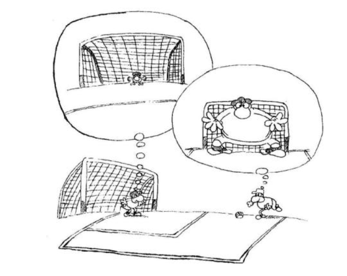

## Section 3 Writing

### Part A

Directions:
	Write a letter to your university library, making suggestions for improving its service.
	You should write about 100words on ANSWER SHEET 2.
	Do not sign your own name at the end of the letter. Use “Li Ming” instead.
	Do not write the address. (10points)

### Part B

Write an essay of 160-200words based on the following drawing. In your essay, you should
	1) describe the drawing briefly,
	2) explain its intended meaning, and then
	3) support your view with an example/examples.
	You should write neatly on ANSWER SHEET 2. (20points)

