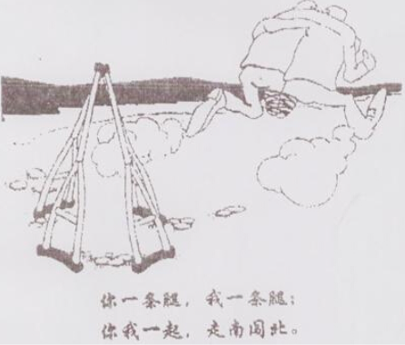

### 51. Directions:

You have just come back from Canada and found a music CD in your luggage that you forgot to return to Bob, your landlord there. Write him a letter to
	1) make an apology, and
	2) suggest a solution.

You should write about 100words on ANSWER SHEET 2.

Do not sign your own name at the end of the letter. Use “Li Ming” instead.
Do not write the address. (10points)

### 52. Directions:

Write an essay of 160-200words based on the following drawing. In your essay, you should
	1) describe the drawing briefly,
	2) explain its intended meaning, and then
	3) give your comments.

You should write neatly on ANSHWER SHEET 2. (20points)

