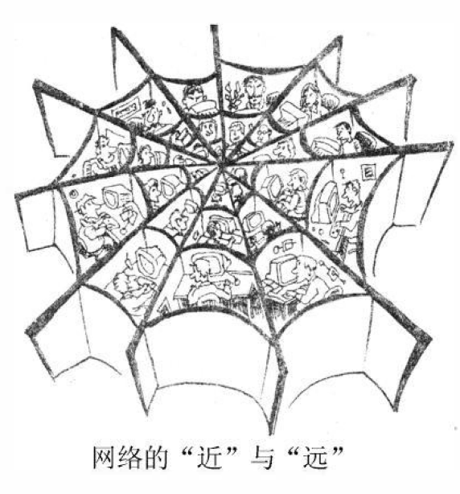

### Part A

51. Directions:
    Restrictions on the use of plastic bags have not been so successful in some regions. "White Pollution" is still going on. Write a letter to the editor(s) of your local newspaper to
    	1) give your opinions briefly, and
    	2) make two or three suggestions.
    You should write about 100words on ANSWER SHEET 2.
    Do not sign your own name at the end of the letter. Use "Li Ming" instead.
    Do not write the address. (10points)

### Part B

52. Directions:
    Write an essay of 160-200words based on the following drawing. In your essay, you should
    	1) describe the drawing briefly,
    	2) explain its intended meaning, and then
    	3) give your comments.
    You should write neatly on ANSWER SHEET 2. (20points)

