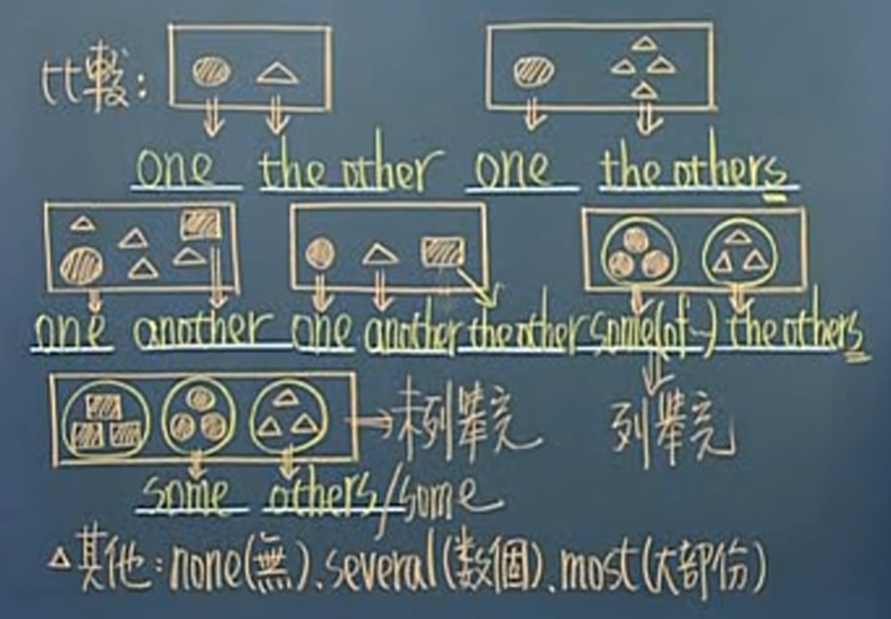

[TOC]

对标谢孟媛初级文法 P4-P7： 代名词

### 人称代名词

人称代词就是代替人的名称的一种词性。

| 人称          | 主格 | 所有格 (~的) | 受格 | 主格 (~们) | 所有格 (~的) | 受格 |
| ------------- | ---- | ------------ | ---- | ---------- | ------------ | ---- |
| 第一人称 (我) | I    | my           | me   | we         | our          | us   |
| 第二人称 (你) | you  | your         | you  | you        | your         | you  |
| 第三人称 (TA) | he   | his          | him  | they       | their        | them |
|               | she  | her          | her  |            |              |      |
|               | it   | its          | it   |            |              |      |

'格' 就是不同场合所对应的不同的表现形式。因此英文中，不同位置的单词就听先出不同的 '格'。
**主格(主词) + 动词**：我游泳，肯定不会说我笔。
	He(主) likes(动) sports.
**所有格 + 名词**：我的笔，肯定不会我我的游泳。
	His(所有格) friends(名词) are over there.
**一般动词/介系词 + 受格**：一般动词表示状态、动作，比如我爱你们、我跟她玩。
	The girl loves(动) him(受) very much.

#### It 当假主词

it放在句首代替一个事情的时候，可以找句子后面的 `to + 原形动词`、`that + 主词 + 动词`、`that + Ving 引导的` 部分。
	**It** is difficult **to learn** Spanish.
	**It** is important **that you should** tell the truth.
	**It** is no use **telling** him about it.

#### 所有代名词 = 所有格 + 名词

所有格和所有代名词，在翻译上都表示 `~的`，但是词性不同、用法不同。

| 人称     | 所有格 | 所有代名词 | 所有格 | 所有代名词 |
| -------- | ------ | ---------- | ------ | ---------- |
| 第一人称 | my     | mine       | our    | ours       |
| 第二人称 | your   | yours      | your   | yours      |
| 第三人称 | his    | his        | their  | theirs     |
|          | her    | hers       |        |            |
|          | its    | its        |        |            |

所有代名词 = 所有格 + 名词。所有代名词的用处就是代替一个已经重复出现的名词。因此，所有格后面要有个名词，但是所有代名词后面一定不要有名词了。
	Your **house** is bigger than **my house**. == Your **house** is bigger than **mine**.
	My bicycles are here and **his** are there. 				（所有代名词) 
	My bicycles are here and **his bicycles** are there. （所有格）

#### 伴随双重所有格

冠词(an..)、所有格、指示形容词(this)、不定形容词(many)，它们各自都能在名词前。
但不可任何两个或以上同时放在名词前。
如：我的(所有格) 一位(冠词) 老朋友。英文不能是 `My an old friend.`，要这样：
	I met **one of my old friends** on the way home.
	I met **an old friend of mine** on the way home.
	I met **an old friend of my friends** on the way home.	

#### 名词的所有代名词 = 名词所有格

​	My dog is black, and Jason's is white.
​	My dog is black, and Jason's dog is white.

### 反身代名词

`~自己` 就是反身代名词，如我自己，你们自己、他自己...
第一、二人称：所有格 + self/selves，self是单数，selves是复数。
第三人称：受格 + self/selves
反身代名词不能做主词，见例3，He himself ...

| 人称     | 反身代名词                          | 反身代名词              |
| -------- | ----------------------------------- | ----------------------- |
| 第一人称 | myself （我自己）                   | ourselves （我们自己）  |
| 第二人称 | yourself （你自己）                 | yourselves （你们自己） |
| 第三人称 | himself, herself, itself （TA自己） | themselves （他们自己） |

主词、受词对象相同的时候，可以用反身代名词。
	You always talk to yourself. 	不可以是 You always talk to you.
	The little girl hurt herself.
	He can do it by himself.  He himself can do it.

### 指示代名词

#### 一般用法
离说话者近的人或事物用 this(单) 或 these(复)
离说话者远的人或事物用 that(单) 或 those(复)
	This is my mask, and that is Mary's.	（Mary's 是所有代名词，因为其单独存在，故不是所有格
	Things are easier these days.	

#### 代替用法
代替已经讲述过的字，单数名词用 that，复数名词用 those。此处不涉及 this、these
当 `名词+修饰语` 的时候（如 weather in Taipei 中 in Taipei 就是修饰语），名词重复了就可以使用这种用法。
下句中 the weather in Taipei 和 the weather in Kaohsiung 中 the weather 重复了，因此可以用 that 代替 the weather. 一定是 `名词+修饰语` 的情况下才可使用。
	**The weather** in Taipei is cooler than **the weather** in Kaohsiung.
=  **The weather** in Taipei is cooler than **that** in Kaohsiung. 	(that 代替 the weather)
	Her **interests** are different from the **interests** of her childhood.
=  Her **interests** are different from **those** of her childhood.  (of her childhood 就是修饰语，interests 重复)

#### so

可以作为动词的受词或补语，表示前面出现过的字或句子。
妈妈说：这一次考试准备好了没？不要像上次考的那么糟哦！我说：我也希望如此啊。
'如此'，就是 so，就是代表考试考的好。
	A：Will it be fine tomorrow?
	B：I hope so.  = I home that it will be fine tomorrow.
	Do you still feel sick? If so, you  must see the doctor.

so 也可解释成 '也'，需要与句中前面的结构一样，即为`助动词+主词` (so can I) 或 `be动词+主词` (so is he)
	Nancy can play the violin, and so can I.   (and so can I = and I can too)
	She is smart. So is he.
	She is smart. So she is.	(`主词+动词`，这种就是再加强一下意思，翻译成为 '她的确如此')

#### such

可以作为代名词、形容词，也可用于单数、复数。表示 '这样的人/事物'
`such (a/an) (形容词) 名词(复)`	
such 前面可以放 all、other、any、few、every ....
	I don't know such a man.
	They will plant flowers such as roses, sunflowers.
	Have you tasted any such food before? 	（some 用于肯定句，any 用于否定句/疑问句）

#### same

same 前面一般都加 the，表示 '相同的事或物'
the same 之前没有一般动词，就需要加上 be动词。
	A：Can I have a cup of coffee, please?
	B：Give me the same, please.
	He uses the same typewriter as I (do). = He uses the same typewriter as I use the typewriter. 
do does did... 这种助动词，除了可以帮助一般动词形成否定、疑问句之外，还有代替句中前面的动作。
上一句中 as I do 中的 do，就是表示 'use the typewriter'
A 和 B 不同：A be different from B.
A 和 B 相同：A be the same as B.

### 不定代名词

用于不特定的人或物，或非一定数量的代名词（很多、一点点）。
	**Some** of the boys like English.	(有限定，some是代名词)
	**Some** boys like English.			    (无限定，some是形容词)

#### one/ones

one、ones 都表示不特定的人或物。可以避免名词的重复出现。
one = a/an + 单数名词，是单数
ones 是复数。
it = the + 单数名词
	I have lost my watch and I have to buy **one**.
	I have lost my watch and I have to buy **a watch**.
	I like small cars better than large **ones**.
	I like small cars better than large **cars**.
	Here are some apples. Take one.	(拿一个苹果吧)
	Take it.	（呐！）
	I bought a good camera. I'll lend it(the camera) to you.

#### both/all

both：两者**都**，用于两个人或两个事物。
all：全部，所有。用于数量为3或3以上的人或事物。也可用于不可数名词。
both/all 一般放在 be动词之后，一般动词之前。
both/all 要放在定冠词(the)、所有格、数词、形容词之前。
人称代名词(them..) 和 不定代名词一起出现时，先人称代名词再不定代名词。
	Both of her children went to New York.	(她只有两个孩子，且两个孩子都....)
	Two of her children went to New York.	 (她不止两个孩子，只有两个孩子都....)
	I've read both of these papers.
	All of my money was stolen. 	（过去式be动词，was/were，money 是单数，故用 was）
	You may take all these toys. == You may take them all.	(人称代名词 之后才是不定代名词)

both/all 出现再否定句中，表示 "部分否定"（即 "并非...."）
	I do not know both of her parents. = I know just one of her parents. (并非都认识)
	Not all of them come from England. = Just some of them come from England. (并非所有来自英国)

#### either/neither

either：两个之中不论哪一个都可以，但是只选其一。
neither：为 both 的否定，表示 "两者都不"。both 和否定搭配时表示并非都...，这里是真的全部否定。因其本身为否定字，所有不可和 not 同时出现。
	Do you know either of the visitor?  (你认识这两个观光客中的其中一位吗？)（这两个人中有没有你认识的？）
	I don't like both hats.		  (两顶帽子我并非都喜欢)
	I like neither of the hats.	(两顶帽子我都不喜欢)

either/neither 也可以作为副词，在否定句中，解释成 "也不"。
之前有 too和so，也解释成 '也'。She is too. So is she. 不过，不能用于否定句。
现在否定句中表示也不，用 either，它的位置和 too 一样在句尾，neither的位置和 so 一样使用倒装。
	Bill didn't come to my party, and Ken didn't**,** either.  (注意有个逗号)
	Neither did Ken.	(neither是否定字故不能再加not)

#### some/any

some：一般用于肯定句
any：用于否定句、疑问句、条件句，可用于可数及不可数
	Some of the boys were late.		(boys 可数且为复数，故用 were)
	Some of my money was stolen from my purse.  （money 不可数，故用单数 was)
	Please lend me some money if you have any.	(条件句用 any)
	Do you have any magazines to read?

但是 some 可用于 "请求，邀请" 的问句。
	Will you give me some help?	
	How about some tea?	

#### other/another

other：表示其他的人或事物，复数是 others.  the other(s) 时表有限定，单独的 other(s) 无限定
another：由 an other 衍生而来，表示不特定的另一个人或物，可以理解为数量大于一时的 '另一个'。
比如："这只笔不能写了，给我另一个"，这里就是没有特定指哪个的另一个。
another没有复数形式。
单独的 other 是形容词，后面不能直接跟动词，需要 the other 变成代名词做主语，后面在跟动词。
	I have two students. One is short, the other is tall.  (这里的 '另一个'，是限定的，故用 other)
	I have three flowers.
	One is red, the others are yellow.	
	One is red, another is yellow, the other is pink.
	I don't like this one, show me another. 	 (总数为 3 或以上)
	I don't like this one, show me the other.	(总数为 2)

#### 比较

总数为2：One ... the other ...
总数大于2，但分为2组，一组一个，一组多个：One ... the others...
总数大于2，其中两个，但这两个不同：One... another...
总数大于2，其中三个，三个各不同：One... another... the other...
总数大于2，分为两组，两组均为多个：some (of)... the others...
总数大于2，分为三组，每组均为多个：some... others...

#### none、several、most

none：一个都没有，可以用于可数、不可数名词。none做主词是，动词用单、复均可。
several：表示好几个，故只能代表可数名词。
most：表示大部分，可用于可数、不可数名词。如：大部分科目，大部分水。
	None of the telephones is/are working. 
	Several of my friends attended the meeting.
	Most of it is true.
	Most of the people know it.

most 还可当形容词，为 many、much 的最高级，表示为 '最...' ，前面可加 the。但表示 '大部分' 时不能加 the
	Who get the most New Year's card?
	She is the most beautiful girl that I've ever seen.

