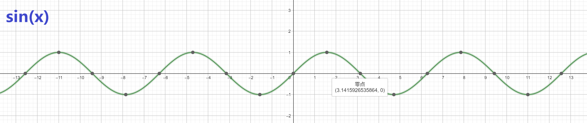
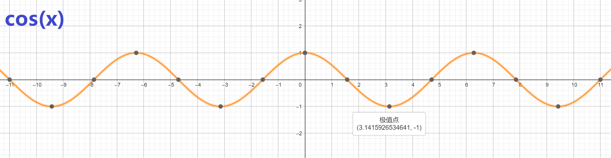
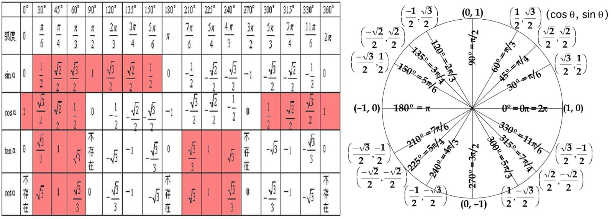

#### 三角





| $sin=\frac{对}{斜}$                 | $cos=\frac{邻}{斜}$                 | $tan=\frac{对}{邻}$                               |                         |
| ----------------------------------- | ----------------------------------- | ------------------------------------------------- | ----------------------- |
| $csc=\frac{1}{sin}=\frac{斜}{对}$   | $sec=\frac{1}{cos}=\frac{斜}{邻}$   | $cot=\frac{1}{tan}=\frac{邻}{对}=\frac{cos}{sin}$ | $\frac{cos}{sin} = cot$ |
| $\frac{sin}{cos} = tan$             | $sec^2 = tan^2+1$                   | $sin^2 = \frac{1}{2}(1-cos2x)$                    | $sin2x=2sinxcosx$       |
| $1=sin^2+cos^2$                     | $\frac{1}{cos}=sec$                 | $\frac{1}{sin}=csc$                               | $\frac{cos}{sin}=cot$   |
| $cot^2=csc^2-1$                     | $cos^2=\frac{1}{2}(1+cos2x)$        | $-sin2x=-2sinxcosx$                               | $cos^2x-sin^2x=cos2x$   |
| $cos^2\frac{x}{2}=\frac{1+cosx}{2}$ | $sin^2\frac{x}{2}=\frac{1-cosx}{2}$ | $sinx=2sin\frac{x}{2}cos\frac{x}{2}$              |                         |



`sinA=B => A = arcsinB`

辅助角公式：$asinx+bcosx = \sqrt{a^2+b^2}\ sin(x+arctan\frac{b}{a})$


### 奇偶

```
奇函数：f(-x) = -f(x)
偶函数：f(x) = f(-x)
若一函数为：f(x) + f(-x) 则为偶函数
若一函数为：f(x) - f(-x) 则为奇函数
```

| f(x) / g(x) | 偶 / 偶 | 偶 / 奇 | 奇 / 偶 | 奇 / 奇 | 备注               |
| ----------- | ------- | ------- | ------- | ------- | ------------------ |
| f(x)+g(x)   | 偶      | /       | /       | 奇      | 正+正=正，负+负=负 |
| f(x)-g(x)   | 偶      | /       | /       | 奇      |                    |
| f(x)g(x)    | 偶      | 奇      | 奇      | 偶      | 同为偶，异为奇     |
| f(x)/g(x)   |         |         | 奇      | 偶      |                    |
| f[g(x)]     | 偶      | 偶      | 偶      | 奇      | 有偶则偶           |

