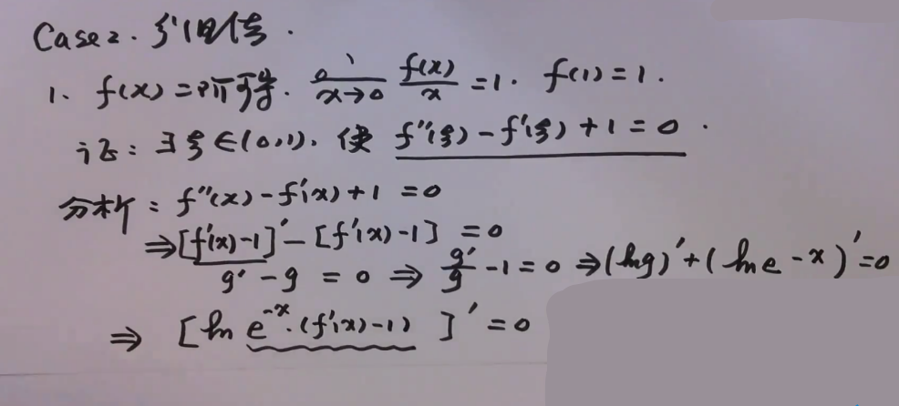

[TOC]

## 介绍

### 闭区间上连续函数的性质

有界定理：若 $f(x) \in C[a,b]$ ，则 $f(x)$ 在 $[a,b]$ 上一定有界。
最值定理：若 $f(x) \in C[a,b]$ ，则 $f(x)$ 在 $[a,b]$ 上一定存在最小值和最大值。
零点定理：若 $f(x) \in C[a,b]$ ，且 $f(a)f(b)<0$，则存在 $\xi \in (a,b)$，使得 $f(\xi)=0$
介值定理：若 $f(x) \in C[a,b]$ ，对任意的 $\eta \in [m,M]$ ，存在 $\xi \in [a,b]$，使得 $f(\xi) = \eta$

设 $f(x) \in C[a,b]$ ，证明关于 $\xi \in(a,b)$ 的命题时，一般使用零点定理。
设 $f(x) \in C[a,b]$ ，证明关于 $\xi \in[a,b]$ 的命题时，一般使用介值定理。
设 $f(x) \in C[a,b]$ ，若出现函数值相加的条件时，一般使用介值定理。

### 极值

$$
\begin{align*}
 f(x) 在 x=a 处取极值 &\implies f'(a)=0 或 f'(a) 不存在 \\
 f(x) 可导且 x=a 为 f(x) 的极值点 &\implies f'(a) = 0
\end{align*}
$$

### 罗尔中值定理

$$
Rolle = \begin{cases} 
	f(x) &\in& C[a,b]  \\ 
	f(x) &在& (a,b)内可导  \\
	f(a) &=& f(b)
\end{cases} \

\Rightarrow 存在\ \xi \in (a,b)，使得f'(\xi) = 0
$$
证明：
$$
\begin{align*}

& f(x) \in C[a,b] \Rightarrow \exists\ m,M	\\
& 1.m = M, f(x) \equiv C_0	\\
& \forall \xi \in(a,b)，有 f'(\xi) = 0 			\\
\\
& 2.m<M, \\
& \because f(a) = f(b) \\
& \therefore m, M 至少一个在 (a,b) 内取到	\\
& 设 \exists\ \xi \in (a,b), f(\xi) = M \\
& \Rightarrow f'(\xi) = 0

\end{align*}
$$

### 拉格朗日中值定理

$$
Lagrange = \begin{cases} 
	f(x) &\in& C[a,b]  \\ 
	f(x) &在& (a,b)内可导  \\
\end{cases} \

\Rightarrow 存在 \xi \in (a,b)，使得f'(\xi) = \frac{f(b)-f(a)}{b-a}
$$
$if [f(a) = f(b)] \Rightarrow $ 拉格朗日就变为罗尔，因此可以将罗尔看作拉格朗日的特殊情况。

分析：
$$
\begin{align*}
    曲线L: \ & 		y = f(x) 								  	\\
    直线L_{AB}: \ & 	y - f(a) = \frac{f(b)-f(a)}{b-a}(x-a)		\\
    即 \ & 			 y = f(a) + \frac{f(b)-f(a)}{b-a}(x-a)		 \\
    令 \ & \varphi(x) = 曲线 - 直线。								  \\
    则 \ & \varphi(a) = 0, \varphi(b) = 0
\end{align*}
$$
证明：
$$
\begin{align*} 
    令\ \varphi(x) = 曲线 - 直线 & = f(x) - f(a) - \frac{f(b)-f(a)}{b-a}(x-a)	\\
    & \because \varphi(a) = \varphi(b) = 0	\\
    & \therefore \exist \xi \in(a,b), 使\ \varphi'(\xi) = 0	\\
    & 而\ \varphi'(x) = f'(x)-\frac{f(b)-f(a)}{b-a},	\\
    & \therefore f'(\xi) = \frac{f(b)-f(a)}{b-a}
\end{align*}
$$
等价形式：
$$
f'(\xi) = \frac{f(b)-f(a)}{b-a} 	\\
\Updownarrow	\\
f(b)-f(a) = f'(\xi)(b-a)	\\
\Updownarrow	\\
f(b)-f(a) = f'[a+\theta(b-a)](b-a) \\
(0 < \theta < 1) \ 且 \ \theta 与 \xi 是 一对一的	\\
$$

### 柯西中值定理

$$
Cauchy = \begin{cases} 
	f(x)、g(x) &\in& C[a,b]  \\ 
	f(x)、g(x) &在& (a,b)内可导  \\
	g'(x) 	  &\neq& 0 \ (a < x < b)
\end{cases} \ 

\Rightarrow \exist \ \xi \in (a,b), 使得\ \frac{f(b)-f(a)}{g(b)-g(a)} = \frac{f'(\xi)}{g'(\xi)}
$$

$$
g'(x) \neq 0 \Rightarrow \begin{cases} 
	g'(\xi) & \neq 0  \\ 
	g(b) - g(a) & \neq 0 \; (若 g(b)=g(a) \ 那就是罗尔了,矛盾)  \\
\end{cases} \
$$

$if \ [g(x)=x] \Rightarrow \frac{f(b)-f(a)}{b-a} = \frac{f'(\xi)}{1} $   柯西变拉格朗日。

分析：
$$
拉格朗日中辅助函数：L = \varphi(x) = 曲线 - 直线 = f(x) - f(a) - \frac{f(b)-f(a)}{b-a}(x-a) \\
因为 g(x) = x时，柯西变拉格朗日，所有这里将 x 变为 g(x) \\
柯西辅助函数：\varphi(x) = f(x) - f(a) - \frac{f(b)-f(a)}{g(b)-g(a)}[g(x)-g(a)]
$$
证明：
$$
\begin{align*}
    令\ \varphi(x) & = f(x) - f(a) - \frac{f(b)-f(a)}{g(b)-g(a)}[g(x)-g(a)]	\\
    & \because \varphi(a) = 0, \varphi(b) = 0	\\
    & \therefore \exist\ \xi \in (a,b), 使 \varphi'(\xi) = 0 \\
    & 而 \ \varphi'(x) = f'(x) - \frac{f(b)-f(a)}{g(b)-g(a)}g'(x) \\
    & \therefore f'(\xi) - \frac{f(b)-f(a)}{g(b)-g(a)}g'(\xi) = 0	\\
    & \because g'(\xi) \neq 0	\\
    & \therefore \frac{f(b)-f(a)}{g(b)-g(a)} = \frac{f'(\xi)}{g'(\xi)}
\end{align*}
$$

## 题型

### 1. $f^{(n)}(\xi) = 0$  (Rolle 型)

例题：P54 L3
想证：
$$
\begin{align*}
f'(\xi)=0 \ & 证 ：\begin{cases} f(a)=f(b) \end{cases}	\\

f''(\xi)=0 \ & 证 ：\begin{cases} f(a)=f(b)=f(c) \\ f'(\xi_1) = f'(\xi_2) \end{cases}
\end{align*}
$$
函数值相加：介质定理

函数值相等：罗尔

函数值不等：拉格朗日

三个点：两次拉格朗日

### 2. 结论中仅有 $\xi$ 无其他字母

#### 2.1 两项且导数差一阶

例题：P56 L1 L2，P57 L4。
用还原法：
$$
\frac{f'(x)}{f(x)} = [lnf(x)]' ，\; \frac{f''(x)}{f'(x)} = [lnf'(x)]'
$$

$$
\begin{align*}

分析：\\
    & 0.待证明的用\ \xi \ 表达的式子，改用\ x \ 表达 	  \\
    & 1.移项改写成 含 \frac{f'(x)}{f(x)} 或 \frac{f''(x)}{f'(x)} 的 式子 	\\
    & 2.写成两个\ ln \ 求导相加等于\ 0 \ 的形式			\\
    & 3.合并两个相加为乘，即\ ln(a)+ln(b)=ln(ab)	  \\
    & 4.ln(ab) 中\ ab \ 做为辅助函数，记作\ \varphi(x)					\\

证明：\\
    & 1.找到两个\ \varphi(x) \ 值相同的点\ a,b，由罗尔定理得\ \varphi'(\xi)=0	\\
    & 2.对\ \varphi(x) \ 求导，得到\ \varphi'(\xi)	\\
    & 3.说明某些元素 \neq 0，再移向化简，结束。

\end{align*}
$$

#### 2.2 导数差距非一阶，或大于两项：

例题：P58 L6
用分组法：

$$
\begin{align*}

分析：\\
    & 0.待证明的用\ \xi \ 表达的式子，改用\ x \ 表达 	  \\
    & 1.将表达式分组为\ [g]'+a[g]=0 的形式	\\	
    & 2.按还原法，写成 含 \frac{g'(x)}{g(x)} 或 \frac{g''(x)}{g'(x)} 的 式子 	\\
    & 3.写成两个\ ln \ 求导相加等于\ 0 \ 的形式			\\
    & 4.合并两个相加为乘，即\ ln(a)+ln(b)=ln(ab)	  \\
    & 5.ln(ab) 中\ ab \ 做为辅助函数，记作\ \varphi(x)					\\

证明：\\
    & 1.找到两个\ \varphi(x) \ 值相同的点\ a,b，由罗尔定理得\ \varphi'(\xi)=0	\\
    & 2.对\ \varphi(x) \ 求导，得到\ \varphi'(\xi)	\\
    & 3.说明某些元素 \neq 0，再移向化简，结束。

\end{align*}
$$

### 3. 结论中含有 $\xi、a、b$

#### 3.1 $\xi$ 与 a，b 可分

将结论化简后，等式一边仅有 $\xi$ 另一边仅有 a,b。操作步骤如下，例题：P59 L2
$$
\begin{align*}
    & 0.化简整理待证式子，将\ \xi\ 和\ a,b\ 分别放至等号两边	\\
    & 1.整理移项后的式子，写成\frac{f(b)-f(a)}{b-a}或\frac{f(b)-f(a)}{g(b)-g(a)}	\\
    & 2.检查放a,b的一侧若为 \frac{f(b)-f(a)}{b-a}则使用拉格朗日	\\
    & 2.或者放a,b的一侧为 \frac{f(b)-f(a)}{g(b)-g(a)}则使用柯西	
\end{align*}
$$

#### 3.2 $\xi$ 与 a，b 不可分

例题：L1 P60
$$
\begin{align*}
& 0.将待证式子中 \xi 改成 x	\\
& 1.有分母去分母，再移项，写成 (...)=0, 再写成 (...)'=0	\\
&\ 如：f'g+fg' = 0 \Rightarrow (fg)'=0	\\
&\ 如：f'g-fg' = 0 \Rightarrow \frac{f'g-fg'}{g^2} = 0 \Rightarrow [\frac{f(x)}{g(x)}]'=0\\
& 2.括号中求导的部分就设为 \varphi(x)	\\
& 3.后续使用罗尔即可
\end{align*}
$$

### 4. 结论至少含有 $\xi、\eta$ 甚至更多

#### 4.1 仅有 $f'(\xi)、f'(\eta)$

找三个点，使用两次拉格朗日。P61 L2

#### 4.2 $\xi、\eta$ 项的复杂程度不同

例题：P62 L2
$$
\begin{align*}
&0.移项化简待证式,将复杂的一边写成 (...)', 再用拉格朗日	\\
&0.若无法写成整个求导，则写成 \frac{(...)'}{(...)'} 的形式, 再用柯西 	\\
&如：e^{2\xi}[f'(\xi)+2f(\xi)] \Rightarrow (e^{2x}f(x))' ,再用拉格朗日	\\
&如：e^{\eta}f'(\eta) = \frac{f'(\eta)}{e^{-\eta}},再用柯西,分子对标 f(x)，分母对标 -e^{-x} \\
& 复杂的一边使用柯西解决后，另一边一般使用拉格朗日
\end{align*}
$$

### 5. 拉格朗日中值定理的惯性思维

例题：L1 P65
$$
\begin{align*}
& 出现：	\\
& 1. f(b)-f(a)、\frac{f(b)-f(a)}{b-a} 用 拉格朗日	\\
& 2. f(a)、f(b)、f(c) 用两次拉格朗日	\\
& 3. f'(a)、f'(b)、f'(c) 用两次拉格朗日	\\
& 4. f'(x) 变成 f(x) 用 拉格朗日
\end{align*}
$$
