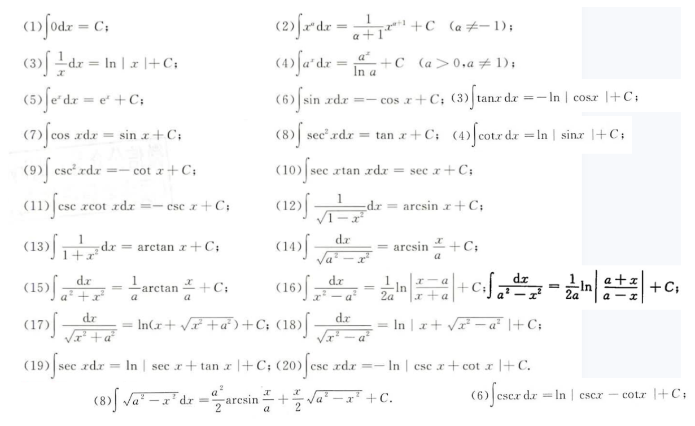

[TOC]

### 基础

#### 部分分式

武忠祥：p10 1:12:00
汤家凤：p24 8:00
$$
\begin{aligned}

& 1. R(x)=\frac{3x-5}{(2x+1)(x-2)}=\frac{A}{2x+1}+\frac{B}{x-2}	\\

& \;\; A(x-2)+B(2x+1)=3x-5 \Rightarrow 
\left\{
\begin{aligned}
A+2B & =3	\\
-2A+B & =-5
\end{aligned}
\right.\\ 

& 2. 分母中有 (ax+b)^n：\frac{A_1}{ax+b}+\frac{A_2}{(ax+b)^2}+...+\frac{A_n}{(ax+b)^n}	\\
& \;\; R(x)=\frac{x^2-3}{(x+1)^2(2x-1)}=\frac{A}{x+1}+\frac{B}{(x+1)^2}+\frac{C}{2x-1} \\

& 3. 分母有两次：\\
& \;\; R(x)=\frac{x^2-3x+1}{(x^2+2)(x-1)^2}=\frac{Ax+B}{x^2+2}+\frac{C}{x-1}+\frac{D}{(x-1)^2}\\

& \;\; R(x)=\frac{3x+2}{x(1+x^2)}=\frac{A}{x}+\frac{Bx+C}{1+x^2} \\
\end{aligned}
$$

### 性质

连续一定存在原函数，有原函数不一定连续。即不连续照样可以存在原函数。
出现一类间断点肯定没有原函数。出现二类间断点可能有原函数。故有原函数不一样连续，即它存在间断点，且此间段点必为二类间断点，不可能是跳跃间断点。

：先积再求导、先积分再微分、先求导再积分、先微分再积分
$$
\begin{aligned}
F'(x) = f(x) & 	\\
\left(\int{f(x)dx}\right) = F(x)+C \Rightarrow \left(\int{f(x)dx}\right)' = f(x)&  \\
d\int{f(x)dx} = f(x)dx & 	\\
\int{f'(x)dx} = f(x)+C	& \\
\int{df(x)} = \int{f'(x)dx} = f(x)+C & 
\end{aligned}
$$

### 积分法

#### 公式

$(sin^2x)'=2sinxcosx=sin2x$；		$(cos^2x)'=-2cosxsinx=-sin2x$
$(sinxcosx)'=cos^2x-sin^2x=cos2x$

#### 分项法

#### 第一类换元（凑微分）

$$
\begin{aligned}
& 若 \int{f(u)du} = F(u)+C	\\
& 则 \int{f[\varphi(x)]\varphi'(x)dx} = \int{f[\varphi(x)]}d\varphi(x) = F[\varphi(x)] + C\\
\end{aligned}
$$

常见应用
$$
(\sqrt{x})'=\frac{1}{2\sqrt{x}} \Rightarrow 看见 \int\frac{1}{\sqrt{x}}dx = \int{d2\sqrt{x}}	\\
$$

#### 第二类换元法

$$
\begin{aligned}
& 令 \sqrt{x} = t，x=t^2，dx=2tdt

\\

三角代换：\\
& \sqrt{a^2-x^2}：令 x=asint 或 acost	，\sqrt{a^2-x^2}=acost， dx = acostdt\\
& \sqrt{a^2+x^2}：令 x=atant，\sqrt{a^2+x^2}=asect，dx=asec^2tdt	\\
& \sqrt{x^2-a^2}：令 x=asect，\sqrt{x^2-a^2}=atant，dx=asecttantdt	\\
\end{aligned}
$$

#### 分部积分

$\int{udv}=uv-\int{vdu}$，适用于两类不同函数相乘.
尤其是：幂函数与指数函数、幂函数与对数函数、幂函数与三角、幂函数与反三角函数、指数函数与三角函数
优先级：反<对<幂<指<三，优先级越大的，优先凑进去(移至后面)，凑进去是找原函数

当指数函数与三角函数之积时：需令原式为 $I$，而后再分部积分，最后会出现非死循环式子，移项即可

被积函数为 $sec^nx$ 或 $csc^nx$ ，n 为偶数时，需要借助三角变形，使用换元法
被积函数为 $sec^nx$ 或 $csc^nx$ ，n 为奇数时，令其为 $I$，而后再分部积分，最后会出现非死循环式子，移项即可

$$
三角有理式：\\
R(sin,-cos)=-R(sin,cos):dsin	\\
R(-sin,-cos)=R(sin,cos):dtan	\\
R(-sin,cos)=-R(sin,cos):dcos
$$

#### 有理函数

真分式时，分子不变，分母因式分解，再拆成部分和的形式（部分分式），不能因式分解就配方。
假分式时，使用多项式除法，拆成多项式与真分式之和，再将真分式拆成部分和的形式。
可以把式子中的某一块，凑成另一块的导数，然后使用一类换元还原放到 $d$ 后面。 

### 做题

见 tan 偶次方，转 sec 的平方
见 cot 偶次方，转 csc 的平方
tan 与 sec 一起，转 sec
cot 与 csc 一起，转 csc