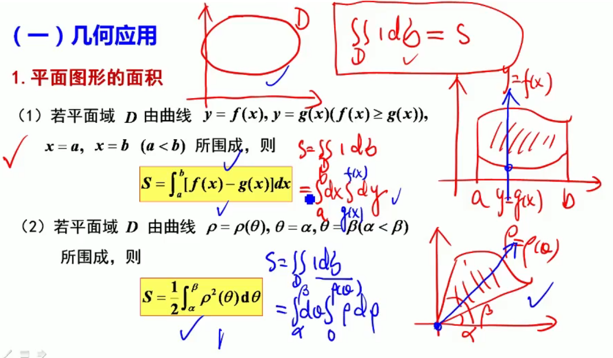
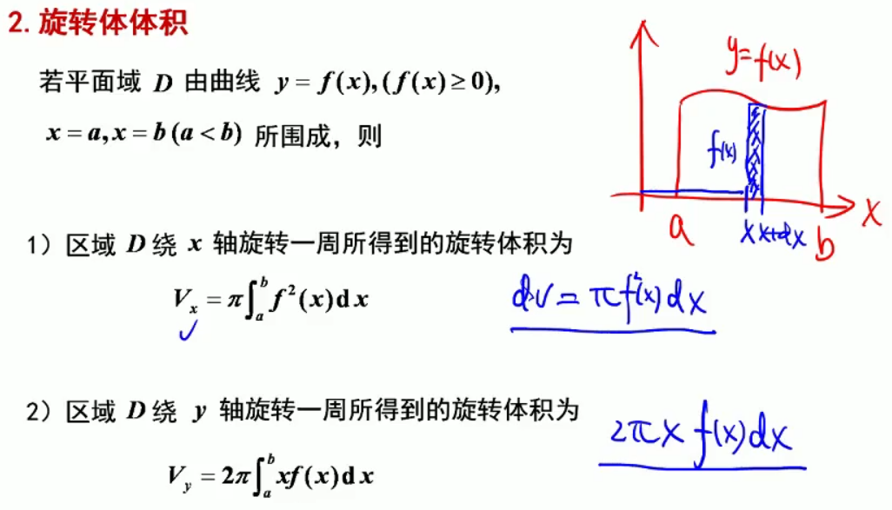
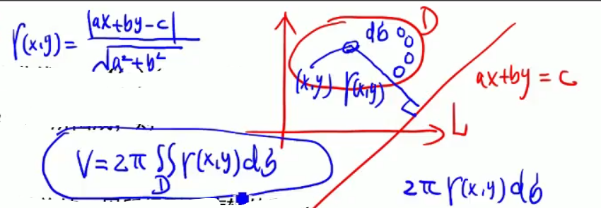
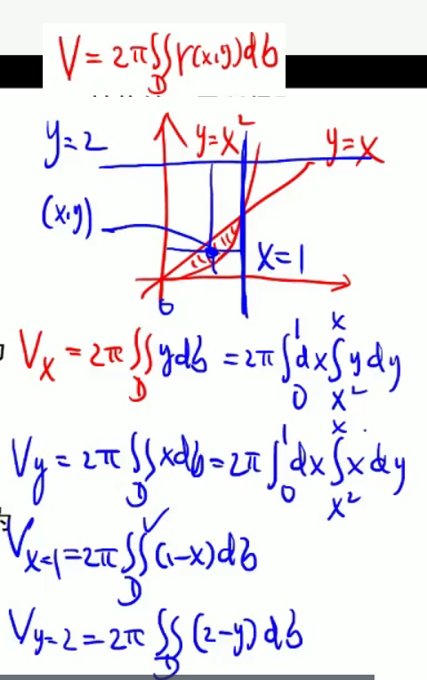

[TOC]

## 定积分应用

### 几何应用

#### 确认与函数相切点的两种方法

- 设 $L:y=lnx $ ，过点$(0,1)、(x_0,y_0)$ 作切线，现欲求出 $x_0,y_0$ 

    切线方程：$k=y'(x_0)=\frac{1}{x_0}$，切线方程为

$$
y-y_0 = \frac{1}{x_0}(x-x_0) \\
1-y_0 = \frac{1}{x_0}(0-x_0) = -1	\\
y_0 = ln(x_0) = 2	\\
x_0 = e^2
$$

- 过 $(0,1)$ 的直线：$y-1=k(x-0)$，现欲求出相切的 $x_0,y_0$ ，相切即：某点的函数值相同、斜率相同

$$
\begin{aligned}
& y-1=k(x-0)	\\
& y=kx+1	\\
& \because 相切 \\
& \therefore 
\begin{cases}
kx+1 = lnx	\\
y' = k = \frac{1}{x}
\end{cases}
\Rightarrow lnx=2 \Rightarrow x=e^2
\end{aligned}
$$

#### 平面图形的面积

#### 旋转体的体积

圆锥体积公式：$\frac{\pi}{3}r^2h$

绕 $x$ 轴转：绕 $x$ 轴转后，就是一个圆柱体，圆柱体的体积就是底面积乘高 $\pi r^2h$，
					此处，半径就是 $f^2(x)$ ，一小段的高就是 $dx$，整体的高就是 $n$ 个小段的积分

绕 $y$ 轴转：绕 $y$ 轴转后，就是一个圆桶，切开再拉直就是长方体，长方体的体积：长*宽\*高
					圆的周长是：$2\pi r$，此处半径就是 $x$，桶壁的厚度可以想象成长方体的宽度
					此处，长就是圆桶的周长：$2\pi x$，一小段宽就是：$dx$ ，整体就是 $n$ 小段的积分，高就是 $f(x)$ 
				

点到转轴的距离：$r(x,y)=\frac{|ax+by-c|}{\sqrt{a^2+b^2}}$ 
周长：$2\pi r(x,y)$ 、一小块区域的面积，即相当于长方体的侧面积的一小块：$d \sigma$，整体的侧面积就是积分

#### 曲线的弧长

弧微分：$\sqrt{1+y'^2}dx$，弧微分的积分就是弧长
$$
\begin{aligned}
直角坐标系：& C:y=y(x), & a\leq x\leq b.\ & s=\int_a^b\sqrt{1+y'^{\ 2}}dx 	\\

参数方程：& C:
\begin{cases}
x=x(t)\\
y=y(t)
\end{cases}
& \alpha\leq t\leq \beta.\ & s=\int_\alpha^\beta\sqrt{x'^{\ 2}+y'^{\ 2}}dt 	\\

极坐标：& C:\sigma=\sigma(\theta), & \alpha\leq \theta\leq \beta. & \ s=\int_\alpha^\beta\sqrt{\sigma^2+\sigma'^{\ 2}}d\theta 	\\
\end{aligned}
$$

#### 旋转体的侧面积

桶外面一周的面积，就是先把同拉直，变成长方体，原来的半径：$f(x)$，
拉直后的长即圆的周长：$2\pi f(x)$、宽：$ds=\sqrt{1+f\ '\ ^2(x)}dx$ 
$$
S = 2\pi\int_a^bf(x)\ ds =  2\pi\int_a^bf(x)\sqrt{1+f\ '\ ^2(x)}dx
$$

### 物理应用

#### 压力

$p(压强) = g(重力加速度) * m(密度) *  h(深度)$

$压力(P) = p(压强)*A(面积)$

#### 变力做功

$力 = 体积*密度*重力加速度$

$W(功) = F(力) * (位移)$

#### 引力

### 题型

#### 几何应用

#### 物理应用