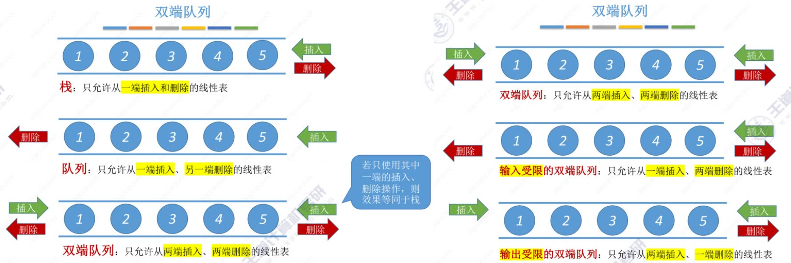
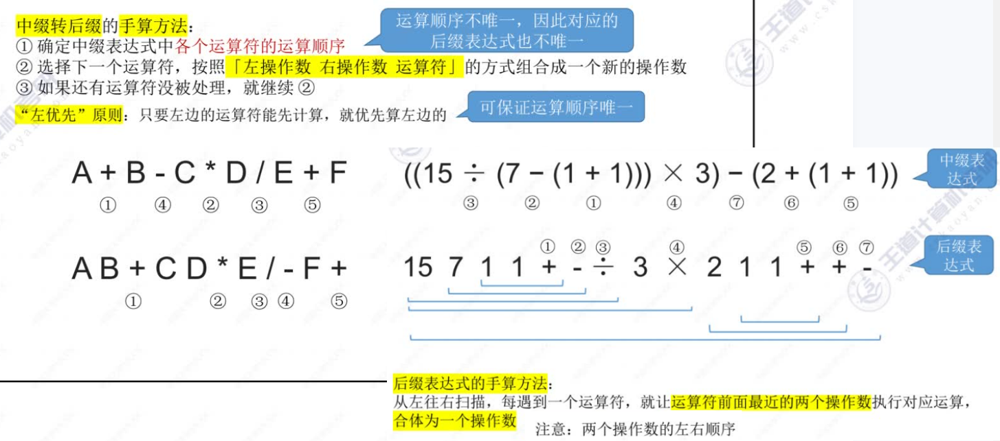
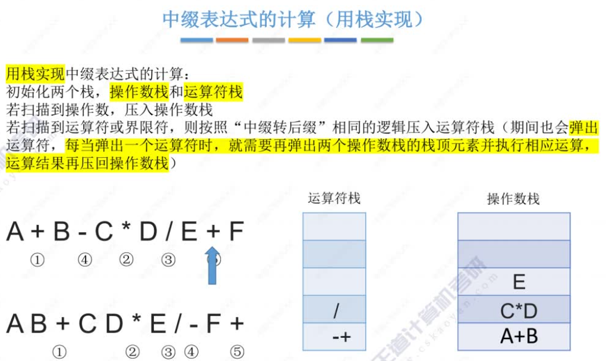
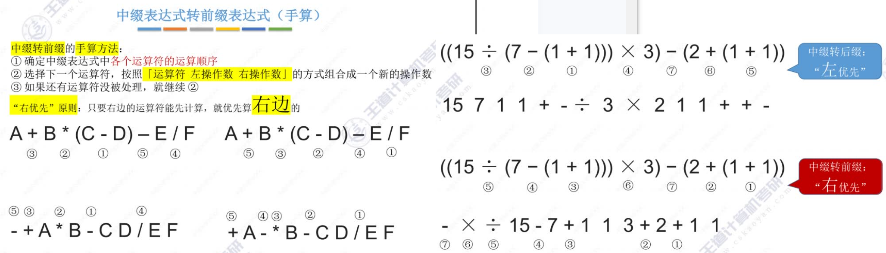

[TOC]


## 栈 (Stack)

类似于手枪弹夹，后进先出

```c++
// 基本操作：
InitStack(&S)
DestroyStack(&S)    
Push(&S, x)    
Pop(&S, &x)     // 弹出栈顶元素
GetTop(S, &x)	// 查询栈顶元素  
StackEmpty(S)
```

n 个不同元素进栈，出栈元素不同排列的个数为 $\frac{1}{n+1}C_{2n}^n$ ，
假设有5个元素进站，则合法的出栈顺序为：$\frac{1}{5+1}C_{10}^5 = \frac{10*9*8*7*6}{6*5*4*3*2*1} = 42$


### 顺序栈

```c++
#define MaxSize 10
typedef struct {
    E data[MaxSize];	// 静态数组存放栈中元素
    int top;			// 栈顶指针 指向栈顶元素
}SqStack;

void InitStack(SqStack &S) {
    S.top = -1;
}

bool StackEmpty(SqStack S) {
    return S.top == -1;
}

bool Push(SqStack &S, E x) {
    if (S.top == MaxSize - 1) return false;
    S.top ++;
    S.data[S.top] = x;	// S.data[++S.top] = x;
    return true;
}

bool Pop(SqStack &S, E &x) {
    if (S.top == -1) return false;
    x = S.data[S.top];
    S.top = S.top - 1;	//x = S.data[S.top--]
    return true;
}

bool GetTop(SqStack S, E &x) {
    if (S.top == -1) return false;
    x = S.data[S.top];
    return true;
}

void test() {
    SqStack S;
    InitStack(S);
}
```


### 共享栈

```c++
#define MaxSize 10
typedef struct {
    E data[MaxSize];
    int top0;	// 0 号栈 栈顶指针
    int top1;	// 1 号栈 栈顶指针
}ShStack;

void InitStack(ShStack &S) {
    S.top0 = -1;
    S.top1 = MaxSize;
}

// 判断栈满 top0 + 1 == top1;
```


### 链栈

```c++
typedef struct LinkNode {
    E data;					// 数据域
    struct LinkNode *next;	// 指针域
} *LiStack;
```


## 队列 (Queue)

```c++
// 基本操作：
InitQueue(&Q)
DestoryQueue(&Q)
EnQueue(&Q, x)		// 入队
DeQueue(&Q, &x)		// 出队
GetHead(Q, &x)		// 查对头元素    
```

```c++
#define MaxSize 10
typedef struct {
    E data[MaxSize];	// 用静态数组存放队列元素
    int front, rear;	// 队头指针、队尾指针
} SqQueue;

void InitQueue(SqQueue &Q) {
    Q.rear = Q.front = 0;
}

bool QueueEmpty(SqQueue Q) {
    return Q.rear == Q.front;
}

bool EnQueue(SqQueue &Q, E x) {
    if ((Q.rear + 1) % MaxSize == Q.front) 	// 队满
        return false;
    Q.data[Q.rear] = x;
    Q.rear = (Q.rear + 1) % MaxSize;
    return true;
}

bool DeQueue(SqQueue &Q, E &x) {
    if (Q.rear == Q.front) return false;	// 队空
    x = Q.data[Q.front];
    Q.front = (Q.front + 1) % MaxSize;
    return true;
}

bool GetHead(SqQueue Q, E &x) {
    if (Q.hear == Q.front) return false;
    x = Q.data[Q.front];
    return true;
}

int GetSize(SqQueue Q) {
    // (rear + MaxSize - front) % MaxSize
    return (Q.rear + MaxSize - Q.front) % MaxSize;
}

void test() {
    SqQueue Q;
    InitQueue(Q);
}
```


### 队列的链式实现

```c++
// 带头结点
typedef struct LinkNode {
    E data;
    struct LinkNode *next;
}LinkNode;

typedef struct {
    LinkNode *front, *rear;
}LinkQueue;


void InitQueue(LinkQueue &Q) {
    Q.front = Q.rear = (LinkNode*)malloc(sizeof(LinkNode));
    Q.front->next = NULL;
}

bool isEmpty(LinkQueue Q) {
   	return Q.front == Q.rear;
}

void EnQueue(LinkQueue &Q, E x) {	// 入队
    LinkNode *s = (LinkNode *) malloc(sizeof(LinkNode));
    s->data = x;
    s->next = x;
    Q.rear->next = s;
    Q.rear = s;
}

bool DeQueue(LinkQueue &Q, E &x) {
    if (Q.front == Q.rear) return false;
    LinkNode *p = Q.front->next;		// 待删除的结点
    x = p->data;
    Q.front->next = p->next;			// 头结点指向待删除结点的后一个结点
    if (Q.rear == p) Q.rear = Q.front;	// 是最后一个结点出队
    free(p);
    return true;
}

void testLinkQueue() {
    LinkQueue Q;
    InitQueue(Q);
}
```


```c++
// 不带头结点
void InitQueue(LinkQueue &Q) {
    Q.front = NULL;
    Q.rear = NULL;
}

bool isEmpty(LinkQueue Q) {
   	return Q.front == NULL;
}

void EnQueue(LinkQueue &Q, E x) {
    LinkNode *s = (LinkNode *)malloc(sizeof(LinkNode));
    s->data = x;
    s->next = NULL;
    if (Q.front == NULL) {		// 队列为空
        Q.front = s;			
        Q.rear = s;
    } else {
        Q.rear->next = s;
        Q.rear = s;
    }
}

bool DeQueue(LinkQueue &Q, E &x) {
    if (Q.front == NULL) return false;
    LinkNode *p = Q.front;		// 待出队的结点
    x = p->data;
    Q.front = p->next;			// 头结点指向待删除结点的后一个结点
    if (Q.rear = p) {			// 最后一个结点出队
        Q.front = NULL;
        Q.rear = NULL;
    }
    free(p);
    return true;
}
```


### 双端队列




## 应用

### 括号匹配（栈）

```c++
bool bracketCheck(char str[], int length) {
    SqStack S;
    InitStack(S);
    for (int i = 0; i < length; i++) {
        if (str[i] == '(' || str[i] == '[' || str[i] == '{') {
            Push(S, str[i]);
        } else {
            if (StackEmpty(S)) return false;	// 扫描道右括号 但此时栈已空
            char topElem;
            Pop(S, topElem);
            if (str[i] == ')' && topElem != '(') return false;
            if (str[i] == ']' && topElem != '[') return false;
            if (str[i] == '}' && topElem != '{') return false;
        }
    }
}
```


### 表达式求值（栈）



```
中缀表达式：A+B*(C-D)-E/F ; A+B-C*D/E+F
后缀表达式：ABCD-*+EF/-   ; AB+CD*E/-F+
```

```c++
/**
* 后缀转中缀 （后缀表达式求值）
* 1.从左往右扫描元素
* 2.扫描道操作数：压入栈，继续扫下一个元素
* 3.扫描道运算符：弹出两个栈顶元素，执行运算，运算结果压回栈顶，再扫下一个元素
*/
// ....
```

```c++
/**
 * 中缀转后缀
 * 遇到操作数：直接加入后缀表达式
 * 遇到界限符：遇到 '(' 直接入栈；遇到 ')' 则依次弹出栈内运算符并加入后缀表达式，直到弹出 '(' 为止, 
 *		  '(' 不加入后缀表达式。
 * 遇到运算符：依次弹出栈中优先级高于或等于当前运算符的所有运算符，并加入后缀表达式，
 *		  碰到 '(' 或栈空则停止，之后再将当前运算符入栈。
 * 操作完所有字符后，依次弹出栈中剩余运算符，并将其加入后缀表达式
 */
```






```c++
/**
* 1.从右往左扫描下一个元素
* 2.扫描道操作数：压入栈，继续扫下一个元素
* 3.扫描道运算符：弹出两个栈顶元素，执行运算，运算结果压回栈顶，再扫下一个元素
*/
// ....
```


## 矩阵的压缩存储

`b[i][j] 的存储地址 = 起始地址 + (i * N + j) * sizeof(ElemType)`
原 `a[i][j]` 的下标从 1 开始，数组的下标从 0 开始

对称矩阵，只存储主对角线 + 下三角区：
行优先：
	数组大小： `n*(1+n)/2` 
	最后一个下标：`n*(1+n)/2 - 1` 
	原 `a[i][j]` 对应的下标：`if (i >= j) a[i*(i+1)/2 + j - 1] : i和j 反转再取即可 ` 


三角矩阵，最后一个元素存常量
	原 `a[i][j]` 对应的下标：`if (i >= j) a[i*(i+1)/2 + j - 1] : a[n(n+1)/2]`


三对角矩阵（带状矩阵）
行优先：
	数组大小：`3n - 2` 
	最后一个的下标：`3n - 3`
	原 `a[i][j]` 对应的下标：`if (|i-j| <= 1) a[2i+j-2-1]`
	数组中 `a[k]` 对应：`i = ceil((k+2)/3)` 或 `i = floor((k+1)/3 + 1)` ; `j = k-2i+3` 


