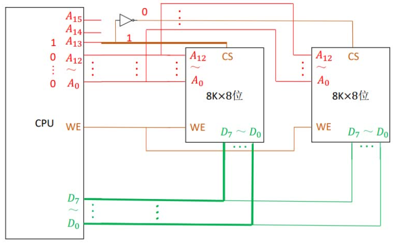
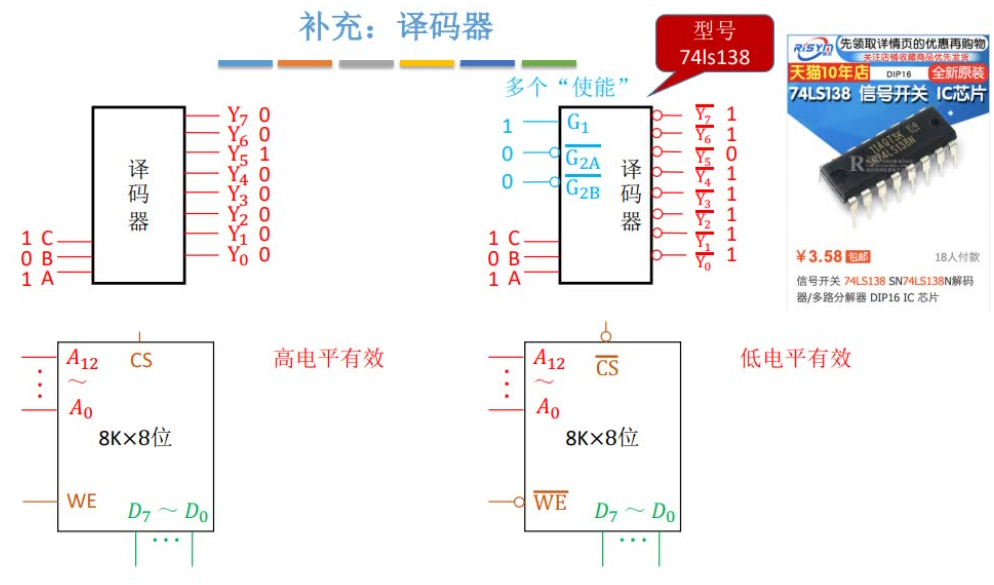

[TOC]

### 存储器分类

#### 按层次结构分

CPU 可直接同 Cache、主存 进行读写，辅存中的数据须调入主存，才能被 CPU 访问。
主存与辅存之间的数据交换：硬件 + 操作系统，实现虚拟存储系统，解决主存容量不够的问题，使用页面置换算													法决定将主存中的数据移至外存。
主存与 Cache 之间的数据交换：硬件自动完成，解决了主存与CPU的速度不匹配问题。

#### 按介质分

半导体存储器：主存、Cache
磁表面存储器：软盘、磁盘、磁带
光存储器：光盘

#### 按存储方式分

随机存取存储器 (RAM)：读写任何一个存储单元所需时间都相同，与存储单元所在物理位置无关，如内存条。
顺序存取存储器 (SAM)：读写一个存储单元所需时间取决于存储单元所在的物理位置。
直接存取存储器 (DAM)：先直接选取信息所在区域，然后按顺序方式存取。故有随机存取特性和顺序存取特性。
相联存储器 (CAM)：按照内容检索到存储位置进行读写，如 “快表”

串行访问存储器：读写时间与存储单元物理位置有关的，即 SAM、DAM

### 存储器性能指标

存储容量：存储字数 * 字长，如 1M * 8位，MAR 的位数反映了存储字数，MDR 的位数反映了存储器的存储字长
单位成本：每位价格 = 总成本 / 总容量，如总价 259 元，容量 8GB，就是：259 / 64(bit)
存储速度：数据传输率(主存带宽) = 数据的宽度(存储字长) / 存储周期
存取周期：存取时间 + 恢复时间

### DRAM 和 SRAM

Dynamic Random Access Memory , 动态 RAM , 适用于主存，使用栅极电容存储信息
Static Random Access Memory , 静态 RAM , 适用于 Cache等，使用双稳态触发器存储信息

### ROM（Read-Only Memory）

RAM：易失性，断电后数据消失
ROM：非易失性，断电后数据不会消失

MROM: Mask Read-Only Memory，生产过程中写入数据，之后只能读，不可重写
PROM: Programmable Read-Only Memory，用户可用写入器写入数据，写一次之后不可更改
EPROM: Erasable Programmable Read-Only Memory，允许用户写入信息，之后还可多次擦除、重写
	UVEPROM：用紫外线照射20分钟，擦除所有信息
	EEPROM：可用电擦除方式，擦除特定的字
Flash Memory：可进行多次快读擦除重写，因写时需要先擦除，所有写通常比读慢，如 U盘、SD卡
SSD: Solid State Drives，可进行多次快速擦除重写，其控制单元与 Flash Memory 不一样，存储介质类似

### 主存与 CPU 的连接

#### 存储器芯片基本结构

地址线：$A_n$ 
数据线：$D_n$
片选信号：
	$\overline{CS}$ 或 $\overline{CE}$ ：低电平有效 （画图的时候加个小圆圈）
	$CS$ 或 $CE$ ：高电平有效
读写控制线：
	$\overline{WE}$ 或 $\overline{WR}$ ：低电平表示写，高电平表示读
	$WE$ 或 $WR$ ：高电平表示写，低电平表示读

#### 位扩展

增加存储器的字长，更好的利用数据总线的传输能力。

每块存储芯片有 8K 个存储单元，8K 对应 $2^{13}$ ，即需要 13 根地址线表示 8K 个地址。
CPU 每次发出 13 位地址信息同时送给 2 片存储芯片，每个芯片的存储单元为 1 bit.

#### 字扩展

增加存储器的存储字数，更好的利用 CPU 的寻址能力。

##### 线选法

当 CPU 给出地址后，地址同时传给两个存储芯片，由于片选信号都是 1，所以两个芯片对应存储单元的 8bit 都会顺着数据总线传给 CPU，然后就冲突了....

初步的解决办法是，两个存储芯片的片选信号接口，连接到不同的地址线上。如图 $A_{13}$ 为 1 时表示使用左边的。
不过，当 $A_{13}$ 和 $A_{14}$ 都是 1 时，两个存储芯片又都被选中了。同理，当为低电平有效时，不能同时为 0.
此时，地址只能使用 $01xxxxxxxxxxxxx$ 和 $10xxxxxxxxxxxxx$，就浪费了 00 开头的 和 11 开头的地址。
此外，这种方法的片选信号数量也局限于 CPU 多余的地址线的数量。

##### 译码片选法

加入一个非门，如下图，此时就是左边的存储芯片被选。
此时合法地址就是，$0xxxxxxxxxxxxx-1xxxxxxxxxxxxx$ ，地址空间没有一个被浪费（拽）

上图的非门，后期就可以改进为一个译码器，给译码器 n 位信息，就可以得到 $2^n$ 个选片信号

来个 2-4 译码器，注意下图的片选信号是低电平有效，低电平通常配合小圆圈。
此时译码器输出的就是一个 0，剩下全是 1。下图的地址空间也没有被浪费。

#### 字位同时扩展

下图每块存储芯片为 4 位，CPU 数据总线是 8 位，所以使用位扩展，使每两块存储芯片为一组。
每组的第一块连接 $D_0-D_3$ 第二块连接 $D_4-D_7$ 

字扩展方面，每块芯片的字数是 16K，对应 $2^{14}$，所以需要 14 位来传输地址数据，故 $A_0 - A{13}$ 作为片内地址。
$A_{14}$ 和 $A_{15}$ 接上一个 2-4 译码器，译码器就可以再接 4 组存储芯片。

每组芯片为 16K*8位，故总数为 64K\*8位，同样地址空间连续，即不浪费地址空间。

### 译码器

译码器也有使能端 (EN)，甚至可以有多跟线连接。下面的 $G_1 \ \overline{G_{2A}} \ \overline{G_{2B}}$ 表示 仅当输入为 `100` 时译码器才工作。当使能端无效的时候，若为高电平有效，那译码器就输出全0，下面是低电平有效，所以输出全1

如下图，可以给使能端口的其中两个输入正常值，剩余1个接口，用于连接 CPU，当需要使用时，CPU传入正常值
加入译码器使能，是因为 CPU 首先通过地址线发出地址信号，地址信号为电信号，初始阶段信号可能不稳定。所以会等一会，等稳定之后，再发出译码器使能信号，又叫主存请求信号（MREQ）.

### 双端口 RAM 

存取周期 T = 存取时间 r + 恢复时间

支持两个 CPU 同时访问 RAM

可同时   读        同一个   存储单元
可同时   读/写   不同的   存储单元
不可同时    写    同一个   存储单元
不可同时 一读一写   同一个  存储单元

若发生冲突，则发出 “BUSY” 信号，其中一个 CPU 的访问端口暂时关闭

### 多模块存储器

每个存储体的存取周期为 T，存取时间为 r ，设 T = 4r

**单体多字存储器：** 每次并行读出 m 个连续的字，不能单独取其中某个字

**多体并行存储器 - 高位交叉编址：**
连续取n个存储字：n*T
理论上可被并行访问，但常因访问地址是连续的，因此实际效果相当于单纯扩容，速度没有多大提升

**多体并行存储器 - 低位交叉编址：** 
微观上 m 个模块被串行访问，宏观上是并行访问
为了使流线型不间断，应保证模块数 m >= T/r
连续取n个存储字：T + (n-1)r

比如插内存条，主板上有四个内存插口，两个内存条插在颜色相同的两个插口上，就是低位交叉的多体存储器，俗称双通道。因此一般都是买两个相同主频、相同容量的插上。

https://www.youtube.com/watch?v=yotR_Sp_W5Y&list=PLjAs5kw1NNs0NBNhPb7PNjSvyPO4sykBQ&index=33

