[TOC]

### Cache

主存通过 双端口RAM、多模块存储器提高了工作速度，但依然与CPU有很大差距。

设 $t_c$ 为访问一次 Cache 所需时间
$t_m$ 为访问一次主存所需时间
Cache 命中率 H：CPU 欲访问的信息已在 Cache 中的比率
缺失率：没有命中的比率，M = 1 - H
平均访问时间：
	先访问 Cache 若未命中再访问主存：$t = H*t_c+(1-H)(t_c+t_m)$
	Cache 和 主存同时访问：$t = H*t_c + (1-H)t_m$

### Cache 和 主存的映射方式

使用有效位、标记位来标记 Cache 块，使得可以从 Cache 块找到与之对应的主存块号。

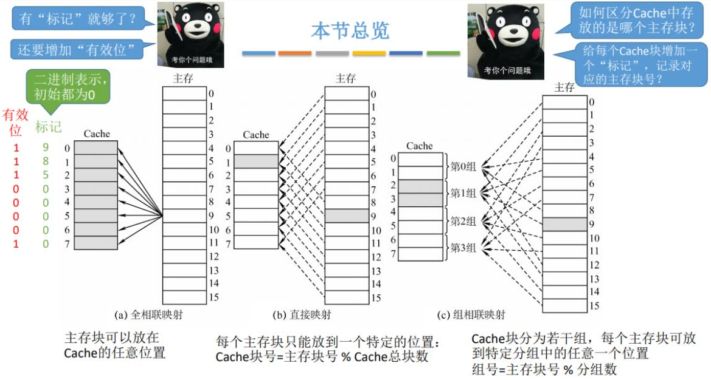

假设计算机主存地址空间为 256M，按字节编址，Cache 有 8 个 Cache 行，行长为 64B
Cache 块与主存块大小相等，$(256M=2^{28}) / (64B=2^6) = 2^{22}$ , 
即主存地址共 28位，可以前 22 位用作主存块号，后 6 位用作块内地址

#### 全相联映射

当 CPU 需要访问一个主存地址的时候，首先检查其是否在 Cache 中：
取地址的块号，在 Cache 的标记位中查找，查找到了再检查其有效位是否合法。满足要求，则 Cache 命中。
命中之后，再根据后 6 位的块内地址，取到对应字节。
未命中，或有效位不合法，则正常访问主存。

#### 直接映射

这种算法，只能经过计算后，放到指定的位置，也就是说哪怕 Cache 还有剩余块，也只能覆盖原有 Cache 块。
若 Cache 的块数可用 $2^n$ 表示，则计算主存块在 Cache 的位置，直接左移就行，末尾几位就是位置，因此标记位也可以去掉末尾的相同几位。

CPU 访问主存，截取主存块号，得到其在 Cache 中所对应的位置，再拿主存块号对比 Cache 的标记位。
同上，标记位可能只记录了去掉末尾后的部分。
标记位匹配并且有效位合法，那就是命中，再根据块内地址找到对应字节即可。
未命中，或有效位不合法，则正常访问主存。

#### 组相联映射

n 路组相联，表示每 n 个 Cache 行为一组。

和直接映射类似，也是取余的，但是直接映射相当于一个组一个 Cache 行，这里一个组有多个 Cache 行。
因此，只要组么有满，就不用覆盖。
同直接映射一样，某些情况下，标记位也可以只取主存块号的前 n 位

CPU 访问主存，计算主存块号得到对应 Cache 组号，某些情况下，左移取主存快号的末尾即可。
在对应的分组中，对比 Cache 标记，找到匹配的并且有效位合法，则为命中，再按块内地址找到数据。
未命中，或有效位不合法，则正常访问主存。

全相联映射可能需要对比 Cache 中所有块号，所有查找标记是最慢的，但是充分利用 Cache 存储空间
直接映射只要计算后对比一次标记，因此其最快，但是 Cache 利用不充分，还经常覆盖，导致命中率低
组相联是前二者的折中，综合效果较好。

### Cache 替换算法

每次被访问的主存块，一定会被立即调入 Cache，因为 Cache 容量远小于主存，所以 Cache 块会经常被替换。
全相联映射：在整个 Cache 被装满后，会在全局选择一块替换。
直接映射：此算法中，主存块存放的目标 Cache 行，是固定的，若原先已存在数据，则直接覆盖，毫无选择
组相联映射：只有主存块所属的 Cache 组满了，才会在组内选择一块替换。

因此替换算法，只应用于全相联映射、组相联映射。

#### 随机算法（RAND）

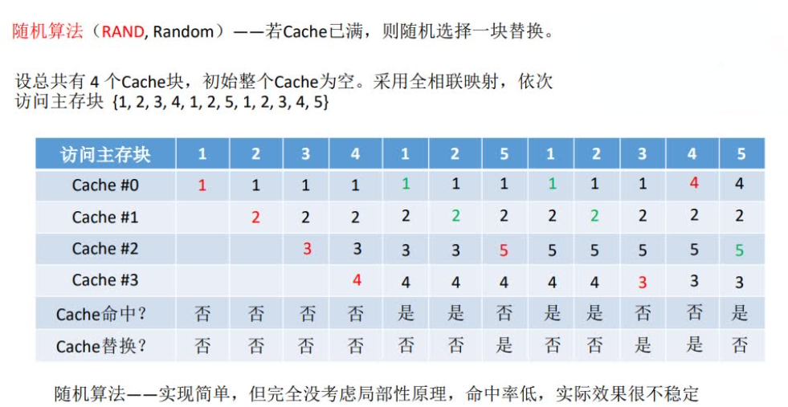

#### 先进先出（FIFO）

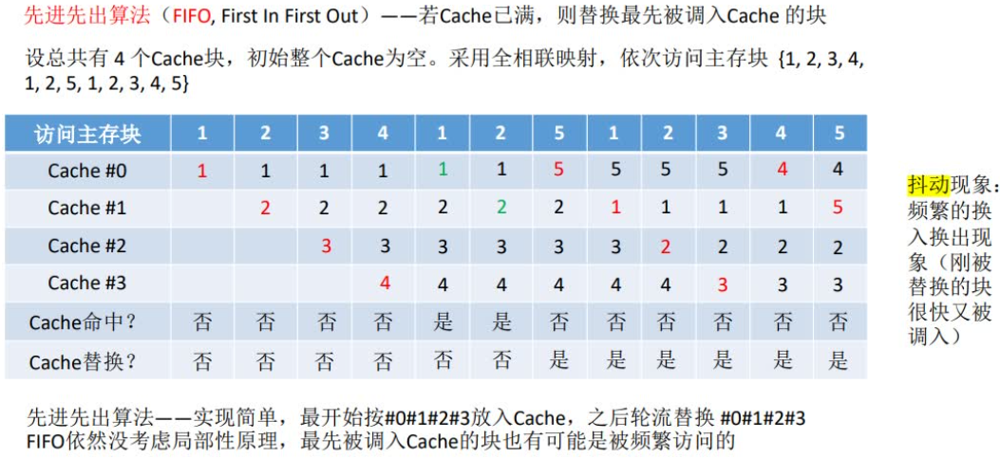

#### 近期最少使用（LRU）

命中时，所命中的行的计数器清零，计数器中比命中行的计数器值低的计数器值自增 1，其余不变。
比名中行的计数器值还大的计数器值，没必要 +1

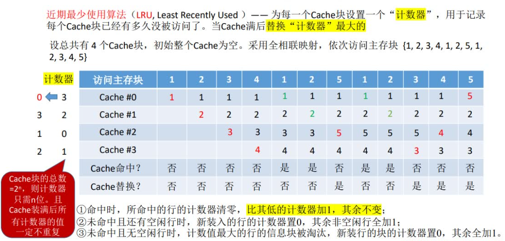

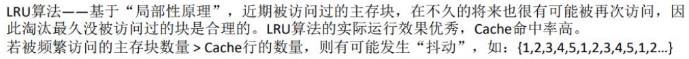

#### 最近不经常使用（LFU）

需要不少的存储空间，来存储计数器值

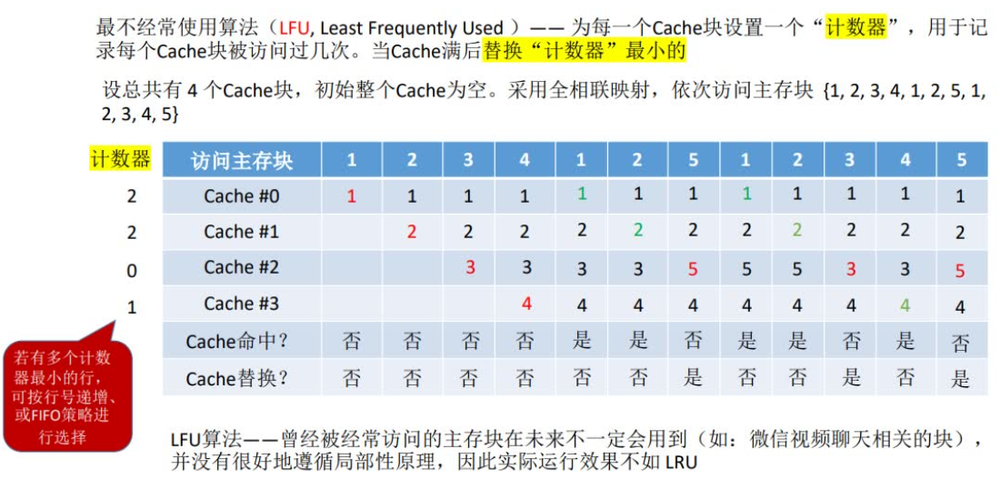

### Cache 写策略

CPU 修改了 Cache 中的数据副本，如何确保主存中的数据母本一致性？

**写命中 - 写回法：**
已经被调入 Cache，命中后，存于 Cache 的那一份数据被修改了。
当 Cache 中被修改的块需要被替换时，才重新将一整行(块)重新写回主存，因此中间可能存在数据不一致的情况
Cache 中未被修改过的，其被替换时，不必写回主存。因此，Cache 需要一个 “脏位” 标记位，表示此行被修改过
根据脏位判断是否需要写回主存，如果需要，再根据标记位知道写回的位置。

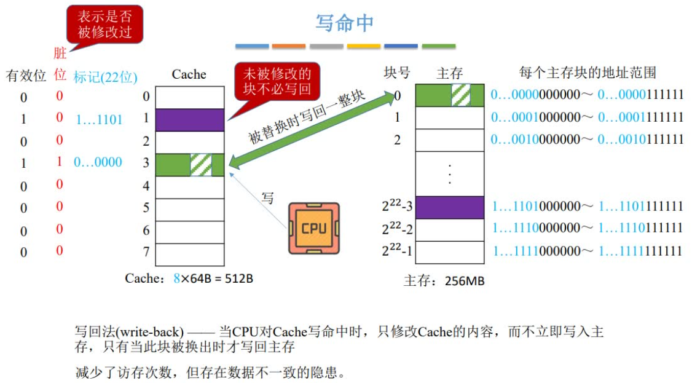

**写命中 - 全写法（写直通法）：**

修改 Cache 中的数据的时候，也会修改对应主存中的数据。
但不是直接写到主存，而是直接写进一个 "SRAM实现的FIFO队列"，有专门的控制电路使队列中的数据写回主存。
因为 SRAM 比主存块，且 CPU 不需要管理从队列写入主存，故写操作不频繁时，效果很好。
若写操作频繁，缓冲队列满了，那就会阻塞，影响 CPU 速度。

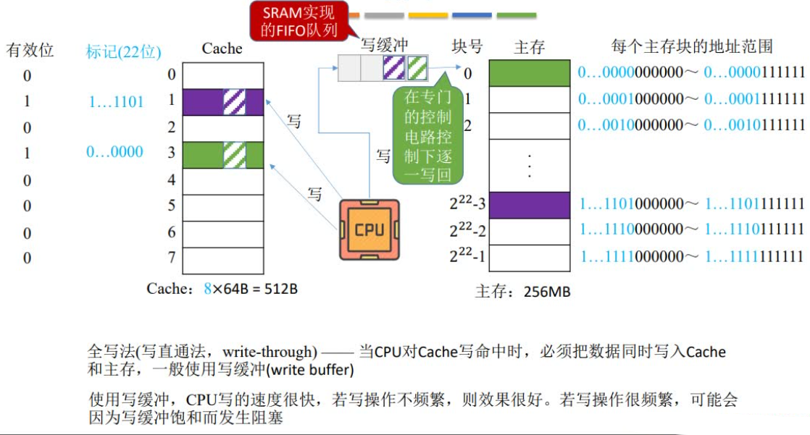

**写不命中 - 写分配法：**

要写的这块数据没有在 Cache 中命中，则首先将其调入 Cahce，在 Cache 中对其进行修改，之后同写回法。

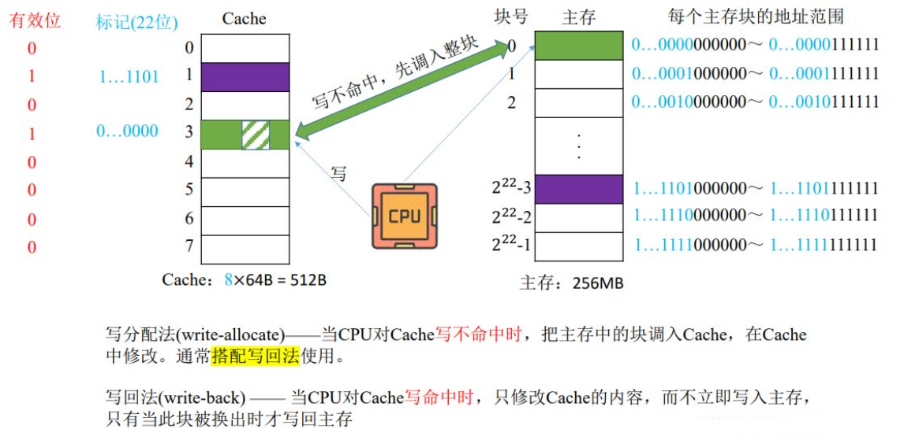

**写不命中 - 非写分配法：**

对没有在 Cache 中命中的数据，CPU 直接在主存中修改，不调入 Cache 了。
注意，一般 "读" 未命中时，才会调入 Cache ，"写" 就随便了

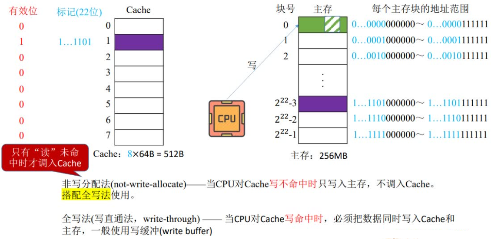

如今，CPU 使用多级 Cache，越接近 CPU 的 Cache 层及，容量越低，速度越快

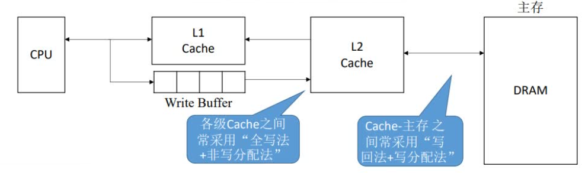

